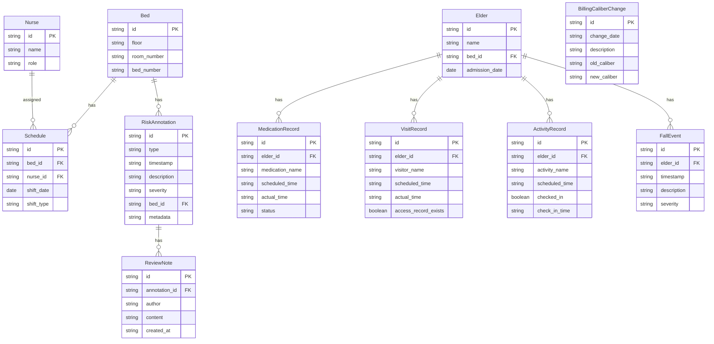

## 1. 架构设计

```mermaid
graph TB
    subgraph "前端层"
        "React App" --> "ECharts 图表引擎"
        "React App" --> "状态管理 Zustand"
    end
    subgraph "后端层"
        "FastAPI" --> "排班服务"
        "FastAPI" --> "风险标注服务"
        "FastAPI" --> "复盘备注服务"
        "FastAPI" --> "导出服务"
    end
    subgraph "数据层"
        "PostgreSQL" --> "业务数据(排班/备注/用户)"
        "DuckDB" --> "分析数据(趋势/统计/口径)"
    end
    "React App" -->|"REST API"| "FastAPI"
    "排班服务" --> "PostgreSQL"
    "排班服务" --> "DuckDB"
    "风险标注服务" --> "DuckDB"
    "复盘备注服务" --> "PostgreSQL"
    "导出服务" --> "DuckDB"
    "导出服务" --> "PostgreSQL"
```

## 2. 技术说明

- 前端：React@18 + TypeScript + ECharts@5 + TailwindCSS@3 + Vite + Zustand
- 初始化工具：Vite (react-ts template)
- 后端：FastAPI@0.115 + Python 3.11 + Uvicorn
- 数据库：PostgreSQL 16（业务数据）+ DuckDB（分析查询）
- ORM：SQLAlchemy@2 (async) + Alembic
- 数据导出：openpyxl (Excel) + pandas

## 3. 路由定义

| 路由 | 用途 |
|------|------|
| `/` | 风险监测看板主页 |
| `/medication` | 用药清单视图 |
| `/visits` | 探访记录视图 |
| `/activities` | 活动签到视图 |

## 4. API 定义

### 4.1 排班与趋势

```typescript
interface ScheduleTrendRequest {
  start_date: string;
  end_date: string;
  bed_id?: string;
  floor_id?: string;
}

interface ScheduleTrendResponse {
  dates: string[];
  occupancy: number[];
  risk_scores: number[];
  annotations: RiskAnnotation[];
}

interface RiskAnnotation {
  type: "terminal_delay" | "access_missing" | "billing_caliber_change" | "fall_event";
  timestamp: string;
  description: string;
  severity: "low" | "medium" | "high";
  metadata?: Record<string, unknown>;
}
```

### 4.2 复盘备注

```typescript
interface ReviewNote {
  id: string;
  annotation_id: string;
  author: string;
  content: string;
  created_at: string;
}

interface CreateReviewNoteRequest {
  annotation_id: string;
  content: string;
}
```

### 4.3 用药清单

```typescript
interface MedicationRecord {
  elder_id: string;
  elder_name: string;
  medications: MedicationItem[];
}

interface MedicationItem {
  name: string;
  scheduled_time: string;
  actual_time: string | null;
  status: "completed" | "delayed" | "missed";
  delay_minutes?: number;
}
```

### 4.4 探访记录

```typescript
interface VisitRecord {
  id: string;
  elder_id: string;
  elder_name: string;
  visitor_name: string;
  scheduled_time: string;
  actual_time: string | null;
  access_record_exists: boolean;
  missing_period?: { start: string; end: string };
}
```

### 4.5 活动签到

```typescript
interface ActivityRecord {
  id: string;
  name: string;
  scheduled_time: string;
  elder_id: string;
  elder_name: string;
  checked_in: boolean;
  check_in_time: string | null;
}
```

### 4.6 数据导出

```typescript
interface ExportRequest {
  start_date: string;
  end_date: string;
  view_type: "schedule" | "medication" | "visits" | "activities";
  format: "csv" | "xlsx";
  include_compliance_rules: boolean;
}

interface ExportResponse {
  download_url: string;
  compliance_rules_attached: boolean;
}
```

## 5. 服务架构图

```mermaid
graph LR
    "Controller" --> "Service"
    "Service" --> "Repository"
    "Repository" --> "PostgreSQL"
    "Repository" --> "DuckDB"
```

## 6. 数据模型

### 6.1 数据模型定义



### 6.2 数据定义语言

```sql
-- PostgreSQL DDL

CREATE TABLE beds (
    id UUID PRIMARY KEY DEFAULT gen_random_uuid(),
    floor VARCHAR(10) NOT NULL,
    room_number VARCHAR(10) NOT NULL,
    bed_number VARCHAR(10) NOT NULL,
    created_at TIMESTAMP DEFAULT NOW()
);

CREATE TABLE nurses (
    id UUID PRIMARY KEY DEFAULT gen_random_uuid(),
    name VARCHAR(100) NOT NULL,
    role VARCHAR(50) NOT NULL,
    created_at TIMESTAMP DEFAULT NOW()
);

CREATE TABLE elders (
    id UUID PRIMARY KEY DEFAULT gen_random_uuid(),
    name VARCHAR(100) NOT NULL,
    bed_id UUID REFERENCES beds(id),
    admission_date DATE NOT NULL,
    created_at TIMESTAMP DEFAULT NOW()
);

CREATE TABLE schedules (
    id UUID PRIMARY KEY DEFAULT gen_random_uuid(),
    bed_id UUID REFERENCES beds(id),
    nurse_id UUID REFERENCES nurses(id),
    shift_date DATE NOT NULL,
    shift_type VARCHAR(20) NOT NULL,
    created_at TIMESTAMP DEFAULT NOW()
);

CREATE TABLE risk_annotations (
    id UUID PRIMARY KEY DEFAULT gen_random_uuid(),
    type VARCHAR(50) NOT NULL,
    timestamp TIMESTAMPTZ NOT NULL,
    description TEXT,
    severity VARCHAR(20) NOT NULL DEFAULT 'low',
    bed_id UUID REFERENCES beds(id),
    metadata JSONB,
    created_at TIMESTAMP DEFAULT NOW()
);

CREATE TABLE review_notes (
    id UUID PRIMARY KEY DEFAULT gen_random_uuid(),
    annotation_id UUID REFERENCES risk_annotations(id),
    author VARCHAR(100) NOT NULL,
    content TEXT NOT NULL,
    created_at TIMESTAMP DEFAULT NOW()
);

CREATE TABLE medication_records (
    id UUID PRIMARY KEY DEFAULT gen_random_uuid(),
    elder_id UUID REFERENCES elders(id),
    medication_name VARCHAR(200) NOT NULL,
    scheduled_time TIMESTAMPTZ NOT NULL,
    actual_time TIMESTAMPTZ,
    status VARCHAR(20) NOT NULL DEFAULT 'pending',
    created_at TIMESTAMP DEFAULT NOW()
);

CREATE TABLE visit_records (
    id UUID PRIMARY KEY DEFAULT gen_random_uuid(),
    elder_id UUID REFERENCES elders(id),
    visitor_name VARCHAR(100) NOT NULL,
    scheduled_time TIMESTAMPTZ NOT NULL,
    actual_time TIMESTAMPTZ,
    access_record_exists BOOLEAN DEFAULT true,
    created_at TIMESTAMP DEFAULT NOW()
);

CREATE TABLE activity_records (
    id UUID PRIMARY KEY DEFAULT gen_random_uuid(),
    elder_id UUID REFERENCES elders(id),
    activity_name VARCHAR(200) NOT NULL,
    scheduled_time TIMESTAMPTZ NOT NULL,
    checked_in BOOLEAN DEFAULT false,
    check_in_time TIMESTAMPTZ,
    created_at TIMESTAMP DEFAULT NOW()
);

CREATE TABLE fall_events (
    id UUID PRIMARY KEY DEFAULT gen_random_uuid(),
    elder_id UUID REFERENCES elders(id),
    timestamp TIMESTAMPTZ NOT NULL,
    description TEXT,
    severity VARCHAR(20) NOT NULL DEFAULT 'medium',
    created_at TIMESTAMP DEFAULT NOW()
);

CREATE TABLE billing_caliber_changes (
    id UUID PRIMARY KEY DEFAULT gen_random_uuid(),
    change_date DATE NOT NULL,
    description TEXT,
    old_caliber VARCHAR(200),
    new_caliber VARCHAR(200),
    created_at TIMESTAMP DEFAULT NOW()
);

CREATE INDEX idx_schedules_bed_date ON schedules(bed_id, shift_date);
CREATE INDEX idx_risk_annotations_type ON risk_annotations(type);
CREATE INDEX idx_risk_annotations_timestamp ON risk_annotations(timestamp);
CREATE INDEX idx_medication_records_elder ON medication_records(elder_id);
CREATE INDEX idx_visit_records_elder ON visit_records(elder_id);
CREATE INDEX idx_activity_records_elder ON activity_records(elder_id);
CREATE INDEX idx_fall_events_elder ON fall_events(elder_id);
CREATE INDEX idx_review_notes_annotation ON review_notes(annotation_id);
```
