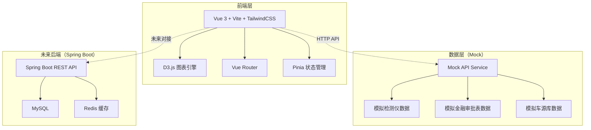
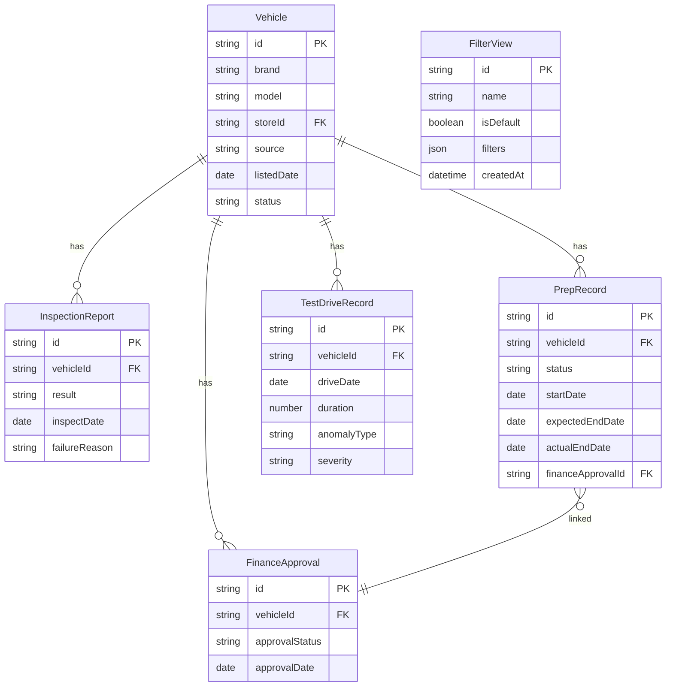

## 1. 架构设计



## 2. 技术说明

- **前端**：Vue 3 + Vite + TailwindCSS + D3.js + Pinia
- **初始化工具**：vite-init（vue-ts 模板）
- **后端**：当前采用 Mock 数据模拟，未来对接 Spring Boot + MySQL + Redis
- **图表库**：D3.js v7（直接操作 SVG，高度定制化）
- **图标**：lucide-vue-next
- **数据模拟**：前端 Mock Service，模拟检测仪、金融审批表、车源库三路数据源

## 3. 路由定义

| 路由 | 用途 |
|------|------|
| / | 看板主页，包含全部图表与筛选功能 |
| /share/:token | 分享页面，带权限校验 |

## 4. API 定义（Mock）

### 4.1 数据概览接口

```typescript
interface DashboardOverview {
  lastRefreshTime: string
  dataSources: {
    inspection: { status: 'online' | 'offline' | 'delayed'; lastSync: string }
    finance: { status: 'online' | 'offline' | 'delayed'; lastSync: string }
    inventory: { status: 'online' | 'offline' | 'delayed'; lastSync: string }
  }
  summary: {
    totalListed: number
    weekOverWeek: number
    monthOverMonth: number
    inspectionPassRate: number
    avgPrepDays: number
    abnormalTestDrives: number
  }
}
```

### 4.2 车辆档案趋势接口

```typescript
interface VehicleArchiveTrend {
  period: string
  listed: number
  delisted: number
  netChange: number
  wowChange: number
  details: Array<{
    date: string
    count: number
    brand: string
    source: 'inspection' | 'finance' | 'inventory'
  }>
}
```

### 4.3 检测报告构成接口

```typescript
interface InspectionReportComposition {
  summary: {
    passed: number
    failed: number
    pending: number
  }
  trendByWeek: Array<{
    week: string
    passed: number
    failed: number
    pending: number
  }>
  failureReasons: Array<{
    reason: string
    count: number
    percentage: number
  }>
}
```

### 4.4 整备清单明细接口

```typescript
interface PrepListDetail {
  statusDistribution: {
    notStarted: number
    inProgress: number
    completed: number
    overdue: number
  }
  avgPrepDays: number
  overdueItems: Array<{
    vehicleId: string
    brand: string
    model: string
    prepDays: number
    expectedDays: number
    status: 'not_started' | 'in_progress' | 'completed' | 'overdue'
    financeApproval: string
  }>
}
```

### 4.5 试驾记录异常标注接口

```typescript
interface TestDriveAnomaly {
  totalDrives: number
  abnormalCount: number
  dailyDistribution: Array<{
    date: string
    normalCount: number
    abnormalCount: number
  }>
  anomalies: Array<{
    vehicleId: string
    date: string
    type: 'accident_test' | 'overspeed' | 'unauthorized_route' | 'long_duration'
    description: string
    severity: 'low' | 'medium' | 'high'
  }>
}
```

### 4.6 筛选视图接口

```typescript
interface FilterView {
  id: string
  name: string
  isDefault: boolean
  filters: {
    storeIds: string[]
    dateRange: { start: string; end: string }
    brands: string[]
    sourceTypes: string[]
    vehicleCondition: string[]
  }
  createdAt: string
  updatedAt: string
}
```

### 4.7 分享与导出接口

```typescript
interface ShareLink {
  token: string
  url: string
  expiresIn: number
  permissions: ('view' | 'export')[]
  includesTurnoverMetrics: boolean
}

interface ExportRequest {
  format: 'pdf' | 'excel'
  filters: FilterView['filters']
  includeTurnoverMetrics: boolean
  turnoverCalculationNote: string
}
```

## 5. 数据模型

### 5.1 数据模型定义



### 5.2 数据定义语言（Mock 阶段使用 TypeScript 类型定义，未来对接 MySQL DDL）

```sql
CREATE TABLE vehicle (
    id VARCHAR(36) PRIMARY KEY,
    brand VARCHAR(50) NOT NULL,
    model VARCHAR(50) NOT NULL,
    store_id VARCHAR(36) NOT NULL,
    source ENUM('inspection', 'finance', 'inventory') NOT NULL,
    listed_date DATE NOT NULL,
    status ENUM('active', 'sold', 'delisted') NOT NULL,
    created_at DATETIME DEFAULT CURRENT_TIMESTAMP,
    INDEX idx_store_date (store_id, listed_date),
    INDEX idx_brand (brand)
);

CREATE TABLE inspection_report (
    id VARCHAR(36) PRIMARY KEY,
    vehicle_id VARCHAR(36) NOT NULL,
    result ENUM('passed', 'failed', 'pending') NOT NULL,
    inspect_date DATE NOT NULL,
    failure_reason VARCHAR(200),
    FOREIGN KEY (vehicle_id) REFERENCES vehicle(id),
    INDEX idx_vehicle_date (vehicle_id, inspect_date)
);

CREATE TABLE prep_record (
    id VARCHAR(36) PRIMARY KEY,
    vehicle_id VARCHAR(36) NOT NULL,
    status ENUM('not_started', 'in_progress', 'completed', 'overdue') NOT NULL,
    start_date DATE,
    expected_end_date DATE,
    actual_end_date DATE,
    finance_approval_id VARCHAR(36),
    FOREIGN KEY (vehicle_id) REFERENCES vehicle(id),
    INDEX idx_status (status)
);

CREATE TABLE test_drive_record (
    id VARCHAR(36) PRIMARY KEY,
    vehicle_id VARCHAR(36) NOT NULL,
    drive_date DATE NOT NULL,
    duration INT,
    anomaly_type ENUM('accident_test', 'overspeed', 'unauthorized_route', 'long_duration'),
    severity ENUM('low', 'medium', 'high'),
    FOREIGN KEY (vehicle_id) REFERENCES vehicle(id),
    INDEX idx_date_anomaly (drive_date, anomaly_type)
);

CREATE TABLE finance_approval (
    id VARCHAR(36) PRIMARY KEY,
    vehicle_id VARCHAR(36) NOT NULL,
    approval_status ENUM('approved', 'rejected', 'pending') NOT NULL,
    approval_date DATE,
    FOREIGN KEY (vehicle_id) REFERENCES vehicle(id)
);

CREATE TABLE filter_view (
    id VARCHAR(36) PRIMARY KEY,
    name VARCHAR(100) NOT NULL,
    is_default BOOLEAN DEFAULT FALSE,
    filters JSON NOT NULL,
    created_at DATETIME DEFAULT CURRENT_TIMESTAMP,
    updated_at DATETIME DEFAULT CURRENT_TIMESTAMP ON UPDATE CURRENT_TIMESTAMP
);
```
