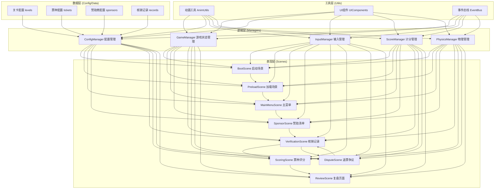
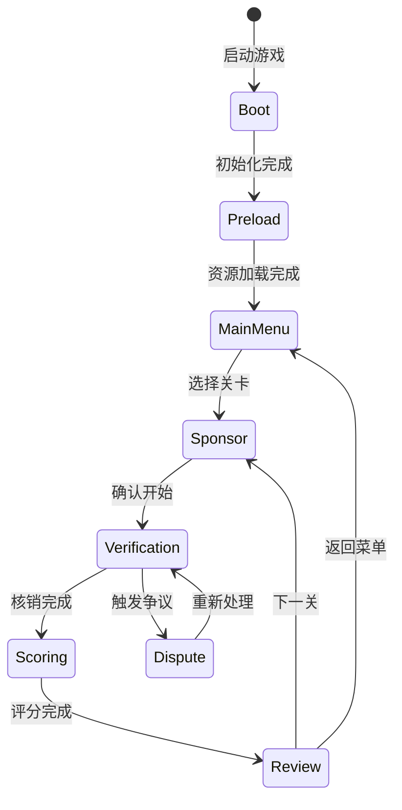

## 1. 架构设计



## 2. 技术选型

### 2.1 核心技术栈

| 技术 | 版本 | 用途 |
|------|------|------|
| Phaser 3 | ^3.80.0 | 2D 游戏框架，场景管理、渲染、输入 |
| TypeScript | ^5.4.0 | 类型安全的 JavaScript 超集 |
| Vite | ^5.2.0 | 构建工具，开发服务器，热更新 |
| Matter.js | ^0.19.0 | 2D 物理引擎，用于卡牌物理效果 |
| @types/matter-js | ^0.19.0 | Matter.js 类型声明 |

### 2.2 开发工具

- **包管理器**：npm
- **代码规范**：ESLint + Prettier
- **类型检查**：TypeScript 严格模式
- **构建优化**：Vite 代码分割、资源压缩

## 3. 目录结构

```
MP0419/
├── src/
│   ├── scenes/                  # 游戏场景
│   │   ├── BootScene.ts         # 启动场景
│   │   ├── PreloadScene.ts      # 加载场景
│   │   ├── MainMenuScene.ts     # 主菜单场景
│   │   ├── SponsorScene.ts      # 赞助清单场景
│   │   ├── VerificationScene.ts # 核销记录场景
│   │   ├── ScoringScene.ts      # 票种评分场景
│   │   ├── DisputeScene.ts      # 退票争议场景
│   │   └── ReviewScene.ts       # 复盘场景
│   ├── managers/                # 管理器
│   │   ├── GameManager.ts       # 游戏状态管理
│   │   ├── ConfigManager.ts     # 配置管理
│   │   ├── InputManager.ts      # 输入管理
│   │   ├── ScoreManager.ts      # 计分管理
│   │   └── PhysicsManager.ts    # 物理管理
│   ├── config/                  # 配置数据
│   │   ├── levels.ts            # 关卡配置
│   │   ├── tickets.ts           # 票种配置
│   │   ├── sponsors.ts          # 赞助商配置
│   │   └── records.ts           # 核销记录模板
│   ├── ui/                      # UI 组件
│   │   ├── ProgressBar.ts       # 进度条组件
│   │   ├── Card.ts              # 卡片组件
│   │   ├── Button.ts            # 按钮组件
│   │   └── Dialog.ts            # 对话框组件
│   ├── utils/                   # 工具函数
│   │   ├── AnimUtils.ts         # 动画工具
│   │   ├── EventBus.ts          # 事件总线
│   │   └── MathUtils.ts         # 数学工具
│   ├── types/                   # 类型定义
│   │   ├── game.ts              # 游戏类型
│   │   └── config.ts            # 配置类型
│   ├── assets/                  # 静态资源
│   │   ├── images/              # 图片资源
│   │   ├── sounds/              # 音效资源
│   │   └── fonts/               # 字体资源
│   ├── main.ts                  # 入口文件
│   └── gameConfig.ts            # 游戏全局配置
├── public/                      # 公共资源
├── index.html                   # HTML 入口
├── package.json                 # 项目依赖
├── tsconfig.json                # TypeScript 配置
├── vite.config.ts               # Vite 配置
└── README.md                    # 项目说明
```

## 4. 核心类型定义

### 4.1 游戏状态类型

```typescript
// src/types/game.ts

export interface GameState {
  currentLevel: number;
  totalScore: number;
  currentScene: string;
  isPaused: boolean;
}

export interface LevelState {
  levelId: string;
  sponsors: Sponsor[];
  tickets: TicketType[];
  records: VerificationRecord[];
  currentRecordIndex: number;
  score: number;
  correctCount: number;
  wrongCount: number;
  disputeCount: number;
  startTime: number;
  endTime: number;
  efficiencyHistory: EfficiencyPoint[];
}

export interface VerificationRecord {
  id: string;
  ticketType: string;
  attendeeName: string;
  time: string;
  sponsorId?: string;
  benefits: string[];
  isValid: boolean;
  hasDispute: boolean;
  disputeReason?: string;
}

export interface EfficiencyPoint {
  time: number;
  correctRate: number;
  speed: number;
}

export type VerificationResult = 'pass' | 'reject' | 'dispute';
```

### 4.2 配置类型

```typescript
// src/types/config.ts

export interface LevelConfig {
  id: string;
  name: string;
  description: string;
  difficulty: 'easy' | 'medium' | 'hard';
  targetScore: number;
  timeLimit?: number;
  sponsorIds: string[];
  ticketTypeIds: string[];
  recordCount: number;
  disputeChance: number;
  unlocked: boolean;
  stars: number;
}

export interface SponsorConfig {
  id: string;
  name: string;
  logo?: string;
  description: string;
  benefits: SponsorBenefit[];
  color: string;
}

export interface SponsorBenefit {
  id: string;
  name: string;
  description: string;
  icon?: string;
}

export interface TicketTypeConfig {
  id: string;
  name: string;
  color: string;
  price: number;
  benefits: string[];
  scoringRules: ScoringRule[];
}

export interface ScoringRule {
  id: string;
  condition: string;
  points: number;
  type: 'bonus' | 'penalty';
}
```

## 5. 场景状态机



## 6. 输入系统设计

### 6.1 键盘控制

| 按键 | 功能 | 场景 |
|------|------|------|
| ↑/↓/←/→ | 导航选择 | 菜单、列表 |
| 空格/回车 | 确认/通过 | 通用 |
| ESC | 返回/取消 | 通用 |
| A / ← | 拒绝核销 | 核销场景 |
| D / → | 通过核销 | 核销场景 |
| 1-9 | 数字快捷键 | 菜单选择 |

### 6.2 触屏控制

| 手势 | 功能 | 场景 |
|------|------|------|
| 点击 | 选择/确认 | 通用 |
| 左滑 | 拒绝/上一条 | 核销场景 |
| 右滑 | 通过/下一条 | 核销场景 |
| 下拉 | 刷新/返回 | 列表场景 |
| 双指缩放 | 缩放内容 | 详情查看 |

## 7. 配置化设计

### 7.1 关卡配置原则

- 所有关卡参数通过 `levels.ts` 配置，不硬编码在场景逻辑中
- 新增关卡只需添加配置项，无需修改游戏逻辑
- 支持动态调整难度、记录数量、争议概率等
- 配置文件支持热重载（开发模式）

### 7.2 配置扩展点

- **票种规则**：可自定义票种权益与评分规则
- **赞助商**：可添加新的赞助商与权益组合
- **核销记录**：支持模板化生成与自定义记录
- **难度参数**：时间限制、目标分数、争议概率等

## 8. 性能优化

### 8.1 资源优化

- 图片资源使用 WebP 格式，提供降级方案
- 音效使用 OGG/MP3 双格式
- 纹理图集打包，减少 Draw Call
- 懒加载非核心资源

### 8.2 渲染优化

- 对象池复用卡牌、按钮等频繁创建的对象
- 离屏渲染静态 UI 元素
- 减少每帧的对象创建与销毁
- 合理使用 Phaser 的显示列表层级

### 8.3 物理优化

- Matter.js 仅在需要物理效果的场景启用
- 控制物理世界的物体数量
- 合理设置碰撞检测精度
- 暂停状态下停止物理更新
