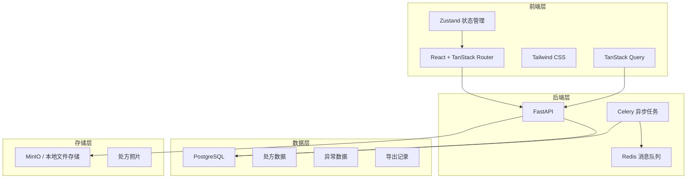
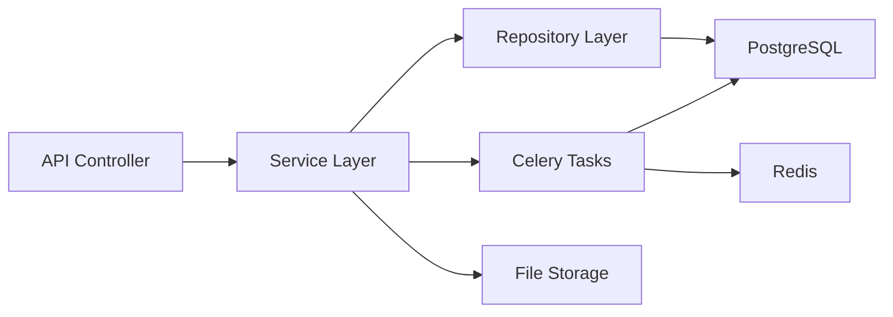
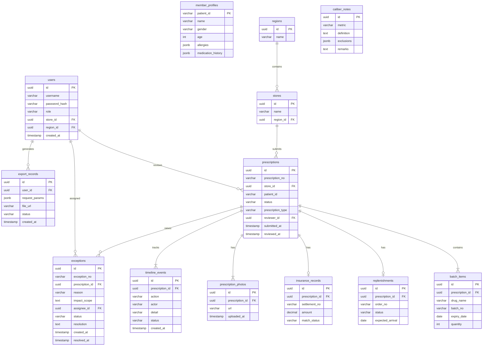

## 1. 架构设计



## 2. 技术说明

- **前端**：React 18 + TanStack Router + Tailwind CSS + Zustand + TanStack Query
- **初始化工具**：Vite（react-ts 模板）
- **后端**：FastAPI + Celery + Redis
- **数据库**：PostgreSQL
- **文件存储**：本地文件存储（处方照片）
- **异步任务**：Celery + Redis（导出报表生成、医保流水匹配）

## 3. 路由定义

| 路由 | 用途 |
|------|------|
| `/login` | 登录页面 |
| `/` | 审核工作台（处方列表） |
| `/prescription/$id` | 处方详情页 |
| `/exceptions` | 异常管理列表 |
| `/exceptions/$id` | 异常详情页 |
| `/export` | 数据导出面板 |
| `/dashboard` | 仪表盘 |

## 4. API 定义

### 4.1 认证

```typescript
interface LoginRequest {
  username: string
  password: string
}

interface LoginResponse {
  access_token: string
  token_type: "bearer"
  user: User
}

interface User {
  id: string
  username: string
  role: "auditor" | "pharmacist" | "manager" | "admin"
  store_id?: string
  region_id?: string
}
```

### 4.2 处方

```typescript
interface Prescription {
  id: string
  prescription_no: string
  store_id: string
  store_name: string
  patient_id: string
  patient_name: string
  status: "pending" | "in_review" | "approved" | "rejected" | "exception"
  prescription_type: "normal" | "chronic" | "pediatric"
  submitted_at: string
  reviewed_at?: string
  reviewer_id?: string
  batch_info: BatchInfo[]
  member_profile: MemberProfile
  replenishment?: Replenishment
  insurance_record?: InsuranceRecord
  photos: PrescriptionPhoto[]
  timeline: TimelineEvent[]
}

interface BatchInfo {
  drug_name: string
  batch_no: string
  expiry_date: string
  quantity: number
}

interface MemberProfile {
  patient_id: string
  name: string
  gender: string
  age: number
  allergies: string[]
  medication_history: string[]
}

interface Replenishment {
  order_no: string
  status: "pending" | "shipped" | "delivered"
  expected_arrival?: string
}

interface InsuranceRecord {
  settlement_no: string
  amount: number
  match_status: "matched" | "unmatched" | "partial"
}

interface PrescriptionPhoto {
  id: string
  url: string
  uploaded_at: string
}

interface TimelineEvent {
  timestamp: string
  action: string
  actor: string
  detail: string
  status: string
}
```

### 4.3 异常

```typescript
interface Exception {
  id: string
  exception_no: string
  prescription_id: string
  prescription_no: string
  reason: string
  impact_scope: string
  assignee_id: string
  assignee_name: string
  status: "open" | "processing" | "resolved" | "closed"
  resolution?: string
  created_at: string
  resolved_at?: string
}
```

### 4.4 导出

```typescript
interface ExportRequest {
  dimensions: ("store" | "date" | "status" | "type")[]
  date_range: { start: string; end: string }
  include_caliber: boolean
  format: "xlsx" | "csv" | "pdf"
}

interface CaliberNote {
  metric: string
  definition: string
  exclusions: string[]
  remarks: string
}
```

## 5. 服务端架构图



## 6. 数据模型

### 6.1 数据模型定义



### 6.2 数据定义语言

```sql
CREATE EXTENSION IF NOT EXISTS "uuid-ossp";

CREATE TABLE regions (
    id UUID PRIMARY KEY DEFAULT uuid_generate_v4(),
    name VARCHAR(100) NOT NULL,
    created_at TIMESTAMP DEFAULT NOW()
);

CREATE TABLE stores (
    id UUID PRIMARY KEY DEFAULT uuid_generate_v4(),
    name VARCHAR(200) NOT NULL,
    region_id UUID REFERENCES regions(id),
    created_at TIMESTAMP DEFAULT NOW()
);

CREATE TABLE users (
    id UUID PRIMARY KEY DEFAULT uuid_generate_v4(),
    username VARCHAR(100) NOT NULL UNIQUE,
    password_hash VARCHAR(255) NOT NULL,
    role VARCHAR(20) NOT NULL CHECK (role IN ('auditor', 'pharmacist', 'manager', 'admin')),
    store_id UUID REFERENCES stores(id),
    region_id UUID REFERENCES regions(id),
    created_at TIMESTAMP DEFAULT NOW()
);

CREATE TABLE member_profiles (
    patient_id VARCHAR(50) PRIMARY KEY,
    name VARCHAR(100) NOT NULL,
    gender VARCHAR(10),
    age INTEGER,
    allergies JSONB DEFAULT '[]',
    medication_history JSONB DEFAULT '[]'
);

CREATE TABLE prescriptions (
    id UUID PRIMARY KEY DEFAULT uuid_generate_v4(),
    prescription_no VARCHAR(50) NOT NULL UNIQUE,
    store_id UUID REFERENCES stores(id),
    patient_id VARCHAR(50) REFERENCES member_profiles(patient_id),
    status VARCHAR(20) NOT NULL DEFAULT 'pending' CHECK (status IN ('pending', 'in_review', 'approved', 'rejected', 'exception')),
    prescription_type VARCHAR(20) NOT NULL DEFAULT 'normal' CHECK (prescription_type IN ('normal', 'chronic', 'pediatric')),
    reviewer_id UUID REFERENCES users(id),
    submitted_at TIMESTAMP DEFAULT NOW(),
    reviewed_at TIMESTAMP
);

CREATE TABLE batch_items (
    id UUID PRIMARY KEY DEFAULT uuid_generate_v4(),
    prescription_id UUID REFERENCES prescriptions(id) ON DELETE CASCADE,
    drug_name VARCHAR(200) NOT NULL,
    batch_no VARCHAR(100) NOT NULL,
    expiry_date DATE NOT NULL,
    quantity INTEGER NOT NULL DEFAULT 1
);

CREATE TABLE replenishments (
    id UUID PRIMARY KEY DEFAULT uuid_generate_v4(),
    prescription_id UUID REFERENCES prescriptions(id) ON DELETE CASCADE,
    order_no VARCHAR(50) NOT NULL UNIQUE,
    status VARCHAR(20) NOT NULL DEFAULT 'pending' CHECK (status IN ('pending', 'shipped', 'delivered')),
    expected_arrival DATE
);

CREATE TABLE insurance_records (
    id UUID PRIMARY KEY DEFAULT uuid_generate_v4(),
    prescription_id UUID REFERENCES prescriptions(id) ON DELETE CASCADE,
    settlement_no VARCHAR(50) NOT NULL UNIQUE,
    amount DECIMAL(10, 2) NOT NULL,
    match_status VARCHAR(20) NOT NULL DEFAULT 'unmatched' CHECK (match_status IN ('matched', 'unmatched', 'partial'))
);

CREATE TABLE prescription_photos (
    id UUID PRIMARY KEY DEFAULT uuid_generate_v4(),
    prescription_id UUID REFERENCES prescriptions(id) ON DELETE CASCADE,
    url VARCHAR(500) NOT NULL,
    uploaded_at TIMESTAMP DEFAULT NOW()
);

CREATE TABLE timeline_events (
    id UUID PRIMARY KEY DEFAULT uuid_generate_v4(),
    prescription_id UUID REFERENCES prescriptions(id) ON DELETE CASCADE,
    action VARCHAR(100) NOT NULL,
    actor VARCHAR(100) NOT NULL,
    detail TEXT,
    status VARCHAR(20) NOT NULL,
    created_at TIMESTAMP DEFAULT NOW()
);

CREATE TABLE exceptions (
    id UUID PRIMARY KEY DEFAULT uuid_generate_v4(),
    exception_no VARCHAR(50) NOT NULL UNIQUE,
    prescription_id UUID REFERENCES prescriptions(id),
    reason TEXT NOT NULL,
    impact_scope TEXT,
    assignee_id UUID REFERENCES users(id),
    status VARCHAR(20) NOT NULL DEFAULT 'open' CHECK (status IN ('open', 'processing', 'resolved', 'closed')),
    resolution TEXT,
    created_at TIMESTAMP DEFAULT NOW(),
    resolved_at TIMESTAMP
);

CREATE TABLE export_records (
    id UUID PRIMARY KEY DEFAULT uuid_generate_v4(),
    user_id UUID REFERENCES users(id),
    request_params JSONB NOT NULL,
    file_url VARCHAR(500),
    status VARCHAR(20) NOT NULL DEFAULT 'processing' CHECK (status IN ('processing', 'completed', 'failed')),
    created_at TIMESTAMP DEFAULT NOW()
);

CREATE TABLE caliber_notes (
    id UUID PRIMARY KEY DEFAULT uuid_generate_v4(),
    metric VARCHAR(100) NOT NULL,
    definition TEXT NOT NULL,
    exclusions JSONB DEFAULT '[]',
    remarks TEXT
);

CREATE INDEX idx_prescriptions_store ON prescriptions(store_id);
CREATE INDEX idx_prescriptions_status ON prescriptions(status);
CREATE INDEX idx_prescriptions_submitted ON prescriptions(submitted_at);
CREATE INDEX idx_prescriptions_patient ON prescriptions(patient_id);
CREATE INDEX idx_exceptions_prescription ON exceptions(prescription_id);
CREATE INDEX idx_exceptions_assignee ON exceptions(assignee_id);
CREATE INDEX idx_exceptions_status ON exceptions(status);
CREATE INDEX idx_timeline_prescription ON timeline_events(prescription_id);
```
