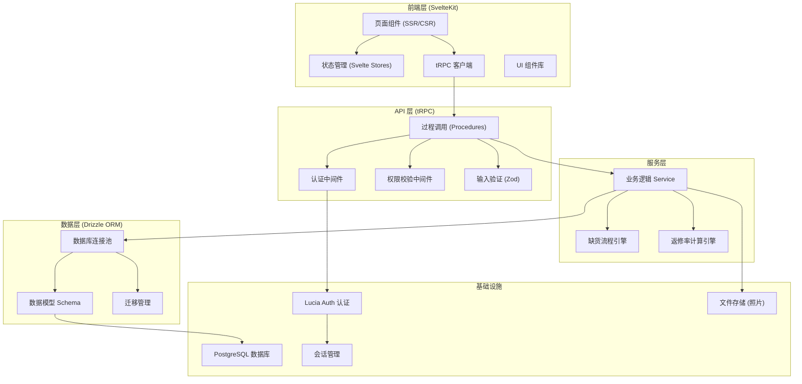
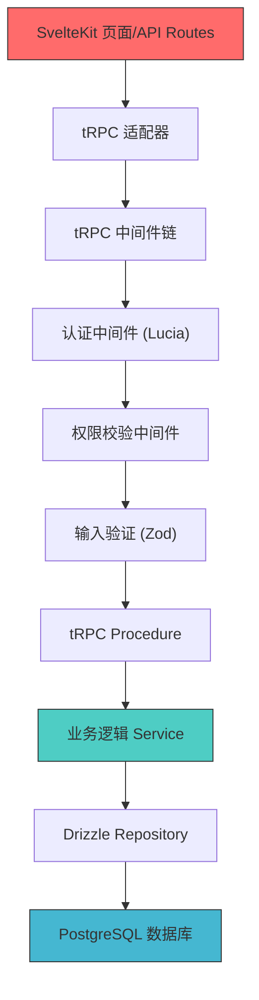
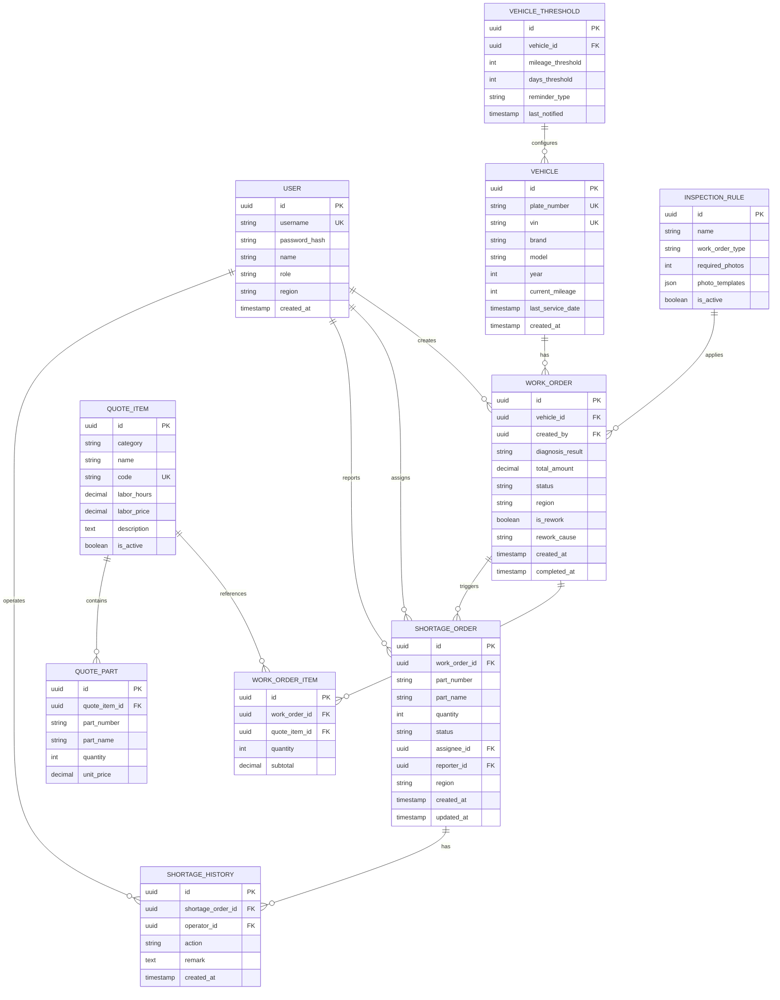

## 1. 架构设计



## 2. 技术栈说明

| 层级 | 技术选择 | 版本 | 用途 |
|------|----------|------|------|
| 前端框架 | SvelteKit | ^2.0 | 全栈框架，支持 SSR/CSR 混合渲染 |
| 语言 | TypeScript | ^5.4 | 类型安全 |
| API 协议 | tRPC | ^11 | 端到端类型安全的 API 调用 |
| ORM | Drizzle ORM | ^0.30 | 类型安全的数据库访问 |
| 数据库 | PostgreSQL | ^16 | 主数据库 |
| 认证 | Lucia Auth | ^3.0 | 无状态会话认证 |
| 验证 | Zod | ^3.22 | Schema 验证 |
| 样式 | Tailwind CSS | ^3.4 | 原子化 CSS |
| 图表 | Chart.js | ^4.4 | 数据可视化 |
| 图标 | Lucide Svelte | ^0.34 | 图标库 |
| 状态管理 | Svelte Stores | 内置 | 客户端状态管理 |

## 3. 路由定义

| 路由路径 | 页面用途 | 权限要求 |
|----------|----------|----------|
| `/login` | 登录页 | 公开 |
| `/` | 仪表盘 | 已登录 |
| `/dictionary/quote-items` | 报价单字典管理 | 管理员 |
| `/dictionary/inspection-rules` | 质检照片规则 | 管理员 |
| `/dictionary/vehicle-thresholds` | 车辆档案阈值 | 管理员 |
| `/workorder/diagnosis` | 诊断与工单处理 | 一线人员/管理员 |
| `/workorder/list` | 工单列表 | 已登录 |
| `/shortage/todo` | 缺货待办中心 | 负责人/管理员 |
| `/shortage/[id]` | 缺货单详情与处理 | 负责人/管理员 |
| `/query` | 综合查询 | 已登录 |
| `/analysis/rework` | 返修率分析 | 质量分析员/管理员 |

## 4. tRPC API 定义

### 4.1 认证模块

```typescript
// 输入类型
type LoginInput = {
  username: string;
  password: string;
};

type RegisterInput = {
  username: string;
  password: string;
  role: 'admin' | 'frontline' | 'manager' | 'analyst';
  name: string;
  region: string;
};

// 输出类型
type User = {
  id: string;
  username: string;
  name: string;
  role: string;
  region: string;
  createdAt: Date;
};

type AuthRoutes = {
  login: (input: LoginInput) => Promise<{ user: User; sessionId: string }>;
  logout: () => Promise<void>;
  getCurrentUser: () => Promise<User | null>;
};
```

### 4.2 报价单字典模块

```typescript
type QuoteItem = {
  id: string;
  category: string;
  name: string;
  code: string;
  laborHours: number;
  laborPrice: number;
  parts: QuotePart[];
  description: string;
  isActive: boolean;
};

type QuotePart = {
  partNumber: string;
  partName: string;
  quantity: number;
  unitPrice: number;
};

type QuoteItemRoutes = {
  list: (filters: { category?: string; keyword?: string; isActive?: boolean }) => Promise<QuoteItem[]>;
  create: (input: Omit<QuoteItem, 'id'>) => Promise<QuoteItem>;
  update: (id: string, input: Partial<Omit<QuoteItem, 'id'>>) => Promise<QuoteItem>;
  delete: (id: string) => Promise<void>;
};
```

### 4.3 缺货处理模块

```typescript
type ShortageStatus = 'pending' | 'processing' | 'replenished' | 'retried' | 'closed';
type ShortageAction = 'report' | 'assign' | 'replenish' | 'retry' | 'close';

type ShortageOrder = {
  id: string;
  workOrderId: string;
  partNumber: string;
  partName: string;
  quantity: number;
  status: ShortageStatus;
  assigneeId: string;
  assignee: User;
  reporterId: string;
  region: string;
  history: ShortageHistoryItem[];
  createdAt: Date;
  updatedAt: Date;
};

type ShortageHistoryItem = {
  id: string;
  action: ShortageAction;
  operatorId: string;
  operatorName: string;
  remark: string;
  timestamp: Date;
};

type ShortageRoutes = {
  list: (filters: { status?: ShortageStatus[]; assigneeId?: string; region?: string; dateRange?: [Date, Date] }) => Promise<ShortageOrder[]>;
  get: (id: string) => Promise<ShortageOrder>;
  create: (input: { workOrderId: string; partNumber: string; partName: string; quantity: number; assigneeId: string }) => Promise<ShortageOrder>;
  process: (id: string, action: ShortageAction, remark: string) => Promise<ShortageOrder>;
};
```

### 4.4 查询与分析模块

```typescript
type QueryFilter = {
  statuses?: string[];
  dateFrom?: Date;
  dateTo?: Date;
  regions?: string[];
  assignees?: string[];
  vehiclePlate?: string;
  keywords?: string;
};

type ReworkAnalysis = {
  period: string;
  totalWorkOrders: number;
  reworkCount: number;
  reworkRate: number;
  byRegion: { region: string; reworkRate: number }[];
  byTechnician: { technician: string; reworkRate: number }[];
  byCause: { cause: string; count: number; percentage: number }[];
  trend: { date: string; reworkRate: number }[];
};

type AnalysisRoutes = {
  queryWorkOrders: (filter: QueryFilter) => Promise<WorkOrder[]>;
  getReworkAnalysis: (filter: QueryFilter) => Promise<ReworkAnalysis>;
  getDashboardStats: () => Promise<{
    todayWorkOrders: number;
    pendingShortages: number;
    monthlyReworkRate: number;
    avgProcessingTime: number;
  }>;
};
```

## 5. 服务器分层架构



## 6. 数据模型

### 6.1 ER 图



### 6.2 DDL 与索引

```sql
-- 用户表
CREATE TABLE users (
    id UUID PRIMARY KEY DEFAULT gen_random_uuid(),
    username VARCHAR(50) UNIQUE NOT NULL,
    password_hash VARCHAR(255) NOT NULL,
    name VARCHAR(100) NOT NULL,
    role VARCHAR(20) NOT NULL CHECK (role IN ('admin', 'frontline', 'manager', 'analyst')),
    region VARCHAR(50),
    created_at TIMESTAMP WITH TIME ZONE DEFAULT CURRENT_TIMESTAMP
);
CREATE INDEX idx_users_role ON users(role);
CREATE INDEX idx_users_region ON users(region);

-- 会话表 (Lucia Auth)
CREATE TABLE sessions (
    id TEXT PRIMARY KEY,
    user_id UUID NOT NULL REFERENCES users(id) ON DELETE CASCADE,
    expires_at TIMESTAMPTZ NOT NULL
);
CREATE INDEX idx_sessions_user_id ON sessions(user_id);

-- 报价项目表
CREATE TABLE quote_items (
    id UUID PRIMARY KEY DEFAULT gen_random_uuid(),
    category VARCHAR(100) NOT NULL,
    name VARCHAR(200) NOT NULL,
    code VARCHAR(50) UNIQUE NOT NULL,
    labor_hours DECIMAL(8,2) DEFAULT 0,
    labor_price DECIMAL(10,2) DEFAULT 0,
    description TEXT,
    is_active BOOLEAN DEFAULT true
);
CREATE INDEX idx_quote_items_category ON quote_items(category);
CREATE INDEX idx_quote_items_is_active ON quote_items(is_active);
CREATE INDEX idx_quote_items_search ON quote_items USING gin (to_tsvector('simple', name || ' ' || code));

-- 配件价格表
CREATE TABLE quote_parts (
    id UUID PRIMARY KEY DEFAULT gen_random_uuid(),
    quote_item_id UUID NOT NULL REFERENCES quote_items(id) ON DELETE CASCADE,
    part_number VARCHAR(100) NOT NULL,
    part_name VARCHAR(200) NOT NULL,
    quantity INT NOT NULL DEFAULT 1,
    unit_price DECIMAL(10,2) NOT NULL
);
CREATE INDEX idx_quote_parts_quote_item ON quote_parts(quote_item_id);
CREATE INDEX idx_quote_parts_number ON quote_parts(part_number);

-- 工单表
CREATE TABLE work_orders (
    id UUID PRIMARY KEY DEFAULT gen_random_uuid(),
    vehicle_id UUID NOT NULL REFERENCES vehicles(id),
    created_by UUID NOT NULL REFERENCES users(id),
    diagnosis_result TEXT,
    total_amount DECIMAL(12,2) DEFAULT 0,
    status VARCHAR(20) NOT NULL DEFAULT 'pending' CHECK (status IN ('pending', 'diagnosed', 'quoted', 'in_progress', 'completed', 'cancelled')),
    region VARCHAR(50),
    is_rework BOOLEAN DEFAULT false,
    rework_cause VARCHAR(500),
    inspection_photos JSONB,
    created_at TIMESTAMP WITH TIME ZONE DEFAULT CURRENT_TIMESTAMP,
    completed_at TIMESTAMP WITH TIME ZONE
);
CREATE INDEX idx_work_orders_status ON work_orders(status);
CREATE INDEX idx_work_orders_region ON work_orders(region);
CREATE INDEX idx_work_orders_created_by ON work_orders(created_by);
CREATE INDEX idx_work_orders_created_at ON work_orders(created_at);
CREATE INDEX idx_work_orders_is_rework ON work_orders(is_rework);
CREATE INDEX idx_work_orders_vehicle ON work_orders(vehicle_id);

-- 缺货单表
CREATE TABLE shortage_orders (
    id UUID PRIMARY KEY DEFAULT gen_random_uuid(),
    work_order_id UUID NOT NULL REFERENCES work_orders(id) ON DELETE CASCADE,
    part_number VARCHAR(100) NOT NULL,
    part_name VARCHAR(200) NOT NULL,
    quantity INT NOT NULL,
    status VARCHAR(20) NOT NULL DEFAULT 'pending' CHECK (status IN ('pending', 'processing', 'replenished', 'retried', 'closed')),
    assignee_id UUID NOT NULL REFERENCES users(id),
    reporter_id UUID NOT NULL REFERENCES users(id),
    region VARCHAR(50),
    created_at TIMESTAMP WITH TIME ZONE DEFAULT CURRENT_TIMESTAMP,
    updated_at TIMESTAMP WITH TIME ZONE DEFAULT CURRENT_TIMESTAMP
);
CREATE INDEX idx_shortage_status ON shortage_orders(status);
CREATE INDEX idx_shortage_assignee ON shortage_orders(assignee_id);
CREATE INDEX idx_shortage_region ON shortage_orders(region);
CREATE INDEX idx_shortage_created_at ON shortage_orders(created_at);

-- 缺货处理历史表
CREATE TABLE shortage_history (
    id UUID PRIMARY KEY DEFAULT gen_random_uuid(),
    shortage_order_id UUID NOT NULL REFERENCES shortage_orders(id) ON DELETE CASCADE,
    operator_id UUID NOT NULL REFERENCES users(id),
    action VARCHAR(20) NOT NULL CHECK (action IN ('report', 'assign', 'replenish', 'retry', 'close')),
    remark TEXT,
    created_at TIMESTAMP WITH TIME ZONE DEFAULT CURRENT_TIMESTAMP
);
CREATE INDEX idx_history_shortage ON shortage_history(shortage_order_id);
CREATE INDEX idx_history_created_at ON shortage_history(created_at);
```

### 6.3 种子数据

```sql
-- 初始化管理员账号 (密码: admin123)
INSERT INTO users (username, password_hash, name, role, region) VALUES
('admin', '$2b$10$...', '系统管理员', 'admin', '总部');

-- 初始化测试人员
INSERT INTO users (username, password_hash, name, role, region) VALUES
('tech01', '$2b$10$...', '张技师', 'frontline', '华东区'),
('tech02', '$2b$10$...', '李技师', 'frontline', '华南区'),
('manager01', '$2b$10$...', '王主管', 'manager', '华东区'),
('analyst01', '$2b$10$...', '陈分析员', 'analyst', '总部');

-- 初始化报价项目
INSERT INTO quote_items (category, name, code, labor_hours, labor_price, description) VALUES
('常规保养', '机油更换', 'MAINT-001', 0.5, 80, '更换发动机机油及机滤'),
('常规保养', '空气滤芯更换', 'MAINT-002', 0.2, 30, '更换发动机空气滤芯'),
('刹车系统', '前刹车片更换', 'BRAKE-001', 1.5, 240, '更换前轴刹车片'),
('刹车系统', '刹车油更换', 'BRAKE-002', 1.0, 160, '更换刹车油并排空'),
('发动机', '火花塞更换', 'ENG-001', 1.0, 160, '更换四缸火花塞'),
('电器系统', '蓄电池更换', 'ELEC-001', 0.5, 80, '更换启动蓄电池');

-- 初始化配件价格
INSERT INTO quote_parts (quote_item_id, part_number, part_name, quantity, unit_price)
SELECT id, 'OIL-001', '全合成机油 5W-40', 5, 120 FROM quote_items WHERE code = 'MAINT-001'
UNION ALL
SELECT id, 'FILT-001', '机油滤清器', 1, 45 FROM quote_items WHERE code = 'MAINT-001'
UNION ALL
SELECT id, 'FILT-002', '空气滤清器', 1, 55 FROM quote_items WHERE code = 'MAINT-002'
UNION ALL
SELECT id, 'BRAKE-101', '前刹车片套装', 1, 680 FROM quote_items WHERE code = 'BRAKE-001'
UNION ALL
SELECT id, 'BRAKE-201', 'DOT4 刹车油', 2, 90 FROM quote_items WHERE code = 'BRAKE-002'
UNION ALL
SELECT id, 'SPARK-001', '铱金火花塞', 4, 110 FROM quote_items WHERE code = 'ENG-001'
UNION ALL
SELECT id, 'BATT-001', '60Ah 蓄电池', 1, 580 FROM quote_items WHERE code = 'ELEC-001';
```
