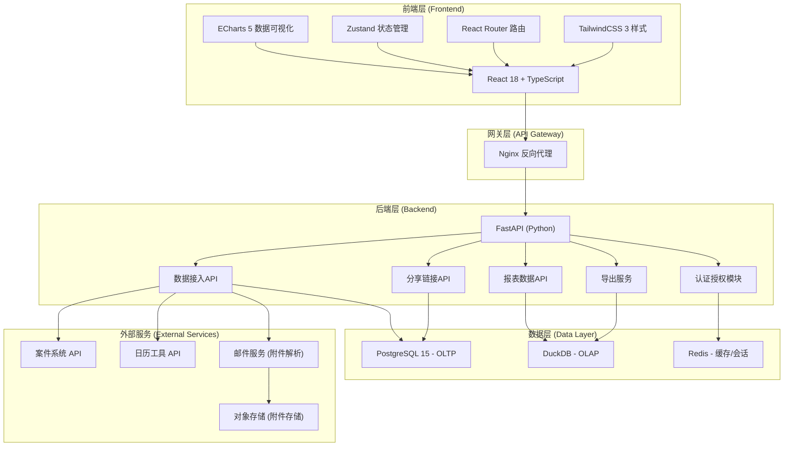
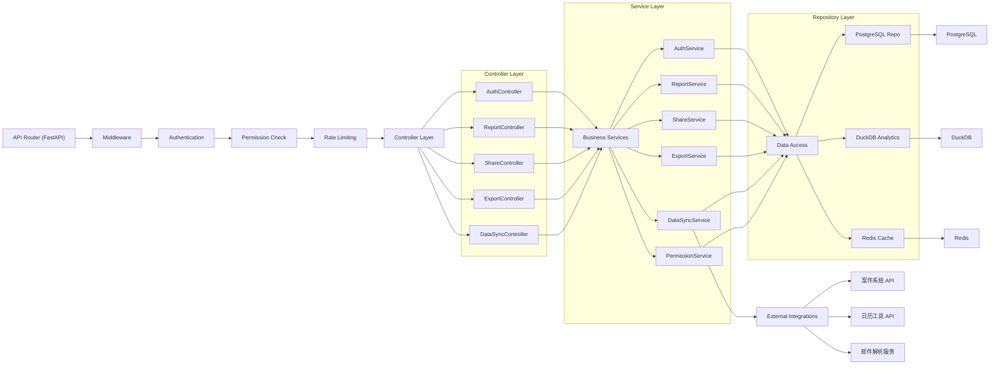
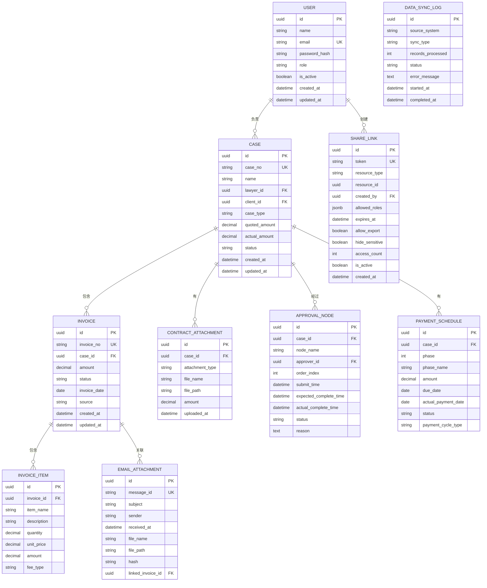

## 1. 架构设计



## 2. 技术描述

### 2.1 前端技术栈
- **框架**: React 18 + TypeScript 5
- **构建工具**: Vite 5
- **路由**: React Router v6
- **状态管理**: Zustand 4
- **样式**: TailwindCSS 3.4
- **数据可视化**: ECharts 5.5
- **图表库**: echarts-for-react
- **图标**: lucide-react
- **HTTP客户端**: Axios
- **UI组件**: shadcn/ui
- **日期处理**: date-fns

### 2.2 后端技术栈
- **框架**: FastAPI 0.110
- **Python版本**: 3.12
- **ORM**: SQLAlchemy 2.0 + Alembic
- **异步驱动**: asyncpg (PostgreSQL)
- **认证**: python-jose[cryptography] + passlib[bcrypt]
- **DuckDB**: duckdb + duckdb-engine
- **数据处理**: pandas 2.2 + polars
- **Excel导出**: openpyxl
- **PDF导出**: reportlab
- **邮件解析**: python-mailparser
- **任务队列**: Celery + Redis

### 2.3 数据存储
- **OLTP数据库**: PostgreSQL 15
  - 存储业务数据、用户权限、分享链接元数据
- **OLAP数据库**: DuckDB 1.0
  - 用于报表分析、聚合查询、多维度数据分析
  - 从PostgreSQL同步数据，支持列式存储和向量化执行
- **缓存**: Redis 7
  - 会话缓存、热点数据缓存、接口限流
- **对象存储**: MinIO / S3
  - 存储邮件附件、合同文件、导出文件

## 3. 路由定义

| 路由 | 页面/模块 | 权限要求 |
|-------|----------|----------|
| `/login` | 登录页 | 公开 |
| `/` | 报表看板页 | 已认证用户 |
| `/dashboard` | 报表看板页 | 已认证用户 |
| `/case/:id` | 案件详情页 | 已认证 + 数据权限 |
| `/share/:token` | 分享链接访问页 | 分享链接校验 |
| `/share/manage` | 分享管理页 | 合伙人/律师 |
| `/export` | 导出中心 | 已认证用户 |
| `/settings` | 个人设置 | 已认证用户 |

## 4. API 定义

### 4.1 认证API

```typescript
// 登录请求
interface LoginRequest {
  email: string;
  password: string;
}

// 登录响应
interface LoginResponse {
  access_token: string;
  token_type: string;
  user: UserInfo;
}

interface UserInfo {
  id: string;
  name: string;
  email: string;
  role: 'partner' | 'lawyer' | 'assistant' | 'client';
  avatar?: string;
}
```

### 4.2 报表数据API

```typescript
// 对账差异趋势
interface ReconciliationTrendRequest {
  start_date: string;
  end_date: string;
  case_ids?: string[];
  lawyer_ids?: string[];
}

interface ReconciliationTrendResponse {
  updated_at: string;
  data: {
    date: string;
    quoted_amount: number;
    actual_amount: number;
    difference: number;
    difference_rate: number;
  }[];
  summary: {
    total_quoted: number;
    total_actual: number;
    total_difference: number;
    avg_difference_rate: number;
  };
}

// 合同附件构成
interface ContractCompositionResponse {
  updated_at: string;
  data: {
    type: string;
    count: number;
    amount: number;
    percentage: number;
    cases: string[];
  }[];
}

// 单据明细
interface InvoiceDetailRequest {
  page: number;
  page_size: number;
  status?: string;
  case_type?: string;
  start_date?: string;
  end_date?: string;
  search?: string;
}

interface InvoiceDetailResponse {
  updated_at: string;
  total: number;
  page: number;
  page_size: number;
  data: {
    id: string;
    invoice_no: string;
    case_name: string;
    case_no: string;
    lawyer_name: string;
    amount: number;
    status: string;
    invoice_date: string;
    source: string;
    has_attachment: boolean;
  }[];
}

// 审批节点异常
interface ApprovalAnomalyResponse {
  updated_at: string;
  data: {
    id: string;
    case_name: string;
    node_name: string;
    approver: string;
    submit_time: string;
    expected_time: string;
    actual_time?: string;
    status: 'pending' | 'delayed' | 'rejected' | 'completed';
    delay_hours?: number;
    reason?: string;
  }[];
}
```

### 4.3 分享链接API

```typescript
interface CreateShareLinkRequest {
  resource_type: 'dashboard' | 'case' | 'invoice';
  resource_id?: string;
  allowed_roles: ('partner' | 'lawyer' | 'assistant' | 'client')[];
  expires_at?: string;
  allow_export: boolean;
  hide_sensitive: boolean;
}

interface ShareLink {
  id: string;
  token: string;
  url: string;
  resource_type: string;
  allowed_roles: string[];
  expires_at?: string;
  created_at: string;
  created_by: string;
  access_count: number;
  is_active: boolean;
}
```

### 4.4 导出API

```typescript
interface ExportRequest {
  type: 'pdf' | 'excel';
  report_type: 'reconciliation' | 'contract' | 'invoice' | 'all';
  filters: {
    start_date: string;
    end_date: string;
    case_ids?: string[];
  };
  include_payment_cycle: boolean;
}

interface ExportResponse {
  task_id: string;
  status: 'processing' | 'completed' | 'failed';
  download_url?: string;
  created_at: string;
}
```

## 5. 服务端架构



## 6. 数据模型

### 6.1 ER图



### 6.2 DDL 语句

```sql
-- 用户表
CREATE TABLE users (
    id UUID PRIMARY KEY DEFAULT gen_random_uuid(),
    name VARCHAR(100) NOT NULL,
    email VARCHAR(255) UNIQUE NOT NULL,
    password_hash VARCHAR(255) NOT NULL,
    role VARCHAR(20) NOT NULL CHECK (role IN ('partner', 'lawyer', 'assistant', 'client')),
    is_active BOOLEAN DEFAULT true,
    created_at TIMESTAMP WITH TIME ZONE DEFAULT CURRENT_TIMESTAMP,
    updated_at TIMESTAMP WITH TIME ZONE DEFAULT CURRENT_TIMESTAMP
);

CREATE INDEX idx_users_role ON users(role);

-- 案件表
CREATE TABLE cases (
    id UUID PRIMARY KEY DEFAULT gen_random_uuid(),
    case_no VARCHAR(50) UNIQUE NOT NULL,
    name VARCHAR(255) NOT NULL,
    lawyer_id UUID REFERENCES users(id),
    client_id UUID REFERENCES users(id),
    case_type VARCHAR(50) NOT NULL,
    quoted_amount DECIMAL(15, 2) NOT NULL DEFAULT 0,
    actual_amount DECIMAL(15, 2) NOT NULL DEFAULT 0,
    status VARCHAR(20) NOT NULL DEFAULT 'active',
    created_at TIMESTAMP WITH TIME ZONE DEFAULT CURRENT_TIMESTAMP,
    updated_at TIMESTAMP WITH TIME ZONE DEFAULT CURRENT_TIMESTAMP
);

CREATE INDEX idx_cases_lawyer ON cases(lawyer_id);
CREATE INDEX idx_cases_client ON cases(client_id);
CREATE INDEX idx_cases_status ON cases(status);
CREATE INDEX idx_cases_type ON cases(case_type);

-- 单据表
CREATE TABLE invoices (
    id UUID PRIMARY KEY DEFAULT gen_random_uuid(),
    invoice_no VARCHAR(50) UNIQUE NOT NULL,
    case_id UUID REFERENCES cases(id) ON DELETE CASCADE,
    amount DECIMAL(15, 2) NOT NULL,
    status VARCHAR(20) NOT NULL DEFAULT 'pending',
    invoice_date DATE NOT NULL,
    source VARCHAR(50) NOT NULL,
    created_at TIMESTAMP WITH TIME ZONE DEFAULT CURRENT_TIMESTAMP,
    updated_at TIMESTAMP WITH TIME ZONE DEFAULT CURRENT_TIMESTAMP
);

CREATE INDEX idx_invoices_case ON invoices(case_id);
CREATE INDEX idx_invoices_status ON invoices(status);
CREATE INDEX idx_invoices_date ON invoices(invoice_date);

-- 单据明细表
CREATE TABLE invoice_items (
    id UUID PRIMARY KEY DEFAULT gen_random_uuid(),
    invoice_id UUID REFERENCES invoices(id) ON DELETE CASCADE,
    item_name VARCHAR(255) NOT NULL,
    description TEXT,
    quantity DECIMAL(10, 2) NOT NULL DEFAULT 1,
    unit_price DECIMAL(15, 2) NOT NULL,
    amount DECIMAL(15, 2) NOT NULL,
    fee_type VARCHAR(50) NOT NULL
);

CREATE INDEX idx_invoice_items_invoice ON invoice_items(invoice_id);
CREATE INDEX idx_invoice_items_fee_type ON invoice_items(fee_type);

-- 合同附件表
CREATE TABLE contract_attachments (
    id UUID PRIMARY KEY DEFAULT gen_random_uuid(),
    case_id UUID REFERENCES cases(id) ON DELETE CASCADE,
    attachment_type VARCHAR(50) NOT NULL,
    file_name VARCHAR(255) NOT NULL,
    file_path VARCHAR(500) NOT NULL,
    amount DECIMAL(15, 2) NOT NULL DEFAULT 0,
    uploaded_at TIMESTAMP WITH TIME ZONE DEFAULT CURRENT_TIMESTAMP
);

CREATE INDEX idx_attachments_case ON contract_attachments(case_id);
CREATE INDEX idx_attachments_type ON contract_attachments(attachment_type);

-- 审批节点表
CREATE TABLE approval_nodes (
    id UUID PRIMARY KEY DEFAULT gen_random_uuid(),
    case_id UUID REFERENCES cases(id) ON DELETE CASCADE,
    node_name VARCHAR(100) NOT NULL,
    approver_id UUID REFERENCES users(id),
    order_index INT NOT NULL,
    submit_time TIMESTAMP WITH TIME ZONE NOT NULL,
    expected_complete_time TIMESTAMP WITH TIME ZONE NOT NULL,
    actual_complete_time TIMESTAMP WITH TIME ZONE,
    status VARCHAR(20) NOT NULL DEFAULT 'pending',
    reason TEXT
);

CREATE INDEX idx_approval_case ON approval_nodes(case_id);
CREATE INDEX idx_approval_status ON approval_nodes(status);
CREATE INDEX idx_approval_expected ON approval_nodes(expected_complete_time);

-- 回款计划表
CREATE TABLE payment_schedules (
    id UUID PRIMARY KEY DEFAULT gen_random_uuid(),
    case_id UUID REFERENCES cases(id) ON DELETE CASCADE,
    phase INT NOT NULL,
    phase_name VARCHAR(100) NOT NULL,
    amount DECIMAL(15, 2) NOT NULL,
    due_date DATE NOT NULL,
    actual_payment_date DATE,
    status VARCHAR(20) NOT NULL DEFAULT 'pending',
    payment_cycle_type VARCHAR(50) NOT NULL
);

CREATE INDEX idx_payment_case ON payment_schedules(case_id);
CREATE INDEX idx_payment_due ON payment_schedules(due_date);
CREATE INDEX idx_payment_status ON payment_schedules(status);

-- 邮件附件表
CREATE TABLE email_attachments (
    id UUID PRIMARY KEY DEFAULT gen_random_uuid(),
    message_id VARCHAR(255) UNIQUE NOT NULL,
    subject VARCHAR(500),
    sender VARCHAR(255),
    received_at TIMESTAMP WITH TIME ZONE NOT NULL,
    file_name VARCHAR(255) NOT NULL,
    file_path VARCHAR(500) NOT NULL,
    hash VARCHAR(64),
    linked_invoice_id UUID REFERENCES invoices(id)
);

CREATE INDEX idx_email_hash ON email_attachments(hash);
CREATE INDEX idx_email_linked ON email_attachments(linked_invoice_id);
CREATE INDEX idx_email_received ON email_attachments(received_at);

-- 分享链接表
CREATE TABLE share_links (
    id UUID PRIMARY KEY DEFAULT gen_random_uuid(),
    token VARCHAR(64) UNIQUE NOT NULL,
    resource_type VARCHAR(50) NOT NULL,
    resource_id UUID,
    created_by UUID REFERENCES users(id),
    allowed_roles JSONB NOT NULL,
    expires_at TIMESTAMP WITH TIME ZONE,
    allow_export BOOLEAN DEFAULT false,
    hide_sensitive BOOLEAN DEFAULT true,
    access_count INT NOT NULL DEFAULT 0,
    is_active BOOLEAN DEFAULT true,
    created_at TIMESTAMP WITH TIME ZONE DEFAULT CURRENT_TIMESTAMP
);

CREATE INDEX idx_share_token ON share_links(token);
CREATE INDEX idx_share_created_by ON share_links(created_by);
CREATE INDEX idx_share_expires ON share_links(expires_at);

-- 数据同步日志表
CREATE TABLE data_sync_logs (
    id UUID PRIMARY KEY DEFAULT gen_random_uuid(),
    source_system VARCHAR(100) NOT NULL,
    sync_type VARCHAR(50) NOT NULL,
    records_processed INT NOT NULL DEFAULT 0,
    status VARCHAR(20) NOT NULL,
    error_message TEXT,
    started_at TIMESTAMP WITH TIME ZONE DEFAULT CURRENT_TIMESTAMP,
    completed_at TIMESTAMP WITH TIME ZONE
);

CREATE INDEX idx_sync_source ON data_sync_logs(source_system);
CREATE INDEX idx_sync_status ON data_sync_logs(status);
CREATE INDEX idx_sync_started ON data_sync_logs(started_at);
```

### 6.3 DuckDB 分析视图

```sql
-- 对账差异趋势视图
CREATE VIEW v_reconciliation_trend AS
SELECT 
    DATE_TRUNC('day', i.invoice_date) AS report_date,
    SUM(c.quoted_amount) AS total_quoted,
    SUM(c.actual_amount) AS total_actual,
    SUM(c.actual_amount - c.quoted_amount) AS total_difference,
    CASE WHEN SUM(c.quoted_amount) > 0 
         THEN ROUND(SUM(c.actual_amount - c.quoted_amount) / SUM(c.quoted_amount) * 100, 2) 
         ELSE 0 END AS difference_rate,
    COUNT(DISTINCT c.id) AS case_count
FROM cases c
LEFT JOIN invoices i ON c.id = i.case_id
WHERE c.status != 'cancelled'
GROUP BY DATE_TRUNC('day', i.invoice_date)
ORDER BY report_date;

-- 合同附件构成视图
CREATE VIEW v_contract_composition AS
SELECT 
    ca.attachment_type,
    COUNT(*) AS count,
    SUM(ca.amount) AS total_amount,
    ROUND(COUNT(*) * 100.0 / (SELECT COUNT(*) FROM contract_attachments), 2) AS percentage,
    ARRAY_AGG(DISTINCT c.case_no) AS case_numbers
FROM contract_attachments ca
JOIN cases c ON ca.case_id = c.id
GROUP BY ca.attachment_type
ORDER BY count DESC;

-- 审批异常分析视图
CREATE VIEW v_approval_anomalies AS
SELECT 
    an.id,
    c.case_no,
    c.name AS case_name,
    an.node_name,
    u.name AS approver_name,
    an.submit_time,
    an.expected_complete_time,
    an.actual_complete_time,
    an.status,
    CASE 
        WHEN an.status = 'pending' AND an.expected_complete_time < NOW() 
        THEN EXTRACT(EPOCH FROM (NOW() - an.expected_complete_time)) / 3600
        WHEN an.status != 'pending' AND an.actual_complete_time > an.expected_complete_time
        THEN EXTRACT(EPOCH FROM (an.actual_complete_time - an.expected_complete_time)) / 3600
        ELSE 0 END AS delay_hours,
    an.reason
FROM approval_nodes an
JOIN cases c ON an.case_id = c.id
LEFT JOIN users u ON an.approver_id = u.id
WHERE an.status = 'rejected' 
   OR (an.status = 'pending' AND an.expected_complete_time < NOW())
   OR (an.actual_complete_time IS NOT NULL AND an.actual_complete_time > an.expected_complete_time)
ORDER BY an.submit_time DESC;
```
