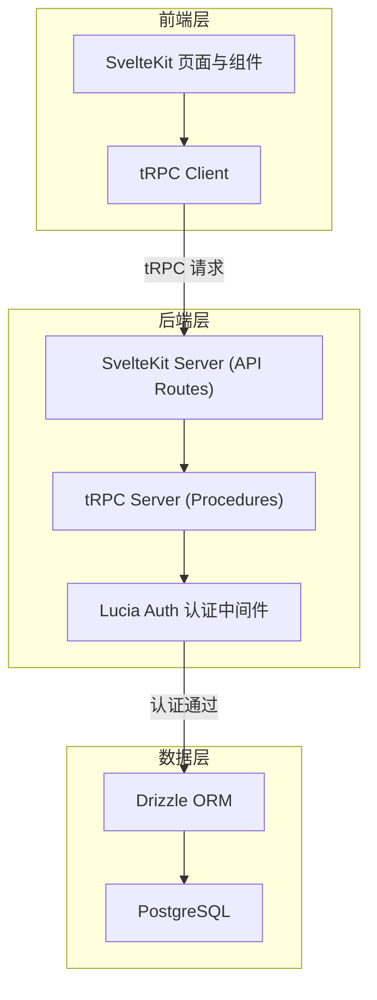
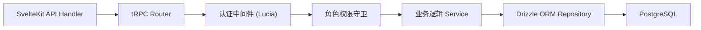
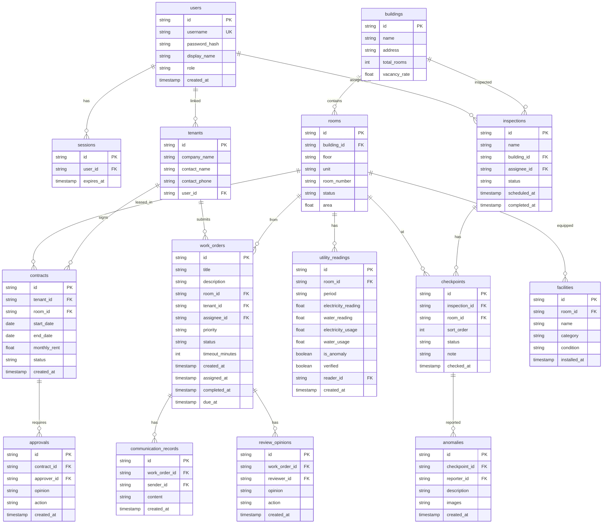

## 1. 架构设计



## 2. 技术说明

- **前端**：SvelteKit + TailwindCSS 4 + Svelte 5 (Runes)
- **后端**：SvelteKit Server-Side API Routes（无独立 Express，tRPC 集成在 SvelteKit 中）
- **API 层**：tRPC（类型安全端到端，SvelteKit API Route 适配器）
- **ORM**：Drizzle ORM（类型安全 SQL 查询、迁移管理）
- **数据库**：PostgreSQL 16
- **认证**：Lucia Auth v3（Session-based 认证、角色权限、SvelteKit 中间件）
- **包管理器**：pnpm

## 3. 路由定义

| 路由 | 用途 | 权限角色 |
|------|------|----------|
| `/login` | 登录页面 | 公开 |
| `/` | 工作台首页 | 所有已登录角色 |
| `/inspection` | 巡检路线列表 | 管理员、巡检员 |
| `/inspection/[id]` | 巡检路线详情 | 管理员、巡检员 |
| `/contracts` | 租户合同列表 | 管理员、财务人员 |
| `/contracts/[id]` | 合同详情与审批 | 管理员、财务人员 |
| `/utilities` | 水电读数核对 | 管理员、财务人员 |
| `/work-orders` | 工单列表 | 所有角色（视角不同） |
| `/work-orders/[id]` | 工单详情 | 所有角色 |
| `/approvals` | 审批中心 | 管理员、财务人员 |
| `/archives` | 房屋档案 | 管理员 |
| `/archives/[buildingId]/[roomId]` | 房间详情 | 管理员 |
| `/dashboard` | 报修响应趋势看板 | 管理员 |

## 4. API 定义

### 4.1 认证相关

```typescript
type AuthRouter = {
  login: Procedure<{ username: string; password: string }, { user: User; session: Session }>
  logout: Procedure<void, { success: boolean }>
  getSession: Procedure<void, { user: User | null; session: Session | null }>
}
```

### 4.2 巡检路线

```typescript
type InspectionRouter = {
  list: Procedure<{ status?: string; assigneeId?: string }, InspectionRoute[]>
  getById: Procedure<{ id: string }, InspectionRouteDetail>
  create: Procedure<{ name: string; buildingId: string; checkpoints: string[] }, InspectionRoute>
  updateCheckpoint: Procedure<{ routeId: string; checkpointId: string; status: string; note?: string }, Checkpoint>
  reportAnomaly: Procedure<{ routeId: string; checkpointId: string; description: string; images?: string[] }, Anomaly>
}
```

### 4.3 租户合同

```typescript
type ContractRouter = {
  list: Procedure<{ status?: string; keyword?: string }, Contract[]>
  getById: Procedure<{ id: string }, ContractDetail>
  create: Procedure<ContractInput, Contract>
  submitApproval: Procedure<{ contractId: string; opinion: string }, Approval>
  approve: Procedure<{ approvalId: string; opinion: string; action: 'approve' | 'reject' }, Approval>
}
```

### 4.4 水电读数

```typescript
type UtilityRouter = {
  list: Procedure<{ period?: string; buildingId?: string }, UtilityReading[]>
  create: Procedure<{ roomId: string; electricity: number; water: number; period: string }, UtilityReading>
  verify: Procedure<{ readingId: string; verified: boolean; note?: string }, UtilityReading>
}
```

### 4.5 工单管理

```typescript
type WorkOrderRouter = {
  list: Procedure<{ status?: string; priority?: string; overdue?: boolean }, WorkOrderListItem[]>
  getById: Procedure<{ id: string }, WorkOrderDetail>
  create: Procedure<{ title: string; description: string; roomId: string; priority: string; tenantId: string }, WorkOrder>
  assign: Procedure<{ workOrderId: string; assigneeId: string }, WorkOrder>
  addCommunication: Procedure<{ workOrderId: string; content: string }, CommunicationRecord>
  submitReview: Procedure<{ workOrderId: string; opinion: string; action: 'confirm' | 'return' }, ReviewOpinion>
  updateStatus: Procedure<{ workOrderId: string; status: string }, WorkOrder>
}
```

### 4.6 房屋档案

```typescript
type ArchiveRouter = {
  listBuildings: Procedure<void, Building[]>
  getBuildingDetail: Procedure<{ id: string }, BuildingDetail>
  getRoomDetail: Procedure<{ buildingId: string; roomId: string }, RoomDetail>
  updateRoom: Procedure<{ roomId: string; data: Partial<Room> }, Room>
}
```

### 4.7 趋势看板

```typescript
type DashboardRouter = {
  getResponseTrend: Procedure<{ range: 'day' | 'week' | 'month'; startDate: string; endDate: string }, TrendData[]>
  getOverdueRate: Procedure<{ groupBy: 'area' | 'type' }, OverdueRateData[]>
  getCompletionRate: Procedure<void, CompletionRateData>
}
```

## 5. 服务端架构



## 6. 数据模型

### 6.1 数据模型定义



### 6.2 数据定义语言

```sql
CREATE TABLE users (
  id TEXT PRIMARY KEY DEFAULT gen_random_uuid(),
  username TEXT UNIQUE NOT NULL,
  password_hash TEXT NOT NULL,
  display_name TEXT NOT NULL,
  role TEXT NOT NULL CHECK (role IN ('admin', 'inspector', 'maintenance', 'finance', 'tenant')),
  created_at TIMESTAMPTZ NOT NULL DEFAULT NOW()
);

CREATE TABLE sessions (
  id TEXT PRIMARY KEY,
  user_id TEXT NOT NULL REFERENCES users(id) ON DELETE CASCADE,
  expires_at TIMESTAMPTZ NOT NULL
);

CREATE TABLE buildings (
  id TEXT PRIMARY KEY DEFAULT gen_random_uuid(),
  name TEXT NOT NULL,
  address TEXT NOT NULL,
  total_rooms INTEGER NOT NULL DEFAULT 0,
  vacancy_rate REAL NOT NULL DEFAULT 0
);

CREATE TABLE rooms (
  id TEXT PRIMARY KEY DEFAULT gen_random_uuid(),
  building_id TEXT NOT NULL REFERENCES buildings(id) ON DELETE CASCADE,
  floor TEXT NOT NULL,
  unit TEXT NOT NULL,
  room_number TEXT NOT NULL,
  status TEXT NOT NULL CHECK (status IN ('vacant', 'occupied', 'maintenance')) DEFAULT 'vacant',
  area REAL NOT NULL DEFAULT 0
);

CREATE TABLE tenants (
  id TEXT PRIMARY KEY DEFAULT gen_random_uuid(),
  company_name TEXT NOT NULL,
  contact_name TEXT NOT NULL,
  contact_phone TEXT NOT NULL,
  user_id TEXT REFERENCES users(id) ON DELETE SET NULL
);

CREATE TABLE contracts (
  id TEXT PRIMARY KEY DEFAULT gen_random_uuid(),
  tenant_id TEXT NOT NULL REFERENCES tenants(id),
  room_id TEXT NOT NULL REFERENCES rooms(id),
  start_date DATE NOT NULL,
  end_date DATE NOT NULL,
  monthly_rent REAL NOT NULL,
  status TEXT NOT NULL CHECK (status IN ('pending', 'active', 'expired', 'terminated')) DEFAULT 'pending',
  created_at TIMESTAMPTZ NOT NULL DEFAULT NOW()
);

CREATE TABLE inspections (
  id TEXT PRIMARY KEY DEFAULT gen_random_uuid(),
  name TEXT NOT NULL,
  building_id TEXT NOT NULL REFERENCES buildings(id),
  assignee_id TEXT NOT NULL REFERENCES users(id),
  status TEXT NOT NULL CHECK (status IN ('pending', 'in_progress', 'completed', 'cancelled')) DEFAULT 'pending',
  scheduled_at TIMESTAMPTZ NOT NULL,
  completed_at TIMESTAMPTZ
);

CREATE TABLE checkpoints (
  id TEXT PRIMARY KEY DEFAULT gen_random_uuid(),
  inspection_id TEXT NOT NULL REFERENCES inspections(id) ON DELETE CASCADE,
  room_id TEXT NOT NULL REFERENCES rooms(id),
  sort_order INTEGER NOT NULL DEFAULT 0,
  status TEXT NOT NULL CHECK (status IN ('pending', 'checked', 'anomaly')) DEFAULT 'pending',
  note TEXT,
  checked_at TIMESTAMPTZ
);

CREATE TABLE anomalies (
  id TEXT PRIMARY KEY DEFAULT gen_random_uuid(),
  checkpoint_id TEXT NOT NULL REFERENCES checkpoints(id) ON DELETE CASCADE,
  reporter_id TEXT NOT NULL REFERENCES users(id),
  description TEXT NOT NULL,
  images TEXT,
  created_at TIMESTAMPTZ NOT NULL DEFAULT NOW()
);

CREATE TABLE utility_readings (
  id TEXT PRIMARY KEY DEFAULT gen_random_uuid(),
  room_id TEXT NOT NULL REFERENCES rooms(id),
  period TEXT NOT NULL,
  electricity_reading REAL NOT NULL DEFAULT 0,
  water_reading REAL NOT NULL DEFAULT 0,
  electricity_usage REAL NOT NULL DEFAULT 0,
  water_usage REAL NOT NULL DEFAULT 0,
  is_anomaly BOOLEAN NOT NULL DEFAULT FALSE,
  verified BOOLEAN NOT NULL DEFAULT FALSE,
  reader_id TEXT NOT NULL REFERENCES users(id),
  created_at TIMESTAMPTZ NOT NULL DEFAULT NOW()
);

CREATE TABLE work_orders (
  id TEXT PRIMARY KEY DEFAULT gen_random_uuid(),
  title TEXT NOT NULL,
  description TEXT NOT NULL,
  room_id TEXT NOT NULL REFERENCES rooms(id),
  tenant_id TEXT NOT NULL REFERENCES tenants(id),
  assignee_id TEXT REFERENCES users(id),
  priority TEXT NOT NULL CHECK (priority IN ('low', 'medium', 'high', 'urgent')) DEFAULT 'medium',
  status TEXT NOT NULL CHECK (status IN ('submitted', 'assigned', 'in_progress', 'completed', 'reviewing', 'closed')) DEFAULT 'submitted',
  timeout_minutes INTEGER NOT NULL DEFAULT 480,
  created_at TIMESTAMPTZ NOT NULL DEFAULT NOW(),
  assigned_at TIMESTAMPTZ,
  completed_at TIMESTAMPTZ,
  due_at TIMESTAMPTZ
);

CREATE TABLE communication_records (
  id TEXT PRIMARY KEY DEFAULT gen_random_uuid(),
  work_order_id TEXT NOT NULL REFERENCES work_orders(id) ON DELETE CASCADE,
  sender_id TEXT NOT NULL REFERENCES users(id),
  content TEXT NOT NULL,
  created_at TIMESTAMPTZ NOT NULL DEFAULT NOW()
);

CREATE TABLE review_opinions (
  id TEXT PRIMARY KEY DEFAULT gen_random_uuid(),
  work_order_id TEXT NOT NULL REFERENCES work_orders(id) ON DELETE CASCADE,
  reviewer_id TEXT NOT NULL REFERENCES users(id),
  opinion TEXT NOT NULL,
  action TEXT NOT NULL CHECK (action IN ('confirm', 'return')) DEFAULT 'confirm',
  created_at TIMESTAMPTZ NOT NULL DEFAULT NOW()
);

CREATE TABLE approvals (
  id TEXT PRIMARY KEY DEFAULT gen_random_uuid(),
  contract_id TEXT NOT NULL REFERENCES contracts(id) ON DELETE CASCADE,
  approver_id TEXT NOT NULL REFERENCES users(id),
  opinion TEXT NOT NULL,
  action TEXT NOT NULL CHECK (action IN ('approve', 'reject')) DEFAULT 'approve',
  created_at TIMESTAMPTZ NOT NULL DEFAULT NOW()
);

CREATE TABLE facilities (
  id TEXT PRIMARY KEY DEFAULT gen_random_uuid(),
  room_id TEXT NOT NULL REFERENCES rooms(id) ON DELETE CASCADE,
  name TEXT NOT NULL,
  category TEXT NOT NULL,
  condition TEXT NOT NULL CHECK (condition IN ('good', 'fair', 'poor', 'broken')) DEFAULT 'good',
  installed_at TIMESTAMPTZ
);

CREATE INDEX idx_rooms_building ON rooms(building_id);
CREATE INDEX idx_contracts_tenant ON contracts(tenant_id);
CREATE INDEX idx_contracts_room ON contracts(room_id);
CREATE INDEX idx_contracts_status ON contracts(status);
CREATE INDEX idx_inspections_building ON inspections(building_id);
CREATE INDEX idx_inspections_assignee ON inspections(assignee_id);
CREATE INDEX idx_checkpoints_inspection ON checkpoints(inspection_id);
CREATE INDEX idx_work_orders_status ON work_orders(status);
CREATE INDEX idx_work_orders_assignee ON work_orders(assignee_id);
CREATE INDEX idx_work_orders_due ON work_orders(due_at);
CREATE INDEX idx_communication_work_order ON communication_records(work_order_id);
CREATE INDEX idx_review_work_order ON review_opinions(work_order_id);
CREATE INDEX idx_approvals_contract ON approvals(contract_id);
CREATE INDEX idx_utility_room_period ON utility_readings(room_id, period);
CREATE INDEX idx_sessions_user ON sessions(user_id);
```
