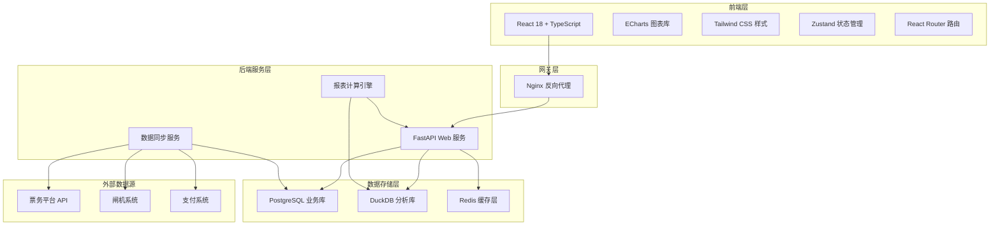
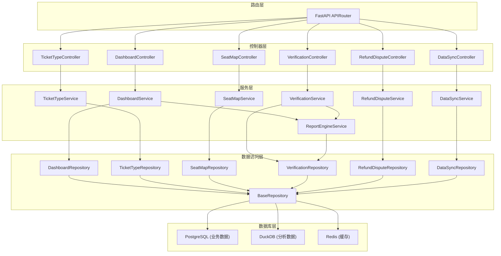
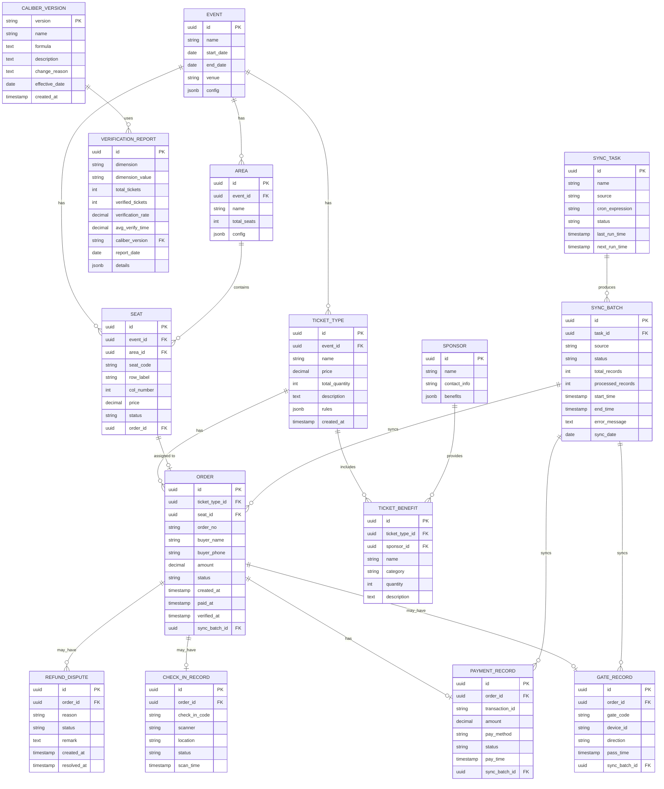

## 1. 架构设计



## 2. 技术描述

### 2.1 前端技术栈
- **框架**: React 18.2 + TypeScript 5
- **构建工具**: Vite 5
- **图表库**: ECharts 5.4
- **样式**: Tailwind CSS 3.4
- **状态管理**: Zustand 4.5
- **路由**: React Router Dom 6.22
- **UI组件**: Lucide React (图标库)
- **HTTP客户端**: Axios

### 2.2 后端技术栈
- **Web框架**: FastAPI 0.109 + Python 3.11
- **异步处理**: asyncio + aiohttp
- **数据库驱动**: asyncpg (PostgreSQL), duckdb (DuckDB)
- **ORM**: SQLAlchemy 2.0
- **缓存**: Redis + redis-py
- **数据验证**: Pydantic 2.6
- **任务调度**: APScheduler

### 2.3 数据库选型
- **PostgreSQL 15**: 存储业务数据（订单、用户、票种、权益等），支持事务和复杂查询
- **DuckDB 0.10**: 列式分析数据库，用于快速聚合计算和报表生成，支持直接查询Parquet文件
- **Redis 7**: 缓存热点数据和实时指标，提升查询性能

### 2.4 部署架构
- **容器化**: Docker + Docker Compose
- **反向代理**: Nginx
- **进程管理**: Uvicorn (ASGI server)

## 3. 路由定义

| 路由路径 | 页面名称 | 说明 |
|----------|----------|------|
| / | 综合看板首页 | KPI概览、赞助权益趋势、同环比对比 |
| /ticket-types | 票种分析页 | 票种规则对比、订单趋势、销售漏斗 |
| /seat-map | 座位图分析页 | 可视化座位图、区域热力图、座位明细 |
| /verification | 核销效率页 | 多维度核销对比、口径版本管理 |
| /refund-dispute | 退票争议页 | 争议工单、样本明细、口径解释 |
| /data-sync | 数据同步页 | 取数链路监控、批次管理、任务监控 |
| /login | 登录页 | 用户登录入口 |

## 4. API 定义

### 4.1 TypeScript 类型定义

```typescript
// 通用响应结构
interface ApiResponse<T> {
  code: number;
  message: string;
  data: T;
}

// KPI 指标
interface KPIData {
  id: string;
  name: string;
  value: number;
  unit: string;
  trend: 'up' | 'down' | 'stable';
  changePercent: number;
  yoyChange: number;
  momChange: number;
}

// 赞助权益数据
interface SponsorshipRight {
  id: string;
  name: string;
  sponsor: string;
  totalQuantity: number;
  usedQuantity: number;
  usageRate: number;
  category: string;
}

// 趋势数据点
interface TrendDataPoint {
  date: string;
  value: number;
  seriesName: string;
}

// 票种数据
interface TicketType {
  id: string;
  name: string;
  price: number;
  benefits: string[];
  salesVolume: number;
  revenue: number;
  verificationRate: number;
}

// 订单数据
interface OrderData {
  orderId: string;
  ticketTypeId: string;
  ticketTypeName: string;
  buyerName: string;
  buyerPhone: string;
  amount: number;
  status: 'pending' | 'paid' | 'used' | 'refunded' | 'disputed';
  createTime: string;
  verifyTime?: string;
  seatId?: string;
  checkInCode?: string;
}

// 座位数据
interface SeatData {
  seatId: string;
  row: string;
  col: number;
  area: string;
  status: 'available' | 'sold' | 'reserved' | 'used';
  price: number;
  orderId?: string;
}

// 区域数据
interface AreaData {
  areaId: string;
  areaName: string;
  totalSeats: number;
  soldSeats: number;
  avgPrice: number;
  revenue: number;
}

// 核销效率数据
interface VerificationData {
  dimension: string;
  dimensionValue: string;
  totalTickets: number;
  verifiedTickets: number;
  verificationRate: number;
  avgVerifyTime: number;
  caliberVersion: string;
}

// 口径版本
interface CaliberVersion {
  version: string;
  name: string;
  formula: string;
  description: string;
  effectiveDate: string;
  changeReason: string;
}

// 退票争议工单
interface RefundDispute {
  disputeId: string;
  orderId: string;
  buyerName: string;
  amount: number;
  reason: string;
  status: 'pending' | 'processing' | 'resolved' | 'rejected';
  createTime: string;
  checkInCode?: string;
  hasGateRecord: boolean;
  hasPaymentRecord: boolean;
}

// 样本明细
interface SampleDetail {
  orderId: string;
  paymentRecord: PaymentRecord;
  checkInRecord: CheckInRecord;
  gateRecord: GateRecord;
}

interface PaymentRecord {
  transactionId: string;
  amount: number;
  payTime: string;
  payMethod: string;
  status: string;
}

interface CheckInRecord {
  checkInCode: string;
  scanTime: string;
  scanner: string;
  location: string;
  status: string;
}

interface GateRecord {
  recordId: string;
  gateCode: string;
  passTime: string;
  direction: 'in' | 'out';
  deviceId: string;
}

// 同步批次
interface SyncBatch {
  batchId: string;
  source: 'ticket_platform' | 'gate_record' | 'payment_flow';
  status: 'pending' | 'running' | 'success' | 'failed';
  totalRecords: number;
  processedRecords: number;
  startTime: string;
  endTime?: string;
  errorMessage?: string;
  syncDate: string;
}

// 同步任务
interface SyncTask {
  taskId: string;
  name: string;
  source: string;
  cronExpression: string;
  lastRunTime?: string;
  nextRunTime: string;
  status: 'active' | 'paused' | 'error';
}
```

### 4.2 API 端点

| 方法 | 路径 | 描述 | 请求参数 | 响应 |
|------|------|------|----------|------|
| GET | /api/dashboard/kpi | 获取KPI数据 | timeRange | `ApiResponse<KPIData[]>` |
| GET | /api/dashboard/trend | 获取赞助权益趋势 | startDate, endDate, category | `ApiResponse<TrendDataPoint[]>` |
| GET | /api/dashboard/yoy-mom | 获取同环比数据 | metrics, compareType | `ApiResponse<any>` |
| GET | /api/ticket-types | 获取票种列表 | - | `ApiResponse<TicketType[]>` |
| GET | /api/ticket-types/{id} | 获取票种详情 | id | `ApiResponse<TicketType>` |
| GET | /api/orders/trend | 获取订单趋势 | startDate, endDate, granularity | `ApiResponse<TrendDataPoint[]>` |
| GET | /api/orders/funnel | 获取销售漏斗 | - | `ApiResponse<any>` |
| GET | /api/seat-map/layout | 获取座位图布局 | eventId | `ApiResponse<SeatData[]>` |
| GET | /api/seat-map/areas | 获取区域数据 | eventId | `ApiResponse<AreaData[]>` |
| GET | /api/seat-map/seats/{seatId} | 获取座位明细 | seatId | `ApiResponse<SeatData & { order?: OrderData }>` |
| GET | /api/verification/efficiency | 获取核销效率 | dimension, startDate, endDate, caliberVersion | `ApiResponse<VerificationData[]>` |
| GET | /api/verification/calibers | 获取口径版本列表 | - | `ApiResponse<CaliberVersion[]>` |
| GET | /api/refund-disputes | 获取争议列表 | status, page, pageSize | `ApiResponse<{ list: RefundDispute[], total: number }>` |
| GET | /api/refund-disputes/{disputeId} | 获取争议详情 | disputeId | `ApiResponse<RefundDispute>` |
| GET | /api/refund-disputes/{disputeId}/sample | 获取样本明细 | disputeId | `ApiResponse<SampleDetail>` |
| GET | /api/checkin-code/caliber | 获取签到码口径说明 | - | `ApiResponse<any>` |
| GET | /api/sync/batches | 获取同步批次列表 | source, status, page, pageSize | `ApiResponse<{ list: SyncBatch[], total: number }>` |
| POST | /api/sync/batches/{batchId}/rerun | 重跑同步批次 | batchId | `ApiResponse<SyncBatch>` |
| GET | /api/sync/tasks | 获取同步任务列表 | - | `ApiResponse<SyncTask[]>` |
| POST | /api/sync/tasks/{taskId}/trigger | 触发同步任务 | taskId | `ApiResponse<SyncBatch>` |
| GET | /api/sync/topology | 获取取数链路拓扑 | - | `ApiResponse<any>` |

## 5. 服务器架构图



## 6. 数据模型

### 6.1 数据模型ER图



### 6.2 数据定义语言 (DDL)

```sql
-- 创建扩展
CREATE EXTENSION IF NOT EXISTS "uuid-ossp";
CREATE EXTENSION IF NOT EXISTS "pg_trgm";

-- Event 表
CREATE TABLE events (
    id UUID PRIMARY KEY DEFAULT uuid_generate_v4(),
    name VARCHAR(255) NOT NULL,
    start_date DATE NOT NULL,
    end_date DATE NOT NULL,
    venue VARCHAR(255) NOT NULL,
    config JSONB DEFAULT '{}',
    created_at TIMESTAMP WITH TIME ZONE DEFAULT CURRENT_TIMESTAMP,
    updated_at TIMESTAMP WITH TIME ZONE DEFAULT CURRENT_TIMESTAMP
);

-- Sponsor 表
CREATE TABLE sponsors (
    id UUID PRIMARY KEY DEFAULT uuid_generate_v4(),
    name VARCHAR(255) NOT NULL,
    contact_info JSONB DEFAULT '{}',
    benefits JSONB DEFAULT '{}',
    created_at TIMESTAMP WITH TIME ZONE DEFAULT CURRENT_TIMESTAMP,
    updated_at TIMESTAMP WITH TIME ZONE DEFAULT CURRENT_TIMESTAMP
);

-- Ticket Type 表
CREATE TABLE ticket_types (
    id UUID PRIMARY KEY DEFAULT uuid_generate_v4(),
    event_id UUID NOT NULL REFERENCES events(id),
    name VARCHAR(100) NOT NULL,
    price DECIMAL(10, 2) NOT NULL,
    total_quantity INT NOT NULL,
    description TEXT,
    rules JSONB DEFAULT '{}',
    created_at TIMESTAMP WITH TIME ZONE DEFAULT CURRENT_TIMESTAMP,
    updated_at TIMESTAMP WITH TIME ZONE DEFAULT CURRENT_TIMESTAMP
);

CREATE INDEX idx_ticket_types_event_id ON ticket_types(event_id);

-- Ticket Benefit 表
CREATE TABLE ticket_benefits (
    id UUID PRIMARY KEY DEFAULT uuid_generate_v4(),
    ticket_type_id UUID NOT NULL REFERENCES ticket_types(id),
    sponsor_id UUID REFERENCES sponsors(id),
    name VARCHAR(200) NOT NULL,
    category VARCHAR(50) NOT NULL,
    quantity INT NOT NULL DEFAULT 1,
    description TEXT,
    created_at TIMESTAMP WITH TIME ZONE DEFAULT CURRENT_TIMESTAMP
);

CREATE INDEX idx_ticket_benefits_ticket_type ON ticket_benefits(ticket_type_id);
CREATE INDEX idx_ticket_benefits_sponsor ON ticket_benefits(sponsor_id);

-- Area 表
CREATE TABLE areas (
    id UUID PRIMARY KEY DEFAULT uuid_generate_v4(),
    event_id UUID NOT NULL REFERENCES events(id),
    name VARCHAR(100) NOT NULL,
    total_seats INT NOT NULL DEFAULT 0,
    config JSONB DEFAULT '{}',
    created_at TIMESTAMP WITH TIME ZONE DEFAULT CURRENT_TIMESTAMP
);

CREATE INDEX idx_areas_event_id ON areas(event_id);

-- Seat 表
CREATE TABLE seats (
    id UUID PRIMARY KEY DEFAULT uuid_generate_v4(),
    event_id UUID NOT NULL REFERENCES events(id),
    area_id UUID NOT NULL REFERENCES areas(id),
    seat_code VARCHAR(50) NOT NULL,
    row_label VARCHAR(10) NOT NULL,
    col_number INT NOT NULL,
    price DECIMAL(10, 2) NOT NULL,
    status VARCHAR(20) NOT NULL DEFAULT 'available',
    order_id UUID,
    created_at TIMESTAMP WITH TIME ZONE DEFAULT CURRENT_TIMESTAMP,
    updated_at TIMESTAMP WITH TIME ZONE DEFAULT CURRENT_TIMESTAMP
);

CREATE INDEX idx_seats_event_id ON seats(event_id);
CREATE INDEX idx_seats_area_id ON seats(area_id);
CREATE INDEX idx_seats_status ON seats(status);
CREATE INDEX idx_seats_order_id ON seats(order_id);
CREATE UNIQUE INDEX idx_seats_event_seat_code ON seats(event_id, seat_code);

-- Order 表
CREATE TABLE orders (
    id UUID PRIMARY KEY DEFAULT uuid_generate_v4(),
    ticket_type_id UUID NOT NULL REFERENCES ticket_types(id),
    seat_id UUID REFERENCES seats(id),
    order_no VARCHAR(50) NOT NULL UNIQUE,
    buyer_name VARCHAR(100) NOT NULL,
    buyer_phone VARCHAR(20) NOT NULL,
    amount DECIMAL(10, 2) NOT NULL,
    status VARCHAR(20) NOT NULL DEFAULT 'pending',
    created_at TIMESTAMP WITH TIME ZONE DEFAULT CURRENT_TIMESTAMP,
    paid_at TIMESTAMP WITH TIME ZONE,
    verified_at TIMESTAMP WITH TIME ZONE,
    sync_batch_id UUID,
    check_in_code VARCHAR(50)
);

CREATE INDEX idx_orders_ticket_type ON orders(ticket_type_id);
CREATE INDEX idx_orders_status ON orders(status);
CREATE INDEX idx_orders_created_at ON orders(created_at);
CREATE INDEX idx_orders_sync_batch ON orders(sync_batch_id);
CREATE INDEX idx_orders_check_in_code ON orders(check_in_code);

-- Payment Record 表
CREATE TABLE payment_records (
    id UUID PRIMARY KEY DEFAULT uuid_generate_v4(),
    order_id UUID NOT NULL REFERENCES orders(id),
    transaction_id VARCHAR(100) NOT NULL,
    amount DECIMAL(10, 2) NOT NULL,
    pay_method VARCHAR(50) NOT NULL,
    status VARCHAR(20) NOT NULL,
    pay_time TIMESTAMP WITH TIME ZONE NOT NULL,
    sync_batch_id UUID,
    created_at TIMESTAMP WITH TIME ZONE DEFAULT CURRENT_TIMESTAMP
);

CREATE INDEX idx_payment_records_order ON payment_records(order_id);
CREATE INDEX idx_payment_records_transaction ON payment_records(transaction_id);
CREATE INDEX idx_payment_records_sync_batch ON payment_records(sync_batch_id);

-- Check In Record 表
CREATE TABLE check_in_records (
    id UUID PRIMARY KEY DEFAULT uuid_generate_v4(),
    order_id UUID NOT NULL REFERENCES orders(id),
    check_in_code VARCHAR(50) NOT NULL,
    scanner VARCHAR(100),
    location VARCHAR(100),
    status VARCHAR(20) NOT NULL,
    scan_time TIMESTAMP WITH TIME ZONE NOT NULL,
    created_at TIMESTAMP WITH TIME ZONE DEFAULT CURRENT_TIMESTAMP
);

CREATE INDEX idx_check_in_records_order ON check_in_records(order_id);
CREATE INDEX idx_check_in_records_code ON check_in_records(check_in_code);
CREATE INDEX idx_check_in_records_time ON check_in_records(scan_time);

-- Gate Record 表
CREATE TABLE gate_records (
    id UUID PRIMARY KEY DEFAULT uuid_generate_v4(),
    order_id UUID REFERENCES orders(id),
    gate_code VARCHAR(50) NOT NULL,
    device_id VARCHAR(50) NOT NULL,
    direction VARCHAR(10) NOT NULL,
    pass_time TIMESTAMP WITH TIME ZONE NOT NULL,
    sync_batch_id UUID,
    created_at TIMESTAMP WITH TIME ZONE DEFAULT CURRENT_TIMESTAMP
);

CREATE INDEX idx_gate_records_order ON gate_records(order_id);
CREATE INDEX idx_gate_records_time ON gate_records(pass_time);
CREATE INDEX idx_gate_records_sync_batch ON gate_records(sync_batch_id);

-- Refund Dispute 表
CREATE TABLE refund_disputes (
    id UUID PRIMARY KEY DEFAULT uuid_generate_v4(),
    order_id UUID NOT NULL REFERENCES orders(id),
    reason TEXT NOT NULL,
    status VARCHAR(20) NOT NULL DEFAULT 'pending',
    remark TEXT,
    created_at TIMESTAMP WITH TIME ZONE DEFAULT CURRENT_TIMESTAMP,
    resolved_at TIMESTAMP WITH TIME ZONE
);

CREATE INDEX idx_refund_disputes_order ON refund_disputes(order_id);
CREATE INDEX idx_refund_disputes_status ON refund_disputes(status);
CREATE INDEX idx_refund_disputes_created ON refund_disputes(created_at);

-- Caliber Version 表
CREATE TABLE caliber_versions (
    version VARCHAR(20) PRIMARY KEY,
    name VARCHAR(100) NOT NULL,
    formula TEXT NOT NULL,
    description TEXT,
    change_reason TEXT,
    effective_date DATE NOT NULL,
    created_at TIMESTAMP WITH TIME ZONE DEFAULT CURRENT_TIMESTAMP
);

-- Verification Report 表
CREATE TABLE verification_reports (
    id UUID PRIMARY KEY DEFAULT uuid_generate_v4(),
    dimension VARCHAR(50) NOT NULL,
    dimension_value VARCHAR(100) NOT NULL,
    total_tickets INT NOT NULL,
    verified_tickets INT NOT NULL,
    verification_rate DECIMAL(5, 4) NOT NULL,
    avg_verify_time DECIMAL(10, 2),
    caliber_version VARCHAR(20) NOT NULL REFERENCES caliber_versions(version),
    report_date DATE NOT NULL,
    details JSONB DEFAULT '{}',
    created_at TIMESTAMP WITH TIME ZONE DEFAULT CURRENT_TIMESTAMP
);

CREATE INDEX idx_verification_reports_date ON verification_reports(report_date);
CREATE INDEX idx_verification_reports_dimension ON verification_reports(dimension, dimension_value);
CREATE INDEX idx_verification_reports_caliber ON verification_reports(caliber_version);

-- Sync Task 表
CREATE TABLE sync_tasks (
    id UUID PRIMARY KEY DEFAULT uuid_generate_v4(),
    name VARCHAR(100) NOT NULL,
    source VARCHAR(50) NOT NULL,
    cron_expression VARCHAR(100) NOT NULL,
    status VARCHAR(20) NOT NULL DEFAULT 'active',
    last_run_time TIMESTAMP WITH TIME ZONE,
    next_run_time TIMESTAMP WITH TIME ZONE,
    created_at TIMESTAMP WITH TIME ZONE DEFAULT CURRENT_TIMESTAMP,
    updated_at TIMESTAMP WITH TIME ZONE DEFAULT CURRENT_TIMESTAMP
);

CREATE INDEX idx_sync_tasks_source ON sync_tasks(source);
CREATE INDEX idx_sync_tasks_status ON sync_tasks(status);

-- Sync Batch 表
CREATE TABLE sync_batches (
    id UUID PRIMARY KEY DEFAULT uuid_generate_v4(),
    task_id UUID NOT NULL REFERENCES sync_tasks(id),
    source VARCHAR(50) NOT NULL,
    status VARCHAR(20) NOT NULL DEFAULT 'pending',
    total_records INT NOT NULL DEFAULT 0,
    processed_records INT NOT NULL DEFAULT 0,
    start_time TIMESTAMP WITH TIME ZONE,
    end_time TIMESTAMP WITH TIME ZONE,
    error_message TEXT,
    sync_date DATE NOT NULL,
    created_at TIMESTAMP WITH TIME ZONE DEFAULT CURRENT_TIMESTAMP
);

CREATE INDEX idx_sync_batches_task ON sync_batches(task_id);
CREATE INDEX idx_sync_batches_source ON sync_batches(source);
CREATE INDEX idx_sync_batches_status ON sync_batches(status);
CREATE INDEX idx_sync_batches_sync_date ON sync_batches(sync_date);
```
