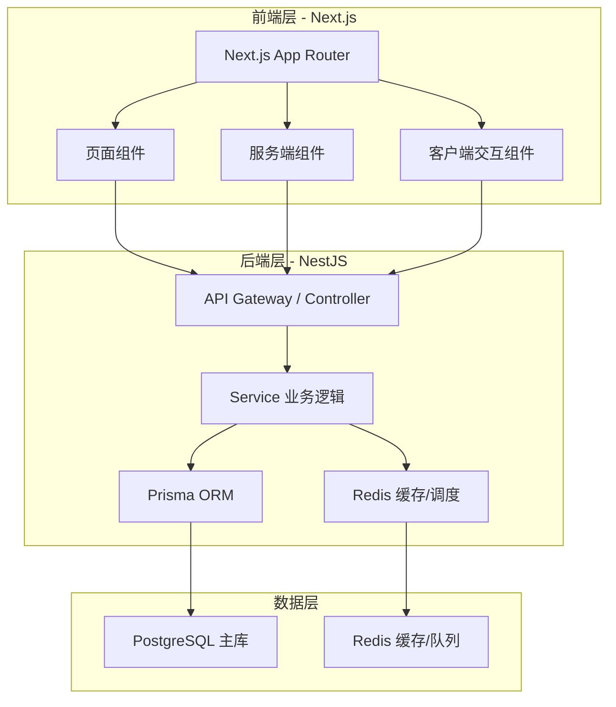
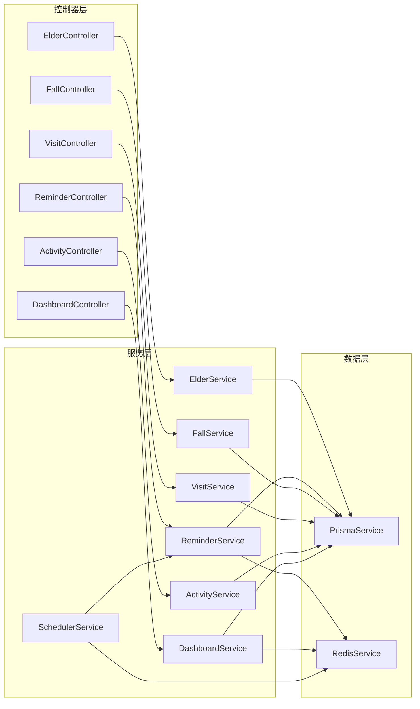
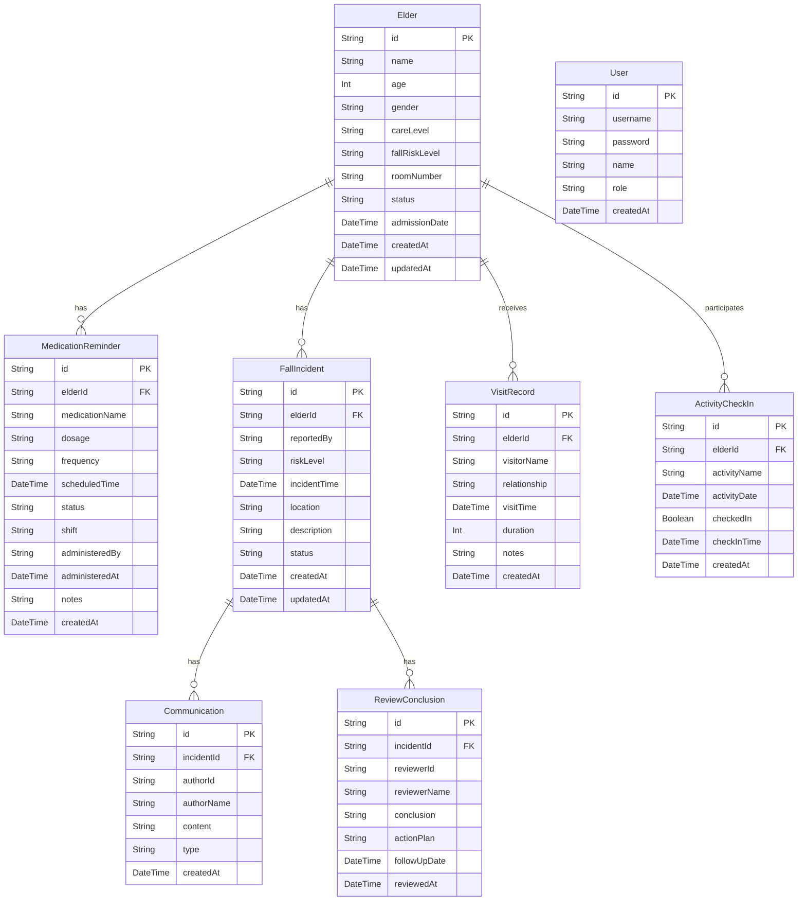

## 1. 架构设计



## 2. 技术说明

- 前端：Next.js 14（App Router）+ Tailwind CSS 3 + Zustand 状态管理
- 初始化工具：create-next-app
- 后端：NestJS 10 + TypeScript
- ORM：Prisma 5
- 数据库：PostgreSQL 16
- 缓存/队列：Redis 7（用药提醒调度、热点数据缓存、会话管理）
- 图表：Recharts

## 3. 路由定义

| 路由 | 用途 |
|------|------|
| / | 任务分派台首页（按班次展示用药提醒任务） |
| /elders | 老人档案列表 |
| /elders/[id] | 老人档案详情（基本信息/健康档案/用药清单） |
| /medications | 用药提醒管理（时间线视图） |
| /visits | 探访记录列表 |
| /activities | 活动签到面板 |
| /falls | 跌倒事件列表（含风险等级标注） |
| /falls/[id] | 跌倒事件详情（沟通+复核双栏） |
| /dashboard | 护理达标趋势看板 |

## 4. API 定义

### 4.1 老人档案

```typescript
interface Elder {
  id: string;
  name: string;
  age: number;
  gender: "MALE" | "FEMALE";
  careLevel: "LEVEL_1" | "LEVEL_2" | "LEVEL_3" | "LEVEL_4" | "LEVEL_5";
  fallRiskLevel: "LOW" | "MEDIUM" | "HIGH";
  roomNumber: string;
  allergies: string[];
  emergencyContact: string;
  emergencyPhone: string;
  admissionDate: string;
  status: "ACTIVE" | "DISCHARGED" | "DECEASED";
  createdAt: string;
  updatedAt: string;
}

// GET /elders - 获取老人列表（支持筛选、分页）
// GET /elders/:id - 获取老人详情
// POST /elders - 新增老人档案
// PUT /elders/:id - 更新老人档案
```

### 4.2 用药提醒

```typescript
interface MedicationReminder {
  id: string;
  elderId: string;
  medicationName: string;
  dosage: string;
  frequency: string;
  scheduledTime: string;
  status: "PENDING" | "IN_PROGRESS" | "COMPLETED" | "MISSED" | "REFUSED" | "ADVERSE_REACTION";
  shift: "MORNING" | "AFTERNOON" | "EVENING";
  administeredBy: string | null;
  administeredAt: string | null;
  notes: string;
  createdAt: string;
}

// GET /reminders?shift=MORNING&date=2026-06-17 - 按班次获取提醒列表
// PUT /reminders/:id/status - 更新提醒状态（完成/异常）
// POST /reminders/bulk-check - 批量护理等级与用药清单核对
```

### 4.3 跌倒事件

```typescript
interface FallIncident {
  id: string;
  elderId: string;
  reportedBy: string;
  riskLevel: "LOW" | "MEDIUM" | "HIGH";
  incidentTime: string;
  location: string;
  description: string;
  status: "REPORTED" | "IN_REVIEW" | "REVIEWED" | "CLOSED";
  communications: Communication[];
  reviewConclusion: ReviewConclusion | null;
  createdAt: string;
  updatedAt: string;
}

interface Communication {
  id: string;
  incidentId: string;
  authorId: string;
  authorName: string;
  content: string;
  type: "NOTE" | "PHONE_CALL" | "FAMILY_NOTIFICATION";
  createdAt: string;
}

interface ReviewConclusion {
  id: string;
  incidentId: string;
  reviewerId: string;
  reviewerName: string;
  conclusion: string;
  actionPlan: string;
  followUpDate: string;
  reviewedAt: string;
}

// GET /falls - 跌倒事件列表（含风险等级）
// GET /falls/:id - 跌倒事件详情（含沟通记录+复核结论）
// POST /falls - 上报跌倒事件
// POST /falls/:id/communications - 新增沟通记录
// POST /falls/:id/review - 提交复核结论
```

### 4.4 探访记录

```typescript
interface VisitRecord {
  id: string;
  elderId: string;
  visitorName: string;
  relationship: string;
  visitTime: string;
  duration: number;
  notes: string;
  createdAt: string;
}

// GET /visits?elderId=xxx - 获取探访记录
// POST /visits - 新增探访记录
```

### 4.5 活动签到

```typescript
interface ActivityCheckIn {
  id: string;
  elderId: string;
  activityName: string;
  activityDate: string;
  checkedIn: boolean;
  checkInTime: string | null;
  createdAt: string;
}

// GET /activities?date=2026-06-17 - 获取活动签到列表
// POST /activities/check-in - 签到
// POST /activities/bulk-check-in - 批量签到
```

### 4.6 趋势统计

```typescript
interface CareTrend {
  period: string;
  overallRate: number;
  medicationRate: number;
  visitRate: number;
  activityRate: number;
  fallIncidents: number;
}

// GET /dashboard/trends?period=week - 获取趋势数据
// GET /dashboard/alerts - 获取异常预警
```

## 5. 服务端架构图



## 6. 数据模型

### 6.1 数据模型定义



### 6.2 数据定义语言

```sql
CREATE TABLE "User" (
  "id" UUID PRIMARY KEY DEFAULT gen_random_uuid(),
  "username" VARCHAR(50) UNIQUE NOT NULL,
  "password" VARCHAR(255) NOT NULL,
  "name" VARCHAR(100) NOT NULL,
  "role" VARCHAR(20) NOT NULL CHECK ("role" IN ('ADMIN', 'SUPERVISOR', 'CAREGIVER', 'MANAGER')),
  "created_at" TIMESTAMP NOT NULL DEFAULT NOW()
);

CREATE TABLE "Elder" (
  "id" UUID PRIMARY KEY DEFAULT gen_random_uuid(),
  "name" VARCHAR(100) NOT NULL,
  "age" INTEGER NOT NULL,
  "gender" VARCHAR(10) NOT NULL CHECK ("gender" IN ('MALE', 'FEMALE')),
  "care_level" VARCHAR(10) NOT NULL CHECK ("care_level" IN ('LEVEL_1','LEVEL_2','LEVEL_3','LEVEL_4','LEVEL_5')),
  "fall_risk_level" VARCHAR(10) NOT NULL DEFAULT 'LOW' CHECK ("fall_risk_level" IN ('LOW','MEDIUM','HIGH')),
  "room_number" VARCHAR(20) NOT NULL,
  "allergies" TEXT[] DEFAULT '{}',
  "emergency_contact" VARCHAR(100),
  "emergency_phone" VARCHAR(20),
  "status" VARCHAR(20) NOT NULL DEFAULT 'ACTIVE' CHECK ("status" IN ('ACTIVE','DISCHARGED','DECEASED')),
  "admission_date" DATE NOT NULL,
  "created_at" TIMESTAMP NOT NULL DEFAULT NOW(),
  "updated_at" TIMESTAMP NOT NULL DEFAULT NOW()
);

CREATE TABLE "MedicationReminder" (
  "id" UUID PRIMARY KEY DEFAULT gen_random_uuid(),
  "elder_id" UUID NOT NULL REFERENCES "Elder"("id") ON DELETE CASCADE,
  "medication_name" VARCHAR(200) NOT NULL,
  "dosage" VARCHAR(100) NOT NULL,
  "frequency" VARCHAR(100) NOT NULL,
  "scheduled_time" TIMESTAMP NOT NULL,
  "status" VARCHAR(30) NOT NULL DEFAULT 'PENDING' CHECK ("status" IN ('PENDING','IN_PROGRESS','COMPLETED','MISSED','REFUSED','ADVERSE_REACTION')),
  "shift" VARCHAR(20) NOT NULL CHECK ("shift" IN ('MORNING','AFTERNOON','EVENING')),
  "administered_by" UUID REFERENCES "User"("id"),
  "administered_at" TIMESTAMP,
  "notes" TEXT DEFAULT '',
  "created_at" TIMESTAMP NOT NULL DEFAULT NOW()
);

CREATE TABLE "FallIncident" (
  "id" UUID PRIMARY KEY DEFAULT gen_random_uuid(),
  "elder_id" UUID NOT NULL REFERENCES "Elder"("id") ON DELETE CASCADE,
  "reported_by" UUID NOT NULL REFERENCES "User"("id"),
  "risk_level" VARCHAR(10) NOT NULL CHECK ("risk_level" IN ('LOW','MEDIUM','HIGH')),
  "incident_time" TIMESTAMP NOT NULL,
  "location" VARCHAR(200) NOT NULL,
  "description" TEXT NOT NULL,
  "status" VARCHAR(20) NOT NULL DEFAULT 'REPORTED' CHECK ("status" IN ('REPORTED','IN_REVIEW','REVIEWED','CLOSED')),
  "created_at" TIMESTAMP NOT NULL DEFAULT NOW(),
  "updated_at" TIMESTAMP NOT NULL DEFAULT NOW()
);

CREATE TABLE "Communication" (
  "id" UUID PRIMARY KEY DEFAULT gen_random_uuid(),
  "incident_id" UUID NOT NULL REFERENCES "FallIncident"("id") ON DELETE CASCADE,
  "author_id" UUID NOT NULL REFERENCES "User"("id"),
  "author_name" VARCHAR(100) NOT NULL,
  "content" TEXT NOT NULL,
  "type" VARCHAR(30) NOT NULL CHECK ("type" IN ('NOTE','PHONE_CALL','FAMILY_NOTIFICATION')),
  "created_at" TIMESTAMP NOT NULL DEFAULT NOW()
);

CREATE TABLE "ReviewConclusion" (
  "id" UUID PRIMARY KEY DEFAULT gen_random_uuid(),
  "incident_id" UUID UNIQUE NOT NULL REFERENCES "FallIncident"("id") ON DELETE CASCADE,
  "reviewer_id" UUID NOT NULL REFERENCES "User"("id"),
  "reviewer_name" VARCHAR(100) NOT NULL,
  "conclusion" TEXT NOT NULL,
  "action_plan" TEXT NOT NULL,
  "follow_up_date" DATE,
  "reviewed_at" TIMESTAMP NOT NULL DEFAULT NOW()
);

CREATE TABLE "VisitRecord" (
  "id" UUID PRIMARY KEY DEFAULT gen_random_uuid(),
  "elder_id" UUID NOT NULL REFERENCES "Elder"("id") ON DELETE CASCADE,
  "visitor_name" VARCHAR(100) NOT NULL,
  "relationship" VARCHAR(50) NOT NULL,
  "visit_time" TIMESTAMP NOT NULL,
  "duration" INTEGER NOT NULL DEFAULT 0,
  "notes" TEXT DEFAULT '',
  "created_at" TIMESTAMP NOT NULL DEFAULT NOW()
);

CREATE TABLE "ActivityCheckIn" (
  "id" UUID PRIMARY KEY DEFAULT gen_random_uuid(),
  "elder_id" UUID NOT NULL REFERENCES "Elder"("id") ON DELETE CASCADE,
  "activity_name" VARCHAR(200) NOT NULL,
  "activity_date" DATE NOT NULL,
  "checked_in" BOOLEAN NOT NULL DEFAULT FALSE,
  "check_in_time" TIMESTAMP,
  "created_at" TIMESTAMP NOT NULL DEFAULT NOW()
);

CREATE INDEX idx_elder_care_level ON "Elder"("care_level");
CREATE INDEX idx_elder_fall_risk ON "Elder"("fall_risk_level");
CREATE INDEX idx_reminder_elder_shift ON "MedicationReminder"("elder_id", "shift");
CREATE INDEX idx_reminder_scheduled ON "MedicationReminder"("scheduled_time");
CREATE INDEX idx_reminder_status ON "MedicationReminder"("status");
CREATE INDEX idx_fall_elder ON "FallIncident"("elder_id");
CREATE INDEX idx_fall_risk ON "FallIncident"("risk_level");
CREATE INDEX idx_visit_elder ON "VisitRecord"("elder_id");
CREATE INDEX idx_activity_elder_date ON "ActivityCheckIn"("elder_id", "activity_date");
```
