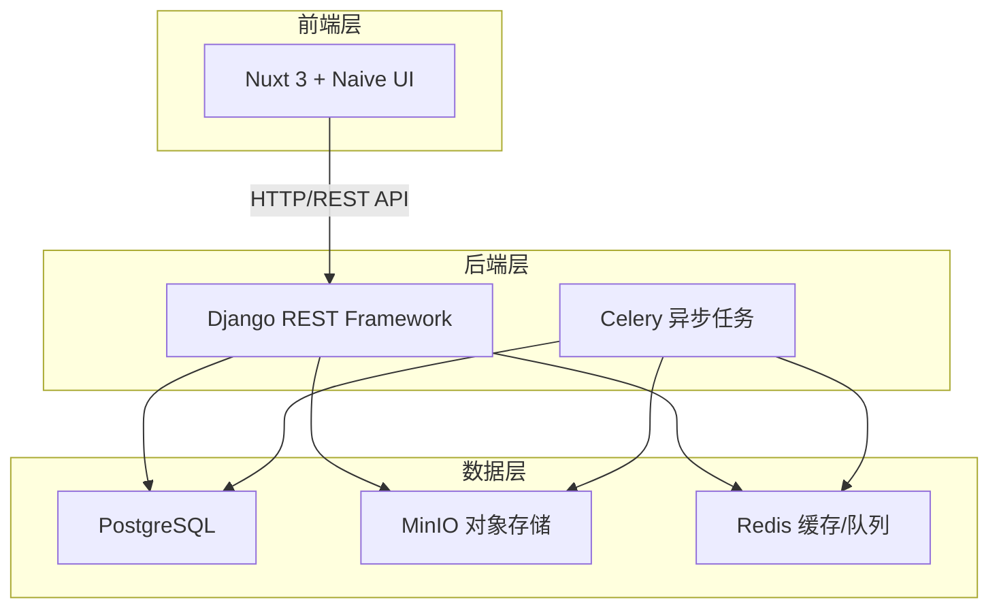
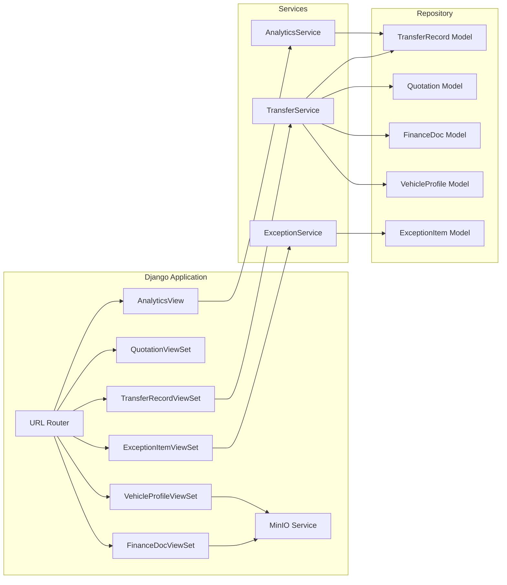
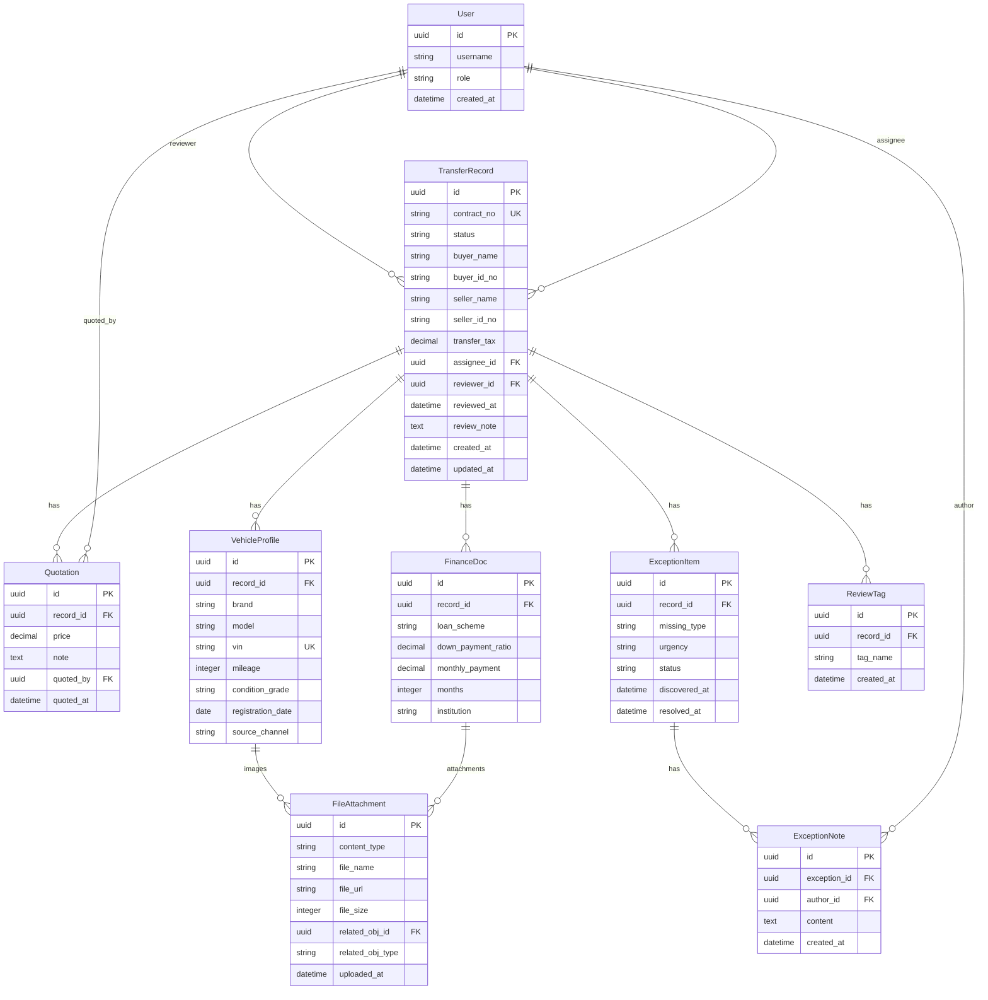

## 1. 架构设计



## 2. 技术说明
- 前端：Nuxt 3 + Naive UI + Pinia + TypeScript
- 后端：Django 5 + Django REST Framework + Celery + Redis
- 数据库：PostgreSQL 16
- 对象存储：MinIO（行驶证/登记证/合同扫描件等文件）
- 缓存/消息队列：Redis（Celery Broker + 接口缓存）

## 3. 路由定义
| 路由 | 用途 |
|------|------|
| / | 首页仪表盘，显示待处理/待复核/异常的数量概览 |
| /workspace/:id | 过户工作台，单据全屏录入与编辑 |
| /records | 记录池管理，三池Tab切换 |
| /records/pending | 待处理池 |
| /records/review | 待复核池 |
| /records/completed | 已完成池 |
| /exceptions | 异常处理中心 |
| /analytics | 汇总看板 |
| /login | 登录页 |

## 4. API 定义

### 4.1 过户记录 API
```typescript
interface TransferRecord {
  id: string
  status: "pending" | "review" | "completed" | "exception"
  contract_no: string
  buyer_name: string
  buyer_id_no: string
  seller_name: string
  seller_id_no: string
  transfer_tax: number
  created_at: string
  updated_at: string
  assignee: UserSummary
  reviewer: UserSummary | null
  reviewed_at: string | null
  review_note: string | null
  exception_items: ExceptionItem[]
  review_tags: string[]
}

interface TransferRecordCreate {
  contract_no: string
  buyer_name: string
  buyer_id_no: string
  seller_name: string
  seller_id_no: string
  transfer_tax: number
  assignee_id: string
}

interface TransferRecordUpdate {
  contract_no?: string
  buyer_name?: string
  buyer_id_no?: string
  seller_name?: string
  seller_id_no?: string
  transfer_tax?: number
  status?: "pending" | "review" | "completed"
}
```

### 4.2 报价历史 API
```typescript
interface Quotation {
  id: string
  record_id: string
  price: number
  quoted_at: string
  quoted_by: UserSummary
  note: string
}

interface QuotationCreate {
  record_id: string
  price: number
  note: string
}
```

### 4.3 金融资料 API
```typescript
interface FinanceDoc {
  id: string
  record_id: string
  loan_scheme: string
  down_payment_ratio: number
  monthly_payment: number
  months: number
  institution: string
  attachments: FileAttachment[]
}

interface FileAttachment {
  id: string
  file_name: string
  file_url: string
  file_size: number
  uploaded_at: string
}
```

### 4.4 车辆档案 API
```typescript
interface VehicleProfile {
  id: string
  record_id: string
  brand: string
  model: string
  vin: string
  mileage: number
  condition_grade: "A" | "B" | "C" | "D"
  registration_date: string
  source_channel: string
  license_images: FileAttachment[]
  registration_images: FileAttachment[]
}
```

### 4.5 异常项 API
```typescript
interface ExceptionItem {
  id: string
  record_id: string
  missing_type: "buyer_id" | "seller_id" | "license" | "registration" | "contract" | "finance" | "other"
  urgency: "low" | "medium" | "high"
  status: "open" | "reminded" | "escalated" | "resolved" | "closed"
  discovered_at: string
  resolved_at: string | null
  notes: ExceptionNote[]
}

interface ExceptionNote {
  id: string
  author: UserSummary
  content: string
  created_at: string
}
```

### 4.6 汇总统计 API
```typescript
interface AnalyticsOverview {
  turnover_avg_days: number
  turnover_trend: { month: string; avg_days: number }[]
  channel_stats: { channel: string; count: number; avg_days: number }[]
  assignee_stats: { assignee: UserSummary; count: number; avg_hours: number; exception_rate: number }[]
  tag_cloud: { tag: string; count: number }[]
}
```

## 5. 服务架构图



## 6. 数据模型

### 6.1 ER 图



### 6.2 DDL 语句

```sql
CREATE TABLE users (
    id UUID PRIMARY KEY DEFAULT gen_random_uuid(),
    username VARCHAR(150) NOT NULL UNIQUE,
    password_hash VARCHAR(255) NOT NULL,
    role VARCHAR(20) NOT NULL CHECK (role IN ('specialist', 'manager', 'finance')),
    is_active BOOLEAN DEFAULT TRUE,
    created_at TIMESTAMPTZ DEFAULT NOW()
);

CREATE TABLE transfer_records (
    id UUID PRIMARY KEY DEFAULT gen_random_uuid(),
    contract_no VARCHAR(50) NOT NULL UNIQUE,
    status VARCHAR(20) NOT NULL DEFAULT 'pending' CHECK (status IN ('pending', 'review', 'completed', 'exception')),
    buyer_name VARCHAR(100) NOT NULL,
    buyer_id_no VARCHAR(30) NOT NULL,
    seller_name VARCHAR(100) NOT NULL,
    seller_id_no VARCHAR(30) NOT NULL,
    transfer_tax DECIMAL(12,2) DEFAULT 0,
    assignee_id UUID NOT NULL REFERENCES users(id),
    reviewer_id UUID REFERENCES users(id),
    reviewed_at TIMESTAMPTZ,
    review_note TEXT,
    created_at TIMESTAMPTZ DEFAULT NOW(),
    updated_at TIMESTAMPTZ DEFAULT NOW()
);

CREATE TABLE quotations (
    id UUID PRIMARY KEY DEFAULT gen_random_uuid(),
    record_id UUID NOT NULL REFERENCES transfer_records(id) ON DELETE CASCADE,
    price DECIMAL(12,2) NOT NULL,
    note TEXT,
    quoted_by UUID NOT NULL REFERENCES users(id),
    quoted_at TIMESTAMPTZ DEFAULT NOW()
);

CREATE TABLE finance_docs (
    id UUID PRIMARY KEY DEFAULT gen_random_uuid(),
    record_id UUID NOT NULL REFERENCES transfer_records(id) ON DELETE CASCADE,
    loan_scheme VARCHAR(100),
    down_payment_ratio DECIMAL(5,4),
    monthly_payment DECIMAL(12,2),
    months INTEGER,
    institution VARCHAR(200)
);

CREATE TABLE vehicle_profiles (
    id UUID PRIMARY KEY DEFAULT gen_random_uuid(),
    record_id UUID NOT NULL REFERENCES transfer_records(id) ON DELETE CASCADE,
    brand VARCHAR(100) NOT NULL,
    model VARCHAR(100) NOT NULL,
    vin VARCHAR(17) NOT NULL UNIQUE,
    mileage INTEGER,
    condition_grade VARCHAR(1) CHECK (condition_grade IN ('A', 'B', 'C', 'D')),
    registration_date DATE,
    source_channel VARCHAR(50)
);

CREATE TABLE file_attachments (
    id UUID PRIMARY KEY DEFAULT gen_random_uuid(),
    content_type VARCHAR(50) NOT NULL,
    file_name VARCHAR(255) NOT NULL,
    file_url VARCHAR(500) NOT NULL,
    file_size INTEGER NOT NULL,
    related_obj_id UUID NOT NULL,
    related_obj_type VARCHAR(50) NOT NULL,
    uploaded_at TIMESTAMPTZ DEFAULT NOW()
);

CREATE TABLE exception_items (
    id UUID PRIMARY KEY DEFAULT gen_random_uuid(),
    record_id UUID NOT NULL REFERENCES transfer_records(id) ON DELETE CASCADE,
    missing_type VARCHAR(30) NOT NULL CHECK (missing_type IN ('buyer_id', 'seller_id', 'license', 'registration', 'contract', 'finance', 'other')),
    urgency VARCHAR(10) NOT NULL DEFAULT 'medium' CHECK (urgency IN ('low', 'medium', 'high')),
    status VARCHAR(15) NOT NULL DEFAULT 'open' CHECK (status IN ('open', 'reminded', 'escalated', 'resolved', 'closed')),
    discovered_at TIMESTAMPTZ DEFAULT NOW(),
    resolved_at TIMESTAMPTZ
);

CREATE TABLE exception_notes (
    id UUID PRIMARY KEY DEFAULT gen_random_uuid(),
    exception_id UUID NOT NULL REFERENCES exception_items(id) ON DELETE CASCADE,
    author_id UUID NOT NULL REFERENCES users(id),
    content TEXT NOT NULL,
    created_at TIMESTAMPTZ DEFAULT NOW()
);

CREATE TABLE review_tags (
    id UUID PRIMARY KEY DEFAULT gen_random_uuid(),
    record_id UUID NOT NULL REFERENCES transfer_records(id) ON DELETE CASCADE,
    tag_name VARCHAR(50) NOT NULL,
    created_at TIMESTAMPTZ DEFAULT NOW()
);

CREATE INDEX idx_transfer_records_status ON transfer_records(status);
CREATE INDEX idx_transfer_records_assignee ON transfer_records(assignee_id);
CREATE INDEX idx_transfer_records_created ON transfer_records(created_at DESC);
CREATE INDEX idx_quotations_record ON quotations(record_id);
CREATE INDEX idx_finance_docs_record ON finance_docs(record_id);
CREATE INDEX idx_vehicle_profiles_record ON vehicle_profiles(record_id);
CREATE INDEX idx_file_attachments_related ON file_attachments(related_obj_type, related_obj_id);
CREATE INDEX idx_exception_items_record ON exception_items(record_id);
CREATE INDEX idx_exception_items_status ON exception_items(status);
CREATE INDEX idx_exception_items_urgency ON exception_items(urgency);
CREATE INDEX idx_review_tags_record ON review_tags(record_id);
CREATE INDEX idx_review_tags_name ON review_tags(tag_name);
```
