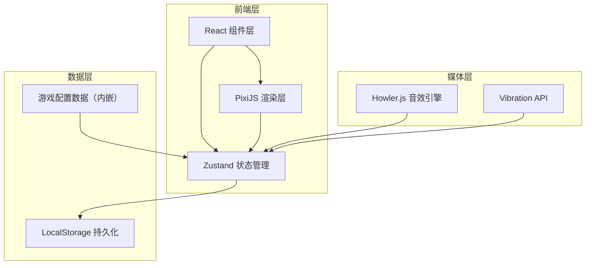
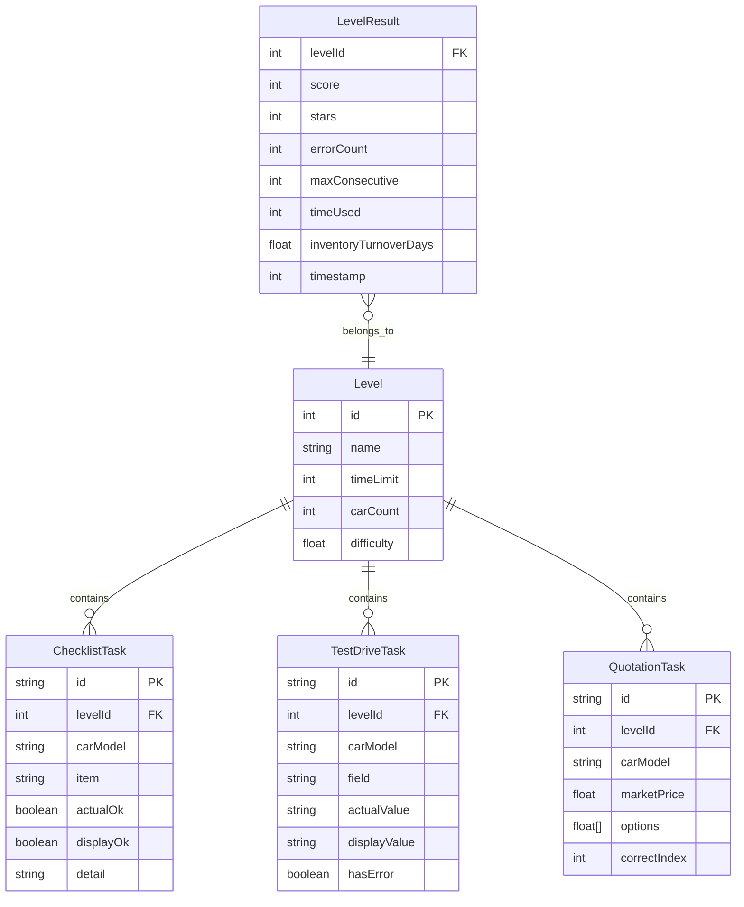

## 1. 架构设计



## 2. 技术说明

- **前端框架**：React 18 + TypeScript + Vite
- **样式方案**：TailwindCSS 3
- **游戏渲染**：PixiJS 8（@pixi/react 作为 React 集成层）
- **状态管理**：Zustand（游戏状态、设置、关卡进度）
- **音效系统**：Howler.js
- **数据持久化**：LocalStorage（关卡进度、设置、历史成绩）
- **图表**：内嵌 Canvas 自绘（复盘页对比图表）
- **无后端**：纯前端应用，所有数据本地存储

## 3. 路由定义

| 路由 | 用途 |
|------|------|
| `/` | 主菜单页 |
| `/game/:levelId` | 游戏主界面（指定关卡） |
| `/result/:levelId` | 关卡结算页 |
| `/review` | 复盘页（多关卡对比） |
| `/settings` | 设置页 |

## 4. 状态管理设计

### 4.1 游戏 Store（useGameStore）

```typescript
interface GameState {
  currentLevel: number
  timeRemaining: number
  isPlaying: boolean
  isPaused: boolean
  score: number
  errorCount: number
  consecutiveCorrect: number
  maxConsecutive: number
  tasks: {
    checklist: ChecklistTask[]
    testDrive: TestDriveTask[]
    quotation: QuotationTask[]
  }
  completedTasks: Set<string>
}
```

### 4.2 设置 Store（useSettingsStore）

```typescript
interface SettingsState {
  soundEnabled: boolean
  vibrationEnabled: boolean
  animationIntensity: 'low' | 'medium' | 'high'
  tutorialCompleted: boolean
}
```

### 4.3 关卡进度 Store（useProgressStore）

```typescript
interface ProgressState {
  levelResults: Map<number, LevelResult>
  saveResult: (levelId: number, result: LevelResult) => void
}

interface LevelResult {
  score: number
  stars: number
  errorCount: number
  maxConsecutive: number
  timeUsed: number
  inventoryTurnoverDays: number
  timestamp: number
}
```

## 5. 数据模型

### 5.1 数据模型定义



## 6. 项目目录结构

```
src/
├── components/
│   ├── game/           # 游戏内组件
│   │   ├── CountdownBar.tsx
│   │   ├── ChecklistPanel.tsx
│   │   ├── TestDrivePanel.tsx
│   │   ├── QuotationPanel.tsx
│   │   ├── ScoreBar.tsx
│   │   └── TaskCard.tsx
│   ├── pixi/           # PixiJS 渲染组件
│   │   ├── GameCanvas.tsx
│   │   ├── CarSilhouette.tsx
│   │   └── ParticleEffect.tsx
│   ├── menu/           # 菜单组件
│   │   ├── MainMenu.tsx
│   │   └── LevelSelect.tsx
│   ├── result/         # 结算组件
│   │   ├── ResultPage.tsx
│   │   ├── StarRating.tsx
│   │   └── TurnoverIndicator.tsx
│   ├── review/         # 复盘组件
│   │   ├── ReviewPage.tsx
│   │   └── ComparisonChart.tsx
│   ├── settings/       # 设置组件
│   │   └── SettingsPage.tsx
│   ├── tutorial/       # 新手引导组件
│   │   └── TutorialOverlay.tsx
│   └── common/         # 通用组件
│       ├── Toggle.tsx
│       └── AnimatedNumber.tsx
├── stores/
│   ├── useGameStore.ts
│   ├── useSettingsStore.ts
│   └── useProgressStore.ts
├── data/
│   └── levels.ts       # 关卡配置数据
├── hooks/
│   ├── useSound.ts
│   ├── useVibration.ts
│   └── useCountdown.ts
├── pages/
│   ├── HomePage.tsx
│   ├── GamePage.tsx
│   ├── ResultPage.tsx
│   ├── ReviewPage.tsx
│   └── SettingsPage.tsx
├── utils/
│   ├── scoring.ts
│   └── turnover.ts
├── App.tsx
└── main.tsx
```
