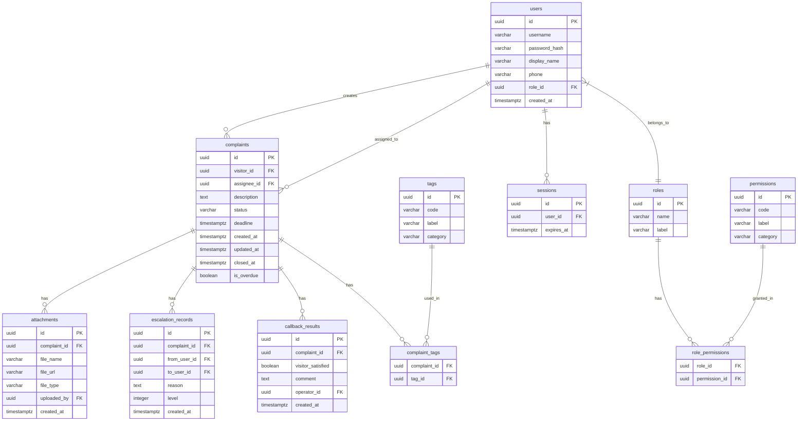

## 1. 架构设计

```mermaid
flowchart TB
    subgraph "前端层"
        "SvelteKit SSR/CSR"
        "tRPC Client"
    end
    subgraph "服务层"
        "SvelteKit API Routes"
        "tRPC Router"
        "Lucia Auth 中间件"
    end
    subgraph "数据层"
        "Drizzle ORM"
        "PostgreSQL"
    end
    "SvelteKit SSR/CSR" --> "tRPC Client"
    "tRPC Client" --> "tRPC Router"
    "tRPC Router" --> "Lucia Auth 中间件"
    "Lucia Auth 中间件" --> "Drizzle ORM"
    "Drizzle ORM" --> "PostgreSQL"
```

## 2. 技术说明

- **前端**: SvelteKit@2 + TailwindCSS@3 + Vite
- **初始化工具**: `npx sv create`
- **API 层**: tRPC@11 + @trpc/server + @trpc/client，挂在 SvelteKit API Routes 上
- **认证**: Lucia Auth@3（基于 SvelteKit 适配器），session-based
- **ORM**: Drizzle ORM@0.38 + drizzle-kit
- **数据库**: PostgreSQL@16
- **表单验证**: zod@3（tRPC 输入校验复用）
- **图标**: phosphor-svelte

## 3. 路由定义

| 路由 | 用途 |
|------|------|
| / | 登录页 |
| /dashboard | 投诉工单台（列表+详情+操作区+协同侧栏） |
| /complaint/[id] | 单个投诉工单详情 |
| /todo-pool | 待办池 |
| /reports | 报表中心 |
| /admin/roles | 权限管理-角色配置 |
| /submit | 游客投诉提交页（移动端优先） |
| /track/[id] | 游客工单追踪页 |

## 4. API 定义

### 4.1 tRPC Router 结构

```typescript
// 认证
authRouter = {
  login:    procedure.input(LoginSchema).mutation(...)
  logout:   procedure.mutation(...)
  session:  procedure.query(...)
}

// 投诉工单
complaintRouter = {
  list:          procedure.input(ComplaintFilterSchema).query(...)
  getById:       procedure.input(z.string()).query(...)
  create:        procedure.input(CreateComplaintSchema).mutation(...)
  update:        procedure.input(UpdateComplaintSchema).mutation(...)
  addAttachment: procedure.input(AttachmentSchema).mutation(...)
  addTag:        procedure.input(TagSchema).mutation(...)
  removeTag:     procedure.input(TagSchema).mutation(...)
  assign:        procedure.input(AssignSchema).mutation(...)
  reject:        procedure.input(RejectSchema).mutation(...)
  close:         procedure.input(CloseSchema).mutation(...)
  supplement:    procedure.input(SupplementSchema).mutation(...)
}

// 升级记录
escalationRouter = {
  list:      procedure.input(z.string()).query(...)
  create:    procedure.input(CreateEscalationSchema).mutation(...)
}

// 回访
callbackRouter = {
  list:      procedure.input(z.string()).query(...)
  create:    procedure.input(CreateCallbackSchema).mutation(...)
}

// 待办池
todoRouter = {
  list:      procedure.input(TodoFilterSchema).query(...)
  claim:     procedure.input(z.string()).mutation(...)
  reassign:  procedure.input(ReassignSchema).mutation(...)
  batchAct:  procedure.input(BatchActionSchema).mutation(...)
}

// 报表
reportRouter = {
  byCloseDuration: procedure.input(ReportFilterSchema).query(...)
  byDate:          procedure.input(ReportFilterSchema).query(...)
  byAssignee:      procedure.input(ReportFilterSchema).query(...)
  export:          procedure.input(ExportSchema).mutation(...)
}

// 权限
roleRouter = {
  list:    procedure.query(...)
  update:  procedure.input(UpdateRoleSchema).mutation(...)
}
```

### 4.2 核心 TypeScript 类型

```typescript
type UserRole = "visitor" | "ticket_agent" | "patrol_agent" | "operator"

type ComplaintStatus =
  | "pending"
  | "assigned"
  | "in_progress"
  | "supplement_requested"
  | "escalated"
  | "rejected"
  | "resolved"
  | "closed"

type ProblemTag =
  | "ticket_issue"
  | "facility_damage"
  | "safety_hazard"
  | "service_attitude"
  | "queue_complaint"
  | "environmental"
  | "pricing_dispute"
  | "other"

interface Complaint {
  id: string
  visitorName: string
  visitorPhone: string
  description: string
  status: ComplaintStatus
  tags: ProblemTag[]
  assigneeId: string | null
  deadline: Date | null
  createdAt: Date
  updatedAt: Date
  closedAt: Date | null
  isOverdue: boolean
}

interface Attachment {
  id: string
  complaintId: string
  fileName: string
  fileUrl: string
  fileType: "image" | "video" | "audio" | "document"
  uploadedBy: string
  createdAt: Date
}

interface EscalationRecord {
  id: string
  complaintId: string
  fromUserId: string
  toUserId: string
  reason: string
  level: number
  createdAt: Date
}

interface CallbackResult {
  id: string
  complaintId: string
  visitorSatisfied: boolean
  comment: string
  operatorId: string
  createdAt: Date
}
```

## 5. 服务架构图

```mermaid
flowchart LR
    "SvelteKit API Route" --> "tRPC Context 初始化"
    "tRPC Context 初始化" --> "Lucia Auth 鉴权"
    "Lucia Auth 鉴权" --> "角色权限中间件"
    "角色权限中间件" --> "业务 Service"
    "业务 Service" --> "Drizzle Repository"
    "Drizzle Repository" --> "PostgreSQL"
```

## 6. 数据模型

### 6.1 数据模型定义



### 6.2 数据定义语言

```sql
CREATE EXTENSION IF NOT EXISTS "pgcrypto";

CREATE TABLE roles (
  id UUID PRIMARY KEY DEFAULT gen_random_uuid(),
  name VARCHAR(50) NOT NULL UNIQUE,
  label VARCHAR(100) NOT NULL
);

CREATE TABLE permissions (
  id UUID PRIMARY KEY DEFAULT gen_random_uuid(),
  code VARCHAR(100) NOT NULL UNIQUE,
  label VARCHAR(200) NOT NULL,
  category VARCHAR(50) NOT NULL
);

CREATE TABLE role_permissions (
  role_id UUID NOT NULL REFERENCES roles(id) ON DELETE CASCADE,
  permission_id UUID NOT NULL REFERENCES permissions(id) ON DELETE CASCADE,
  PRIMARY KEY (role_id, permission_id)
);

CREATE TABLE users (
  id UUID PRIMARY KEY DEFAULT gen_random_uuid(),
  username VARCHAR(100) NOT NULL UNIQUE,
  password_hash TEXT NOT NULL,
  display_name VARCHAR(100) NOT NULL,
  phone VARCHAR(20),
  role_id UUID NOT NULL REFERENCES roles(id),
  created_at TIMESTAMPTZ NOT NULL DEFAULT now()
);

CREATE TABLE sessions (
  id UUID PRIMARY KEY DEFAULT gen_random_uuid(),
  user_id UUID NOT NULL REFERENCES users(id) ON DELETE CASCADE,
  expires_at TIMESTAMPTZ NOT NULL
);

CREATE TABLE tags (
  id UUID PRIMARY KEY DEFAULT gen_random_uuid(),
  code VARCHAR(50) NOT NULL UNIQUE,
  label VARCHAR(100) NOT NULL,
  category VARCHAR(50) NOT NULL
);

CREATE TABLE complaints (
  id UUID PRIMARY KEY DEFAULT gen_random_uuid(),
  visitor_id UUID NOT NULL REFERENCES users(id),
  assignee_id UUID REFERENCES users(id),
  description TEXT NOT NULL,
  status VARCHAR(30) NOT NULL DEFAULT 'pending',
  deadline TIMESTAMPTZ,
  created_at TIMESTAMPTZ NOT NULL DEFAULT now(),
  updated_at TIMESTAMPTZ NOT NULL DEFAULT now(),
  closed_at TIMESTAMPTZ,
  is_overdue BOOLEAN NOT NULL DEFAULT false
);

CREATE TABLE attachments (
  id UUID PRIMARY KEY DEFAULT gen_random_uuid(),
  complaint_id UUID NOT NULL REFERENCES complaints(id) ON DELETE CASCADE,
  file_name VARCHAR(255) NOT NULL,
  file_url TEXT NOT NULL,
  file_type VARCHAR(20) NOT NULL,
  uploaded_by UUID NOT NULL REFERENCES users(id),
  created_at TIMESTAMPTZ NOT NULL DEFAULT now()
);

CREATE TABLE complaint_tags (
  complaint_id UUID NOT NULL REFERENCES complaints(id) ON DELETE CASCADE,
  tag_id UUID NOT NULL REFERENCES tags(id) ON DELETE CASCADE,
  PRIMARY KEY (complaint_id, tag_id)
);

CREATE TABLE escalation_records (
  id UUID PRIMARY KEY DEFAULT gen_random_uuid(),
  complaint_id UUID NOT NULL REFERENCES complaints(id) ON DELETE CASCADE,
  from_user_id UUID NOT NULL REFERENCES users(id),
  to_user_id UUID NOT NULL REFERENCES users(id),
  reason TEXT NOT NULL,
  level INTEGER NOT NULL DEFAULT 1,
  created_at TIMESTAMPTZ NOT NULL DEFAULT now()
);

CREATE TABLE callback_results (
  id UUID PRIMARY KEY DEFAULT gen_random_uuid(),
  complaint_id UUID NOT NULL REFERENCES complaints(id) ON DELETE CASCADE,
  visitor_satisfied BOOLEAN NOT NULL,
  comment TEXT,
  operator_id UUID NOT NULL REFERENCES users(id),
  created_at TIMESTAMPTZ NOT NULL DEFAULT now()
);

CREATE INDEX idx_complaints_status ON complaints(status);
CREATE INDEX idx_complaints_assignee ON complaints(assignee_id);
CREATE INDEX idx_complaints_visitor ON complaints(visitor_id);
CREATE INDEX idx_complaints_overdue ON complaints(is_overdue) WHERE is_overdue = true;
CREATE INDEX idx_complaints_created ON complaints(created_at);
CREATE INDEX idx_sessions_user ON sessions(user_id);
CREATE INDEX idx_escalation_complaint ON escalation_records(complaint_id);
CREATE INDEX idx_callback_complaint ON callback_results(complaint_id);
CREATE INDEX idx_attachments_complaint ON attachments(complaint_id);

-- 种子数据：角色
INSERT INTO roles (name, label) VALUES
  ('visitor', '游客'),
  ('ticket_agent', '票务员'),
  ('patrol_agent', '巡场员'),
  ('operator', '运营');

-- 种子数据：标签
INSERT INTO tags (code, label, category) VALUES
  ('ticket_issue', '票务问题', 'ticket'),
  ('facility_damage', '设施损坏', 'facility'),
  ('safety_hazard', '安全隐患', 'safety'),
  ('service_attitude', '服务态度', 'service'),
  ('queue_complaint', '排队投诉', 'service'),
  ('environmental', '环境问题', 'environment'),
  ('pricing_dispute', '价格争议', 'ticket'),
  ('other', '其他', 'other');

-- 种子数据：权限
INSERT INTO permissions (code, label, category) VALUES
  ('complaint:view:own', '查看自己投诉', 'complaint'),
  ('complaint:view:assigned', '查看已分派投诉', 'complaint'),
  ('complaint:view:all', '查看全部投诉', 'complaint'),
  ('complaint:create', '创建投诉', 'complaint'),
  ('complaint:assign', '分派投诉', 'complaint'),
  ('complaint:reject', '驳回投诉', 'complaint'),
  ('complaint:close', '关闭投诉', 'complaint'),
  ('complaint:supplement', '补充材料', 'complaint'),
  ('complaint:escalate', '升级投诉', 'complaint'),
  ('attachment:upload', '上传附件', 'attachment'),
  ('callback:create', '创建回访', 'callback'),
  ('report:view', '查看报表', 'report'),
  ('report:export', '导出报表', 'report'),
  ('role:manage', '管理角色权限', 'admin'),
  ('field:phone', '查看手机号', 'sensitive_field'),
  ('field:visitor_name', '查看游客姓名', 'sensitive_field');

-- 种子数据：角色权限映射
INSERT INTO role_permissions (role_id, permission_id)
  SELECT r.id, p.id FROM roles r, permissions p
  WHERE r.name = 'visitor' AND p.code IN ('complaint:view:own', 'complaint:create', 'complaint:supplement', 'attachment:upload')
  UNION ALL
  SELECT r.id, p.id FROM roles r, permissions p
  WHERE r.name = 'ticket_agent' AND p.code IN ('complaint:view:assigned', 'complaint:supplement', 'attachment:upload', 'field:phone', 'field:visitor_name')
  UNION ALL
  SELECT r.id, p.id FROM roles r, permissions p
  WHERE r.name = 'patrol_agent' AND p.code IN ('complaint:view:assigned', 'complaint:supplement', 'attachment:upload', 'field:phone', 'field:visitor_name')
  UNION ALL
  SELECT r.id, p.id FROM roles r, permissions p
  WHERE r.name = 'operator' AND p.code IN (
    'complaint:view:all', 'complaint:assign', 'complaint:reject', 'complaint:close',
    'complaint:supplement', 'complaint:escalate', 'attachment:upload',
    'callback:create', 'report:view', 'report:export', 'role:manage',
    'field:phone', 'field:visitor_name'
  );
```
