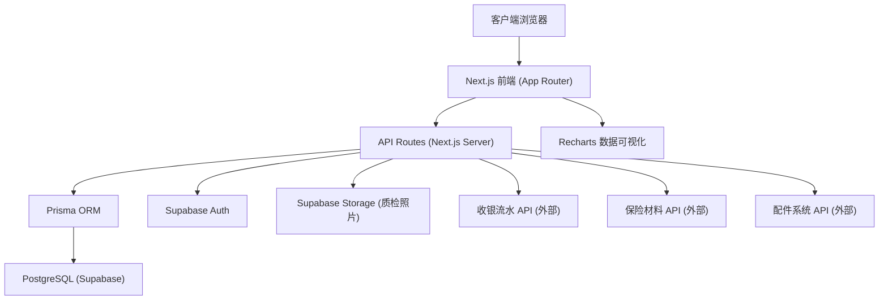
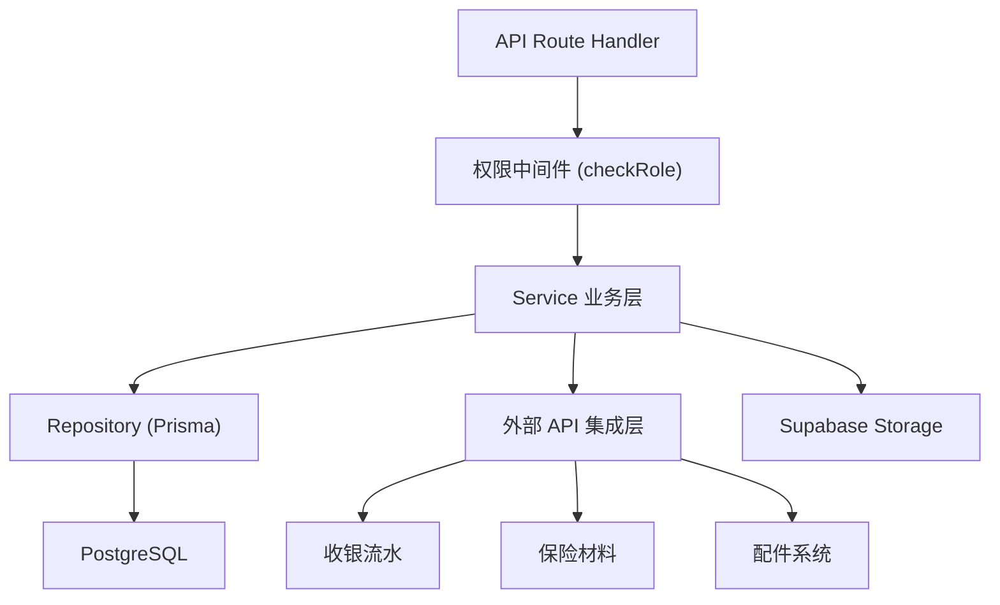
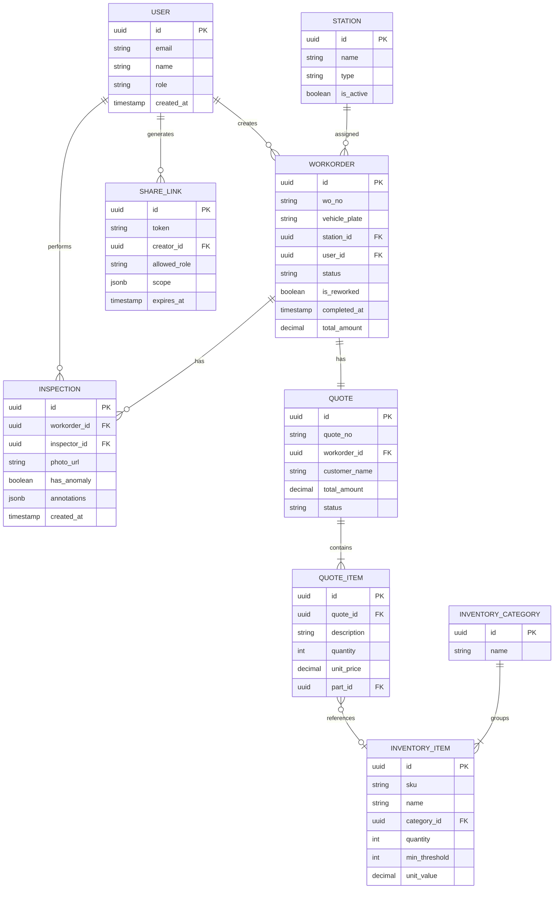

## 1. 架构设计



## 2. 技术说明

- **前端框架**：Next.js 14 (App Router) + TypeScript
- **样式方案**：TailwindCSS 3
- **图表库**：Recharts 2
- **状态管理**：Zustand
- **后端**：Next.js API Routes (Serverless)
- **ORM**：Prisma 5
- **数据库**：PostgreSQL (Supabase 托管)
- **认证鉴权**：Supabase Auth (RLS 行级安全)
- **文件存储**：Supabase Storage
- **图标**：Lucide React
- **导出**：xlsx (SheetJS) + json2csv

## 3. 路由定义

| 路由 | 页面/用途 | 权限要求 |
|------|-----------|----------|
| `/` | 风险监测仪表盘主页 | 登录用户 |
| `/inspection/[id]` | 质检照片详情与标注页 | 质检员/管理员 |
| `/share/[token]` | 分享视图（受权限控制） | 分享链接持有者 |
| `/api/dashboard` | 获取仪表盘聚合数据 | 登录用户 |
| `/api/workorders/trend` | 工单趋势数据 | 登录用户 |
| `/api/inventory` | 配件库存数据（含缺口标识） | 登录用户 |
| `/api/quotes` | 报价单明细列表 | 登录用户 |
| `/api/quotes/[id]/parts` | 报价单关联配件追溯 | 登录用户 |
| `/api/inspections` | 质检记录列表 | 质检员/管理员 |
| `/api/inspections/[id]` | 质检详情与异常标注 CRUD | 质检员/管理员 |
| `/api/export` | 数据导出（含返修率口径） | 管理员/调度员 |
| `/api/share` | 生成/验证分享链接 | 管理员 |
| `/api/auth/me` | 当前用户信息与权限 | 登录用户 |

## 4. API 数据结构定义

```typescript
// 用户与权限
interface User {
  id: string;
  email: string;
  name: string;
  role: 'admin' | 'dispatcher' | 'inspector' | 'viewer';
  avatarUrl?: string;
}

// 仪表盘聚合数据
interface DashboardData {
  lastRefreshedAt: string;
  warnings: {
    overloadedStations: number;
    inventoryGaps: number;
    qualityAnomalies: number;
    reworkRateAlert: boolean;
  };
  reworkRate: {
    value: number;
    threshold: number;
    calculation: string;
  };
}

// 工单趋势数据点
interface WorkorderTrendPoint {
  date: string;
  total: number;
  completed: number;
  reworked: number;
  reworkRate: number;
  breakdown: { type: string; count: number }[];
}

// 配件库存
interface InventoryItem {
  id: string;
  sku: string;
  name: string;
  category: string;
  quantity: number;
  minThreshold: number;
  isGap: boolean;
  value: number;
}

// 报价单
interface Quote {
  id: string;
  quoteNo: string;
  customerName: string;
  vehiclePlate: string;
  totalAmount: number;
  createdAt: string;
  status: 'draft' | 'approved' | 'completed';
  items: QuoteItem[];
}

interface QuoteItem {
  id: string;
  description: string;
  quantity: number;
  unitPrice: number;
  partId?: string;
  partSku?: string;
}

// 质检记录
interface Inspection {
  id: string;
  workorderId: string;
  vehiclePlate: string;
  photoUrl: string;
  hasAnomaly: boolean;
  annotations: Annotation[];
  createdAt: string;
  inspectorId: string;
}

interface Annotation {
  id: string;
  type: 'scratch' | 'dent' | 'missing_part' | 'other';
  x: number;
  y: number;
  width: number;
  height: number;
  remark: string;
}

// 返修率计算口径（导出时附带）
const REWORK_RATE_CALCULATION = `
返修率计算口径说明：
1. 计算公式：返修率 = 返修工单数 / 完工总工单数 × 100%
2. 统计范围：当月已完工且已结算的工单
3. 返修定义：同一车辆30天内因相同故障再次入场维修
4. 排除项：正常保养、召回维修、保险理赔二次维修不计入返修
5. 数据来源：收银流水系统 + 工单系统交叉校验
`;
```

## 5. 服务端架构



## 6. 数据模型

### 6.1 ER 图



### 6.2 Prisma Schema 关键约束
- `WORKORDER.is_reworked`：标记是否为返修工单
- `INVENTORY_ITEM.min_threshold`：安全库存阈值，`quantity < min_threshold` 视为缺口
- `INSPECTION.annotations`：JSONB 存储异常标注坐标和分类
- `SHARE_LINK.allowed_role`：分享链接绑定的角色权限，不可绕过
- RLS 策略：基于 `auth.uid()` 关联 `USER` 表实现行级权限控制
