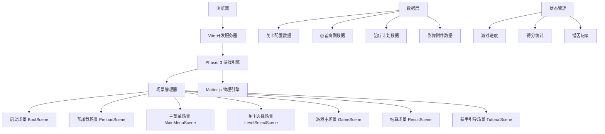

## 1. 架构设计



## 2. 技术描述

### 核心技术栈
- **前端框架**：Phaser 3.70.x - 2D 游戏引擎，提供场景管理、输入处理、动画系统
- **开发语言**：TypeScript 5.x - 类型安全，提升代码可维护性
- **构建工具**：Vite 5.x - 快速开发服务器，热模块替换
- **物理引擎**：Matter.js 0.19.x - 用于 UI 交互动画、拖拽效果、物理反馈
- **样式方案**：Tailwind CSS 3.x - 用于 DOM UI 元素样式（结算页面、设置弹窗等）
- **图标库**：Lucide React - 高质量线性图标（用于 DOM 层 UI）

### 技术选型说明
1. **Phaser 3**：成熟的 HTML5 游戏引擎，内置场景管理、资源加载、输入处理、动画系统，适合开发 2D 模拟类游戏
2. **TypeScript**：提供类型安全，减少运行时错误，提升大型项目的可维护性
3. **Vite**：极快的冷启动和热更新，提升开发体验
4. **Matter.js**：轻量级 2D 物理引擎，用于实现卡片拖拽、弹性动画、碰撞反馈等增强交互体验的效果
5. **Tailwind CSS**：用于游戏中 DOM 层的 UI 元素（如结算页面、设置弹窗），快速构建响应式界面

### 初始化命令
```bash
# macOS / Linux
npm init vite-init@latest -y . -- --template react-ts --force
```

## 3. 场景定义（Phaser Scenes）

| 场景名称 | 路径 | 功能描述 |
|----------|------|----------|
| BootScene | `src/scenes/BootScene.ts` | 游戏启动入口，初始化基础配置，加载必要资源 |
| PreloadScene | `src/scenes/PreloadScene.ts` | 预加载所有游戏资源（图片、音频、数据），显示加载进度 |
| MainMenuScene | `src/scenes/MainMenuScene.ts` | 主菜单界面，提供开始游戏、关卡选择、设置等入口 |
| LevelSelectScene | `src/scenes/LevelSelectScene.ts` | 关卡选择界面，支持模式切换（训练/自由/挑战） |
| GameScene | `src/scenes/GameScene.ts` | 游戏核心场景，处理任务、影像、决策逻辑 |
| ResultScene | `src/scenes/ResultScene.ts` | 结算页面，展示得分、用时、错因分析 |
| TutorialScene | `src/scenes/TutorialScene.ts` | 新手引导场景，分步讲解游戏玩法 |

## 4. 数据模型定义

### 4.1 核心类型定义

```typescript
// 患者信息
interface Patient {
  id: string;
  name: string;
  age: number;
  gender: 'male' | 'female';
  avatar: string;
  medicalRecord: string;
}

// 影像附件
interface ImageAttachment {
  id: string;
  type: 'xray' | 'ct' | 'photo' | 'scan';
  url: string;
  thumbnail: string;
  description: string;
  date: string;
}

// 治疗计划
interface TreatmentPlan {
  id: string;
  name: string;
  description: string;
  steps: TreatmentStep[];
  followUp?: FollowUpTask;
}

interface TreatmentStep {
  id: string;
  order: number;
  description: string;
  requiredImages: string[];
}

interface FollowUpTask {
  id: string;
  type: 'review' | 'reminder' | 're-examination';
  dueDate: string;
  description: string;
}

// 关卡任务
interface GameTask {
  id: string;
  patient: Patient;
  treatmentPlan: TreatmentPlan;
  images: ImageAttachment[];
  correctAction: ActionType;
  correctReason: string;
  timeLimit: number;
  points: number;
  difficulty: 'easy' | 'medium' | 'hard';
}

// 操作类型
type ActionType = 
  | 'archive'          // 正常归档
  | 'forward_doctor'   // 转发给医生
  | 'forward_front'    // 转发给前台
  | 'return_missing'   // 退回（缺少资料）
  | 'return_quality'   // 退回（质量问题）
  | 'follow_up'        // 随访提醒
  | 'missed_appointment'; // 患者爽约处理

// 关卡定义
interface Level {
  id: string;
  name: string;
  description: string;
  category: 'archive' | 'frontdesk' | 'nurse';
  mode: 'training' | 'practice' | 'challenge';
  difficulty: 'easy' | 'medium' | 'hard';
  tasks: string[];
  timeLimit: number;
  passingScore: number;
  unlocked: boolean;
  stars: number;
  bestScore: number;
}

// 游戏状态
interface GameState {
  currentLevel: Level | null;
  currentTaskIndex: number;
  tasks: GameTask[];
  score: number;
  combo: number;
  maxCombo: number;
  startTime: number;
  elapsedTime: number;
  errors: GameError[];
  correctCount: number;
  totalCount: number;
  isPaused: boolean;
  isTutorial: boolean;
}

// 错误记录
interface GameError {
  taskId: string;
  patientName: string;
  selectedAction: ActionType;
  correctAction: ActionType;
  reason: string;
  timestamp: number;
}
```

### 4.2 操作选项配置

```typescript
interface ActionOption {
  type: ActionType;
  label: string;
  icon: string;
  description: string;
  color: string;
}

const ACTION_OPTIONS: ActionOption[] = [
  {
    type: 'archive',
    label: '正常归档',
    icon: 'archive',
    description: '资料完整，符合归档要求',
    color: '#43A047'
  },
  {
    type: 'forward_doctor',
    label: '转发医生',
    icon: 'user-md',
    description: '需要医生确认或补充',
    color: '#1E88E5'
  },
  {
    type: 'forward_front',
    label: '转发前台',
    icon: 'building',
    description: '涉及费用或预约问题',
    color: '#FF9800'
  },
  {
    type: 'return_missing',
    label: '退回-缺资料',
    icon: 'file-x',
    description: '缺少必要的影像或文档',
    color: '#E53935'
  },
  {
    type: 'return_quality',
    label: '退回-质量差',
    icon: 'image-off',
    description: '影像质量不符合要求',
    color: '#E53935'
  },
  {
    type: 'follow_up',
    label: '随访提醒',
    icon: 'calendar-clock',
    description: '需要设置随访提醒',
    color: '#8E24AA'
  },
  {
    type: 'missed_appointment',
    label: '爽约处理',
    icon: 'user-x',
    description: '患者未按时就诊',
    color: '#795548'
  }
];
```

## 5. 项目结构

```
MP0197/
├── .trae/documents/          # 项目文档
├── public/                   # 静态资源
│   ├── images/               # 游戏图片资源
│   │   ├── ui/               # UI 元素
│   │   ├── avatars/          # 患者头像
│   │   ├── images/           # 模拟影像图片
│   │   └── icons/            # 图标资源
│   └── data/                 # 静态数据
│       ├── levels.json       # 关卡配置
│       ├── tasks.json        # 任务数据
│       └── tutorial.json     # 新手引导配置
├── src/
│   ├── scenes/               # Phaser 场景
│   │   ├── BootScene.ts
│   │   ├── PreloadScene.ts
│   │   ├── MainMenuScene.ts
│   │   ├── LevelSelectScene.ts
│   │   ├── GameScene.ts
│   │   ├── ResultScene.ts
│   │   └── TutorialScene.ts
│   ├── components/           # 可复用组件
│   │   ├── ui/               # UI 组件
│   │   │   ├── Button.ts
│   │   │   ├── Card.ts
│   │   │   ├── ProgressBar.ts
│   │   │   └── Timer.ts
│   │   ├── game/             # 游戏组件
│   │   │   ├── TaskPanel.ts
│   │   │   ├── ImageViewer.ts
│   │   │   ├── DecisionPanel.ts
│   │   │   └── TreatmentPlanView.ts
│   │   └── physics/          # Matter.js 物理组件
│   │       └── DraggableCard.ts
│   ├── types/                # TypeScript 类型定义
│   │   ├── game.ts
│   │   └── index.ts
│   ├── data/                 # 游戏数据
│   │   ├── levels.ts
│   │   ├── tasks.ts
│   │   └── actions.ts
│   ├── stores/               # 状态管理
│   │   └── gameStore.ts
│   ├── utils/                # 工具函数
│   │   ├── scoring.ts        # 得分计算
│   │   ├── validation.ts     # 验证逻辑
│   │   └── animation.ts      # 动画辅助
│   ├── config/               # 配置文件
│   │   ├── gameConfig.ts
│   │   └── colors.ts
│   ├── App.tsx               # React 根组件（DOM UI 层）
│   ├── main.tsx              # React 入口
│   ├── game.ts               # Phaser 游戏实例
│   ├── index.css             # 全局样式
│   └── vite-env.d.ts
├── index.html
├── package.json
├── tsconfig.json
├── vite.config.ts
└── tailwind.config.js
```

## 6. 核心算法与逻辑

### 6.1 得分计算算法

```typescript
/**
 * 计算任务得分
 * @param basePoints 基础分
 * @param responseTime 响应时间（秒）
 * @param combo 连击数
 * @param timeLimit 时间限制
 * @returns 最终得分
 */
function calculateScore(
  basePoints: number,
  responseTime: number,
  combo: number,
  timeLimit: number
): number {
  // 基础分
  let score = basePoints;
  
  // 时间奖励：响应越快，奖励越高
  const timeRatio = Math.max(0, (timeLimit - responseTime) / timeLimit);
  const timeBonus = Math.floor(basePoints * timeRatio * 0.5);
  score += timeBonus;
  
  // 连击奖励：每次连击增加 10%，最高 50%
  const comboMultiplier = Math.min(1 + combo * 0.1, 1.5);
  score = Math.floor(score * comboMultiplier);
  
  return score;
}

/**
 * 计算星级评定
 * @param score 最终得分
 * @param maxScore 满分
 * @returns 星级（1-3）
 */
function calculateStars(score: number, maxScore: number): number {
  const ratio = score / maxScore;
  if (ratio >= 0.9) return 3;
  if (ratio >= 0.7) return 2;
  if (ratio >= 0.5) return 1;
  return 0;
}
```

### 6.2 任务验证逻辑

```typescript
/**
 * 验证用户操作是否正确
 * @param task 当前任务
 * @param selectedAction 用户选择的操作
 * @returns 验证结果
 */
function validateAction(
  task: GameTask,
  selectedAction: ActionType
): ValidationResult {
  const isCorrect = selectedAction === task.correctAction;
  
  return {
    isCorrect,
    correctAction: task.correctAction,
    reason: task.correctReason,
    points: isCorrect 
      ? calculateScore(task.points, responseTime, combo, task.timeLimit)
      : -Math.floor(task.points * 0.3)
  };
}
```

### 6.3 错因分类

```typescript
const ERROR_CATEGORIES = {
  WRONG_ARCHIVE: {
    code: 'wrong_archive',
    label: '误归档',
    description: '资料不完整或有问题时不应直接归档'
  },
  MISSED_FOLLOWUP: {
    code: 'missed_followup',
    label: '遗漏随访',
    description: '有随访任务时应设置随访提醒'
  },
  WRONG_FORWARD: {
    code: 'wrong_forward',
    label: '转发错误',
    description: '转发给了错误的岗位'
  },
  UNNECESSARY_RETURN: {
    code: 'unnecessary_return',
    label: '不必要退回',
    description: '资料完整时不应退回'
  },
  MISSED_MISSED_APPOINTMENT: {
    code: 'missed_missed_appointment',
    label: '未识别爽约',
    description: '患者爽约时应按爽约流程处理'
  }
};
```

## 7. 状态管理

使用 Zustand 管理全局游戏状态，Phaser 场景与 React UI 层共享状态。

```typescript
// src/stores/gameStore.ts
import { create } from 'zustand';

interface GameStore {
  // 游戏状态
  currentScene: string;
  gameState: GameState | null;
  
  // 关卡进度
  completedLevels: Record<string, { stars: number; bestScore: number }>;
  
  // 设置
  soundEnabled: boolean;
  musicEnabled: boolean;
  tutorialCompleted: boolean;
  
  // Actions
  setCurrentScene: (scene: string) => void;
  startGame: (level: Level) => void;
  endGame: () => GameResult;
  recordAction: (taskId: string, selected: ActionType, correct: ActionType, isCorrect: boolean) => void;
  updateScore: (points: number) => void;
  toggleSound: () => void;
  toggleMusic: () => void;
  completeTutorial: () => void;
  resetProgress: () => void;
}

export const useGameStore = create<GameStore>((set, get) => ({
  // 初始状态...
}));
```

## 8. 性能优化

1. **资源懒加载**：按场景预加载资源，避免一次性加载所有资源
2. **对象池**：重复利用游戏对象，减少频繁创建销毁
3. **纹理图集**：将 UI 图片打包为纹理图集，减少 Draw Call
4. **事件节流**：对高频输入事件进行节流处理
5. **物理模拟优化**：只在需要时启用 Matter.js 物理模拟
6. **虚拟列表**：关卡选择和错因列表使用虚拟滚动
