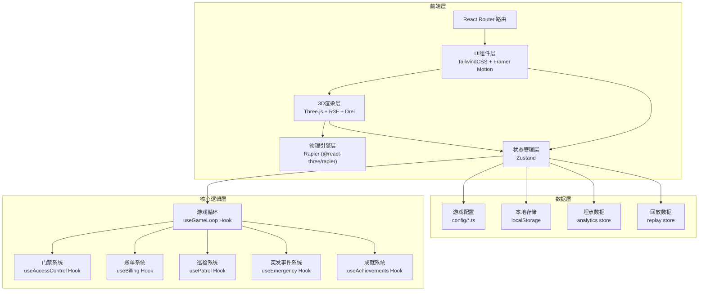
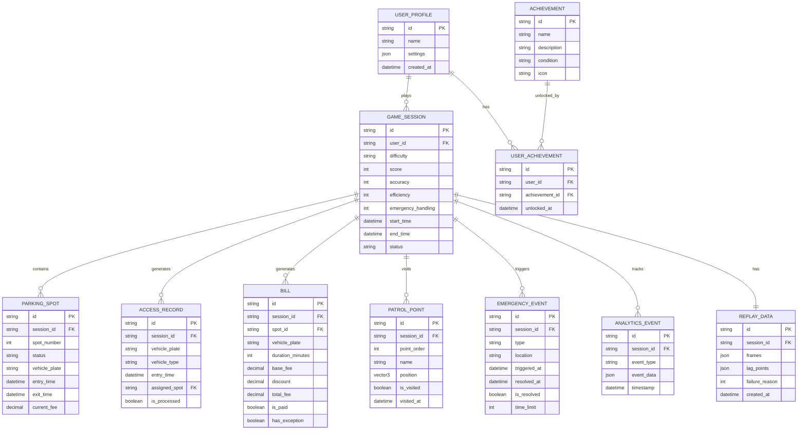

## 1. 架构设计



## 2. 技术描述

### 2.1 前端技术栈
- **框架**: React 18 + TypeScript
- **构建工具**: Vite 5
- **路由**: react-router-dom 6
- **状态管理**: zustand 4
- **样式**: tailwindcss 3
- **动画**: framer-motion
- **图标**: lucide-react
- **3D渲染**: three 0.160, @react-three/fiber 8.15, @react-three/drei 9.92
- **物理引擎**: @dimforge/rapier3d-compat 0.12, @react-three/rapier 0.15
- **后处理**: @react-three/postprocessing 2.15

### 2.2 项目结构
```
src/
├── components/          # React组件
│   ├── ui/             # 通用UI组件
│   ├── game/           # 游戏相关组件
│   ├── hud/            # 游戏内HUD
│   └── three/          # 3D场景组件
├── hooks/              # 自定义Hooks
│   ├── useGameLoop.ts
│   ├── useAccessControl.ts
│   ├── useBilling.ts
│   ├── usePatrol.ts
│   ├── useEmergency.ts
│   ├── useAchievements.ts
│   └── useReplay.ts
├── store/              # Zustand状态
│   ├── gameStore.ts
│   ├── replayStore.ts
│   └── analyticsStore.ts
├── config/             # 游戏配置
│   ├── difficulty.ts
│   ├── achievements.ts
│   ├── items.ts
│   └── analytics.ts
├── pages/              # 页面组件
│   ├── MainMenu.tsx
│   ├── GameScene.tsx
│   ├── Settlement.tsx
│   ├── Review.tsx
│   └── Settings.tsx
├── types/              # TypeScript类型
│   └── index.ts
├── utils/              # 工具函数
│   ├── math.ts
│   ├── time.ts
│   └── storage.ts
├── App.tsx
├── main.tsx
└── index.css
```

### 2.3 无后端设计
- 所有数据存储在浏览器 localStorage 中
- 游戏配置为静态 TypeScript 文件
- 回放数据使用 IndexedDB 存储（可选）
- 埋点数据本地存储，不上传服务器

## 3. 路由定义

| 路由 | 页面 | 说明 |
|------|------|------|
| `/` | MainMenu | 主菜单页面 |
| `/game` | GameScene | 3D游戏场景 |
| `/settlement` | Settlement | 结算页面 |
| `/review` | Review | 复盘分析页面 |
| `/review/:replayId` | Review | 指定回放ID的复盘页面 |
| `/settings` | Settings | 设置页面 |

## 4. 数据模型

### 4.1 数据模型ER图



### 4.2 核心类型定义

```typescript
// 游戏难度配置
interface DifficultyConfig {
  id: 'easy' | 'normal' | 'hard';
  name: string;
  description: string;
  billingComplexity: number;      // 账单复杂度 1-3
  emergencyFrequency: number;     // 突发事件频率 0-1
  emergencyTimeLimit: number;     // 应急处理时限(秒)
  patrolPointCount: number;       // 巡检点数量
  timeMultiplier: number;         // 时间流速倍率
  itemCooldowns: Record<string, number>; // 道具冷却时间(秒)
}

// 车位状态
interface ParkingSpot {
  id: string;
  number: number;
  status: 'empty' | 'occupied' | 'reserved';
  vehiclePlate?: string;
  entryTime?: number;
  exitTime?: number;
  currentFee: number;
  position: [number, number, number];
}

// 门禁记录
interface AccessRecord {
  id: string;
  vehiclePlate: string;
  vehicleType: 'car' | 'truck' | 'motorcycle';
  entryTime: number;
  assignedSpotId?: string;
  isProcessed: boolean;
}

// 账单
interface Bill {
  id: string;
  spotId: string;
  vehiclePlate: string;
  durationMinutes: number;
  baseFee: number;
  discount: number;
  totalFee: number;
  isPaid: boolean;
  hasException: boolean;
  exceptionReason?: string;
}

// 巡检点
interface PatrolPoint {
  id: string;
  order: number;
  name: string;
  position: [number, number, number];
  isVisited: boolean;
  visitedAt?: number;
  task?: {
    type: 'check' | 'repair' | 'verify';
    description: string;
  };
}

// 突发事件
interface EmergencyEvent {
  id: string;
  type: 'device_failure' | 'payment_issue' | 'vehicle_block';
  location: string;
  position: [number, number, number];
  triggeredAt: number;
  resolvedAt?: number;
  isResolved: boolean;
  timeLimit: number;
  description: string;
}

// 回放帧数据
interface ReplayFrame {
  timestamp: number;
  playerPosition: [number, number, number];
  cameraRotation: [number, number, number];
  spots: ParkingSpot[];
  currentTask: string;
  interaction?: {
    type: 'drag' | 'click' | 'key';
    target: string;
  };
}

// 卡顿点数据
interface LagPoint {
  timestamp: number;
  duration: number;
  reason: 'thinking' | 'interaction' | 'waiting';
  description: string;
  position: [number, number, number];
}

// 回放数据
interface ReplayData {
  id: string;
  sessionId: string;
  difficulty: string;
  startTime: number;
  endTime: number;
  frames: ReplayFrame[];
  lagPoints: LagPoint[];
  failureReason: string;
  finalScore: number;
}

// 成就
interface Achievement {
  id: string;
  name: string;
  description: string;
  icon: string;
  condition: {
    type: 'score' | 'time' | 'accuracy' | 'streak';
    operator: 'gt' | 'lt' | 'eq';
    value: number;
  };
  isUnlocked: boolean;
  unlockedAt?: number;
}

// 埋点事件
interface AnalyticsEvent {
  id: string;
  sessionId: string;
  eventType: 'game_start' | 'game_end' | 'task_complete' | 'task_fail' | 'emergency' | 'achievement';
  eventData: Record<string, any>;
  timestamp: number;
}
```

## 5. 关键技术方案

### 5.1 3D拖拽交互方案
使用 `@react-three/rapier` 提供的物理碰撞检测，结合自定义拖拽逻辑：
1. 门禁卡片使用 `RigidBody` + `Collider` 启用物理碰撞
2. 使用 `useDrag` 自定义 Hook 处理鼠标/触摸拖拽
3. 车位使用 `Sensor` 碰撞器检测卡片释放
4. 吸附逻辑：当卡片距离车位 < 1m 时，自动吸附到车位中心

### 5.2 时间流速系统
游戏内时间与现实时间分离：
```typescript
// 简单难度: 游戏1分钟 = 现实10秒
// 普通难度: 游戏1分钟 = 现实5秒  
// 困难难度: 游戏1分钟 = 现实3秒
```
使用 `useFrame` 钩子每帧更新游戏时间，账单费用按游戏时间实时计算。

### 5.3 回放系统设计
- 每 100ms 记录一帧游戏状态（帧数据压缩存储）
- 监听用户操作间隔，超过 3 秒无操作标记为卡顿点
- 卡顿点分类：思考中(3-5s)、交互困难(5-10s)、等待超时(>10s)
- 最多存储 3 次失败回放，使用队列方式替换最旧记录
- 回放时可跳转到指定卡顿点

### 5.4 状态管理分区
使用 Zustand 分割为三个独立 store：
1. `gameStore` - 游戏核心状态（车位、账单、巡检、突发事件）
2. `replayStore` - 回放数据管理
3. `analyticsStore` - 埋点数据收集

### 5.5 配置驱动设计
所有游戏参数通过配置文件控制：
- `difficulty.ts` - 三档难度参数
- `achievements.ts` - 成就定义和解锁条件
- `items.ts` - 道具定义和冷却时间
- `analytics.ts` - 埋点事件定义

修改配置无需改动业务代码。

## 6. 性能优化

### 6.1 3D性能
- 使用 `InstancedMesh` 渲染重复物体（路灯、树木）
- 启用 `frustumCulled` 视锥体剔除
- 阴影使用 `PCFSoftShadowMap` 平衡质量与性能
- 后处理效果可在设置中开关

### 6.2 状态更新
- 使用 Zustand `selectors` 避免不必要的重渲染
- 账单更新采用 `setTimeout` 批量处理
- 大数组操作使用 `useMemo` 缓存结果

### 6.3 回放性能
- 回放帧数据使用 delta 压缩（仅存储变化量）
- 卡顿点独立存储，不随帧数据重复
- 回放时按需加载帧数据，避免一次性加载大量数据
