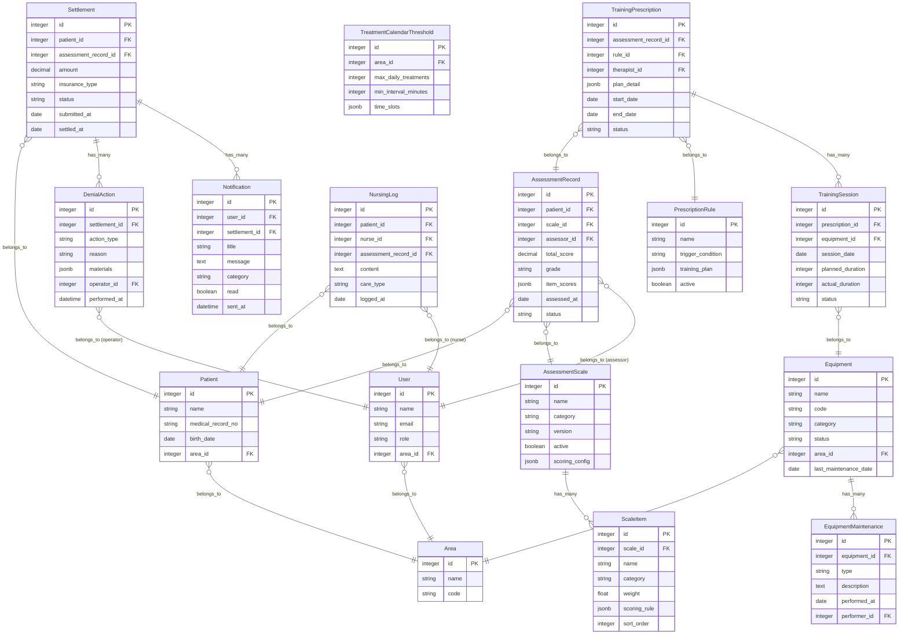

## 1. 架构设计

```mermaid
flowchart TB
    subgraph "前端层 - Hotwire"
        "Turbo Drive" --- "Turbo Frames"
        "Turbo Frames" --- "Stimulus Controllers"
        "Stimulus Controllers" --- "Tailwind CSS"
    end

    subgraph "应用层 - Ruby on Rails 7"
        "Routes" --- "Controllers"
        "Controllers" --- "Services"
        "Services" --- "Models"
    end

    subgraph "后台任务 - Sidekiq"
        "Sidekiq Workers" --- "Redis"
        "Sidekiq Workers" --- "ActionMailer"
    end

    subgraph "数据层"
        "PostgreSQL" --- "pg_search"
        "PostgreSQL" --- "ActiveRecord"
    end

    "前端层 - Hotwire" --> "应用层 - Ruby on Rails 7"
    "应用层 - Ruby on Rails 7" --> "后台任务 - Sidekiq"
    "应用层 - Ruby on Rails 7" --> "数据层"
```

## 2. 技术说明

- **后端**：Ruby on Rails 7.1+，采用经典 MVC + Service Object 模式
- **前端**：Hotwire（Turbo Drive + Turbo Frames + Stimulus.js）+ Tailwind CSS 3
- **数据库**：PostgreSQL 16，使用 pg_search 全文搜索
- **后台任务**：Sidekiq 7 + Redis 7，处理拒付提醒推送、报表计算
- **认证授权**：Devise + Pundit
- **构建工具**：Rails 7 importmap / esbuild + Tailwind CSS CLI

## 3. 路由定义

| 路由 | 用途 |
|------|------|
| `/` | 仪表盘概览 |
| `/assessment_scales` | 评估量表列表 |
| `/assessment_scales/:id` | 量表详情与项目编辑 |
| `/assessment_records` | 评估记录列表 |
| `/assessment_records/new` | 新建评估 |
| `/assessment_records/:id` | 评估记录详情 |
| `/prescription_rules` | 训练处方规则管理 |
| `/prescription_executions` | 处方执行追踪 |
| `/treatment_calendars` | 治疗日历（含阈值设置） |
| `/equipment` | 器械管理 |
| `/equipment/:id` | 器械详情 |
| `/nursing_logs` | 护理日志列表 |
| `/nursing_logs/:id` | 护理日志详情 |
| `/settlements` | 医保结算单列表 |
| `/settlements/:id` | 结算单详情与拒付处理 |
| `/settlements/:id/timeline` | 操作回看时间线 |
| `/analytics/completion_rate` | 训练完成率复盘 |
| `/analytics/combined_query` | 组合查询 |
| `/analytics/trends` | 趋势报表 |

## 4. API 定义

### 4.1 评估量表相关

```ruby
# AssessmentScales::ItemsController
# POST /assessment_scales/:scale_id/items
{ item: { name: String, category: String, weight: Float, scoring_rule: Hash } }

# AssessmentRecordsController
# POST /assessment_records
{ assessment_record: { patient_id: Integer, scale_id: Integer, items_attributes: [{ scale_item_id: Integer, score: Integer }] } }
```

### 4.2 医保结算相关

```ruby
# SettlementsController
# PATCH /settlements/:id/retry
{ settlement: { supplement_materials: [file], retry_reason: String } }

# PATCH /settlements/:id/close
{ settlement: { close_reason: String } }
```

### 4.3 复盘分析相关

```ruby
# Analytics::CompletionRatesController
# GET /analytics/completion_rate
{ filters: { start_date: Date, end_date: Date, area: String, responsible_person_id: Integer, status: String } }
```

## 5. 服务架构图

```mermaid
flowchart LR
    subgraph "Controller 层"
        "AssessmentScalesController"
        "AssessmentRecordsController"
        "PrescriptionRulesController"
        "SettlementsController"
        "AnalyticsController"
    end

    subgraph "Service 层"
        "AssessmentService"
        "PrescriptionEngine"
        "SettlementProcessor"
        "DenialNotifier"
        "CompletionRateCalculator"
    end

    subgraph "Model 层"
        "AssessmentScale"
        "AssessmentRecord"
        "PrescriptionRule"
        "Settlement"
        "DenialAction"
    end

    "Controller 层" --> "Service 层"
    "Service 层" --> "Model 层"
```

## 6. 数据模型

### 6.1 数据模型定义



### 6.2 数据定义语言

```sql
-- 区域
CREATE TABLE areas (
  id BIGSERIAL PRIMARY KEY,
  name VARCHAR(100) NOT NULL,
  code VARCHAR(20) NOT NULL UNIQUE,
  created_at TIMESTAMP NOT NULL DEFAULT NOW(),
  updated_at TIMESTAMP NOT NULL DEFAULT NOW()
);

-- 用户
CREATE TABLE users (
  id BIGSERIAL PRIMARY KEY,
  name VARCHAR(100) NOT NULL,
  email VARCHAR(255) NOT NULL UNIQUE,
  role VARCHAR(20) NOT NULL DEFAULT 'therapist',
  area_id BIGINT REFERENCES areas(id),
  created_at TIMESTAMP NOT NULL DEFAULT NOW(),
  updated_at TIMESTAMP NOT NULL DEFAULT NOW()
);

-- 患者
CREATE TABLE patients (
  id BIGSERIAL PRIMARY KEY,
  name VARCHAR(100) NOT NULL,
  medical_record_no VARCHAR(50) NOT NULL UNIQUE,
  birth_date DATE,
  area_id BIGINT REFERENCES areas(id),
  created_at TIMESTAMP NOT NULL DEFAULT NOW(),
  updated_at TIMESTAMP NOT NULL DEFAULT NOW()
);

-- 评估量表
CREATE TABLE assessment_scales (
  id BIGSERIAL PRIMARY KEY,
  name VARCHAR(200) NOT NULL,
  category VARCHAR(50) NOT NULL,
  version VARCHAR(20) NOT NULL DEFAULT '1.0',
  active BOOLEAN NOT NULL DEFAULT TRUE,
  scoring_config JSONB DEFAULT '{}',
  created_at TIMESTAMP NOT NULL DEFAULT NOW(),
  updated_at TIMESTAMP NOT NULL DEFAULT NOW()
);

-- 量表项目
CREATE TABLE scale_items (
  id BIGSERIAL PRIMARY KEY,
  scale_id BIGINT NOT NULL REFERENCES assessment_scales(id) ON DELETE CASCADE,
  name VARCHAR(200) NOT NULL,
  category VARCHAR(50),
  weight DECIMAL(5,2) DEFAULT 1.0,
  scoring_rule JSONB DEFAULT '{}',
  sort_order INTEGER DEFAULT 0,
  created_at TIMESTAMP NOT NULL DEFAULT NOW(),
  updated_at TIMESTAMP NOT NULL DEFAULT NOW()
);

-- 评估记录
CREATE TABLE assessment_records (
  id BIGSERIAL PRIMARY KEY,
  patient_id BIGINT NOT NULL REFERENCES patients(id),
  scale_id BIGINT NOT NULL REFERENCES assessment_scales(id),
  assessor_id BIGINT NOT NULL REFERENCES users(id),
  total_score DECIMAL(8,2),
  grade VARCHAR(10),
  item_scores JSONB DEFAULT '{}',
  assessed_at DATE NOT NULL,
  status VARCHAR(20) NOT NULL DEFAULT 'draft',
  created_at TIMESTAMP NOT NULL DEFAULT NOW(),
  updated_at TIMESTAMP NOT NULL DEFAULT NOW()
);

-- 处方规则
CREATE TABLE prescription_rules (
  id BIGSERIAL PRIMARY KEY,
  name VARCHAR(200) NOT NULL,
  trigger_condition TEXT NOT NULL,
  training_plan JSONB DEFAULT '{}',
  active BOOLEAN NOT NULL DEFAULT TRUE,
  created_at TIMESTAMP NOT NULL DEFAULT NOW(),
  updated_at TIMESTAMP NOT NULL DEFAULT NOW()
);

-- 训练处方
CREATE TABLE training_prescriptions (
  id BIGSERIAL PRIMARY KEY,
  assessment_record_id BIGINT NOT NULL REFERENCES assessment_records(id),
  rule_id BIGINT REFERENCES prescription_rules(id),
  therapist_id BIGINT NOT NULL REFERENCES users(id),
  plan_detail JSONB DEFAULT '{}',
  start_date DATE NOT NULL,
  end_date DATE,
  status VARCHAR(20) NOT NULL DEFAULT 'pending',
  created_at TIMESTAMP NOT NULL DEFAULT NOW(),
  updated_at TIMESTAMP NOT NULL DEFAULT NOW()
);

-- 训练执行记录
CREATE TABLE training_sessions (
  id BIGSERIAL PRIMARY KEY,
  prescription_id BIGINT NOT NULL REFERENCES training_prescriptions(id),
  equipment_id BIGINT REFERENCES equipment(id),
  session_date DATE NOT NULL,
  planned_duration INTEGER NOT NULL DEFAULT 0,
  actual_duration INTEGER DEFAULT 0,
  status VARCHAR(20) NOT NULL DEFAULT 'planned',
  created_at TIMESTAMP NOT NULL DEFAULT NOW(),
  updated_at TIMESTAMP NOT NULL DEFAULT NOW()
);

-- 治疗日历阈值
CREATE TABLE treatment_calendar_thresholds (
  id BIGSERIAL PRIMARY KEY,
  area_id BIGINT NOT NULL REFERENCES areas(id),
  max_daily_treatments INTEGER NOT NULL DEFAULT 20,
  min_interval_minutes INTEGER NOT NULL DEFAULT 30,
  time_slots JSONB DEFAULT '[]',
  created_at TIMESTAMP NOT NULL DEFAULT NOW(),
  updated_at TIMESTAMP NOT NULL DEFAULT NOW()
);

-- 器械
CREATE TABLE equipment (
  id BIGSERIAL PRIMARY KEY,
  name VARCHAR(200) NOT NULL,
  code VARCHAR(50) NOT NULL UNIQUE,
  category VARCHAR(50),
  status VARCHAR(20) NOT NULL DEFAULT 'normal',
  area_id BIGINT REFERENCES areas(id),
  last_maintenance_date DATE,
  created_at TIMESTAMP NOT NULL DEFAULT NOW(),
  updated_at TIMESTAMP NOT NULL DEFAULT NOW()
);

-- 器械维护记录
CREATE TABLE equipment_maintenances (
  id BIGSERIAL PRIMARY KEY,
  equipment_id BIGINT NOT NULL REFERENCES equipment(id),
  type VARCHAR(30) NOT NULL,
  description TEXT,
  performed_at DATE NOT NULL,
  performer_id BIGINT REFERENCES users(id),
  created_at TIMESTAMP NOT NULL DEFAULT NOW(),
  updated_at TIMESTAMP NOT NULL DEFAULT NOW()
);

-- 护理日志
CREATE TABLE nursing_logs (
  id BIGSERIAL PRIMARY KEY,
  patient_id BIGINT NOT NULL REFERENCES patients(id),
  nurse_id BIGINT NOT NULL REFERENCES users(id),
  assessment_record_id BIGINT REFERENCES assessment_records(id),
  content TEXT NOT NULL,
  care_type VARCHAR(30),
  logged_at DATE NOT NULL,
  created_at TIMESTAMP NOT NULL DEFAULT NOW(),
  updated_at TIMESTAMP NOT NULL DEFAULT NOW()
);

-- 结算单
CREATE TABLE settlements (
  id BIGSERIAL PRIMARY KEY,
  patient_id BIGINT NOT NULL REFERENCES patients(id),
  assessment_record_id BIGINT REFERENCES assessment_records(id),
  amount DECIMAL(12,2) NOT NULL DEFAULT 0,
  insurance_type VARCHAR(30),
  status VARCHAR(20) NOT NULL DEFAULT 'pending',
  submitted_at DATE,
  settled_at DATE,
  created_at TIMESTAMP NOT NULL DEFAULT NOW(),
  updated_at TIMESTAMP NOT NULL DEFAULT NOW()
);

-- 拒付操作记录
CREATE TABLE denial_actions (
  id BIGSERIAL PRIMARY KEY,
  settlement_id BIGINT NOT NULL REFERENCES settlements(id),
  action_type VARCHAR(20) NOT NULL,
  reason TEXT,
  materials JSONB DEFAULT '[]',
  operator_id BIGINT NOT NULL REFERENCES users(id),
  performed_at TIMESTAMP NOT NULL DEFAULT NOW(),
  created_at TIMESTAMP NOT NULL DEFAULT NOW(),
  updated_at TIMESTAMP NOT NULL DEFAULT NOW()
);

-- 通知
CREATE TABLE notifications (
  id BIGSERIAL PRIMARY KEY,
  user_id BIGINT NOT NULL REFERENCES users(id),
  settlement_id BIGINT REFERENCES settlements(id),
  title VARCHAR(200) NOT NULL,
  message TEXT,
  category VARCHAR(30),
  read BOOLEAN NOT NULL DEFAULT FALSE,
  sent_at TIMESTAMP NOT NULL DEFAULT NOW(),
  created_at TIMESTAMP NOT NULL DEFAULT NOW(),
  updated_at TIMESTAMP NOT NULL DEFAULT NOW()
);

-- 索引
CREATE INDEX idx_assessment_records_patient ON assessment_records(patient_id);
CREATE INDEX idx_assessment_records_assessor ON assessment_records(assessor_id);
CREATE INDEX idx_assessment_records_status ON assessment_records(status);
CREATE INDEX idx_assessment_records_assessed_at ON assessment_records(assessed_at);
CREATE INDEX idx_scale_items_scale ON scale_items(scale_id);
CREATE INDEX idx_training_prescriptions_status ON training_prescriptions(status);
CREATE INDEX idx_training_sessions_prescription ON training_sessions(prescription_id);
CREATE INDEX idx_training_sessions_date ON training_sessions(session_date);
CREATE INDEX idx_training_sessions_status ON training_sessions(status);
CREATE INDEX idx_settlements_status ON settlements(status);
CREATE INDEX idx_settlements_patient ON settlements(patient_id);
CREATE INDEX idx_denial_actions_settlement ON denial_actions(settlement_id);
CREATE INDEX idx_notifications_user ON notifications(user_id);
CREATE INDEX idx_notifications_read ON notifications(read);
CREATE INDEX idx_nursing_logs_patient ON nursing_logs(patient_id);
CREATE INDEX idx_nursing_logs_date ON nursing_logs(logged_at);
CREATE INDEX idx_equipment_status ON equipment(status);
CREATE INDEX idx_equipment_area ON equipment(area_id);
