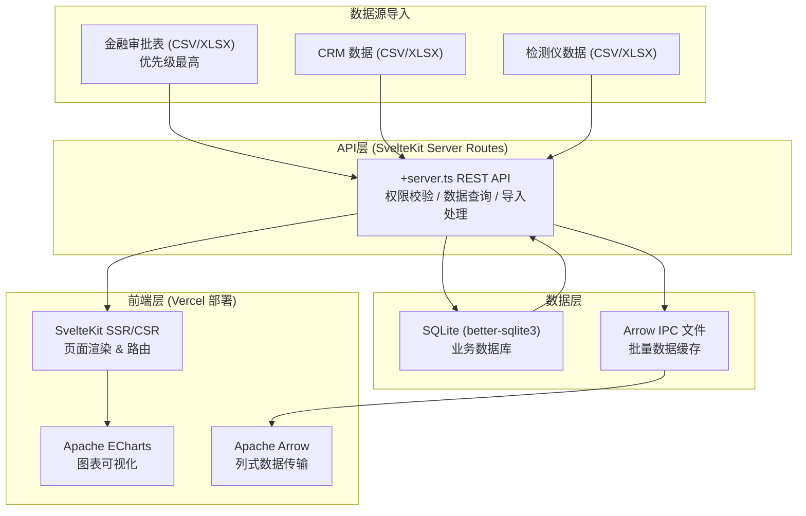
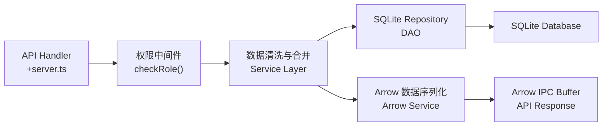
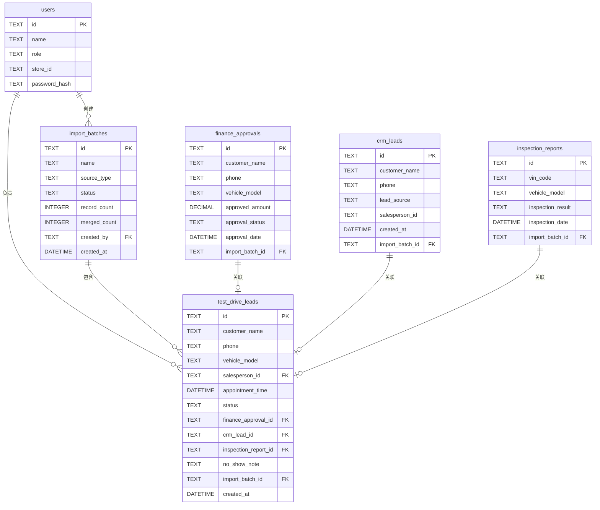

## 1. 架构设计



## 2. 技术说明

- **前端框架**: SvelteKit@2 + TypeScript
- **图表库**: Apache ECharts@5
- **数据传输**: Apache Arrow (apache-arrow@15)
- **数据库**: SQLite (better-sqlite3)
- **部署平台**: Vercel (Node.js Serverless Functions + SQLite via KV)
- **样式方案**: Tailwind CSS@3
- **UI 组件**: 自研组件库 (基于 Tailwind)
- **文件处理**: xlsx (SheetJS) 解析 Excel/CSV
- **构建工具**: Vite (SvelteKit 内置)

## 3. 路由定义

| 路由 | 页面用途 | 权限 |
|------|---------|------|
| /login | 登录页面 | 公开 |
| /dashboard | 管理层总览仪表盘 | 管理层 |
| /dashboard/analysis | 数据分析区 | 管理层/销售 |
| /dashboard/leads | 线索转化明细 | 管理层(全量)/销售(个人) |
| /dashboard/imports | 数据导入批次管理 | 管理层 |
| /api/auth/login | 登录 API | 公开 |
| /api/dashboard/overview | 总览指标数据 | 管理层 |
| /api/dashboard/funnel | 漏斗数据 API | 管理层/销售 |
| /api/dashboard/timeslots | 预约时段分布 | 管理层/销售 |
| /api/dashboard/trends | 客户线索变化趋势 | 管理层/销售 |
| /api/dashboard/ranking | 试驾排行 API | 管理层/销售 |
| /api/leads | 线索列表 API | 管理层(全量)/销售(个人) |
| /api/leads/:id/note | 爽约注释 API | 销售(本人线索) |
| /api/imports | 批次列表 API | 管理层 |
| /api/imports/:id | 批次详情回查 | 管理层 |
| /api/imports/upload | 数据上传合并 | 管理层 |

## 4. API 类型定义

```typescript
// 用户与权限
interface User {
  id: string;
  name: string;
  role: 'manager' | 'sales';
  storeId?: string;
}

// 试驾线索
interface TestDriveLead {
  id: string;
  customerName: string;
  phone: string;
  vehicleModel: string;
  salespersonId: string;
  salespersonName: string;
  appointmentTime: string;
  status: 'appointed' | 'arrived' | 'completed' | 'no_show' | 'closed';
  financeApprovalId?: string;
  crmLeadId?: string;
  inspectionReportId?: string;
  noShowNote?: string;
  createdAt: string;
  importBatchId: string;
}

// 转化漏斗阶段
interface FunnelStage {
  stage: 'leads' | 'appointments' | 'arrivals' | 'test_drives' | 'deals';
  label: string;
  count: number;
  conversionRate?: number;
}

// 预约时段分布
interface TimeSlotData {
  hour: number;
  dayOfWeek: number;
  count: number;
}

// 趋势数据
interface TrendPoint {
  date: string;
  leadsCount: number;
  testDriveCount: number;
}

// 排行数据
interface RankingItem {
  rank: number;
  name: string;
  value: number;
  change?: number;
}

// 导入批次
interface ImportBatch {
  id: string;
  name: string;
  sourceType: 'finance' | 'crm' | 'inspection';
  status: 'processing' | 'merged' | 'failed';
  recordCount: number;
  mergedCount: number;
  createdAt: string;
  createdBy: string;
}
```

## 5. 服务端架构



服务端分层：
- **路由层**: SvelteKit +server.ts 处理 HTTP 请求
- **服务层**: 指标加工、数据合并、权限过滤
- **仓储层**: SQLite CRUD 操作封装
- **数据层**: better-sqlite3 同步驱动，高性能查询

## 6. 数据模型

### 6.1 ER 图



### 6.2 DDL 语句

```sql
-- 用户表
CREATE TABLE IF NOT EXISTS users (
  id TEXT PRIMARY KEY,
  name TEXT NOT NULL,
  role TEXT NOT NULL CHECK (role IN ('manager', 'sales')),
  store_id TEXT,
  password_hash TEXT NOT NULL,
  created_at DATETIME DEFAULT CURRENT_TIMESTAMP
);

-- 导入批次表
CREATE TABLE IF NOT EXISTS import_batches (
  id TEXT PRIMARY KEY,
  name TEXT NOT NULL,
  source_type TEXT NOT NULL CHECK (source_type IN ('finance', 'crm', 'inspection')),
  status TEXT NOT NULL CHECK (status IN ('processing', 'merged', 'failed')),
  record_count INTEGER DEFAULT 0,
  merged_count INTEGER DEFAULT 0,
  created_by TEXT NOT NULL REFERENCES users(id),
  created_at DATETIME DEFAULT CURRENT_TIMESTAMP
);

-- 金融审批表
CREATE TABLE IF NOT EXISTS finance_approvals (
  id TEXT PRIMARY KEY,
  customer_name TEXT NOT NULL,
  phone TEXT NOT NULL,
  vehicle_model TEXT,
  approved_amount DECIMAL,
  approval_status TEXT,
  approval_date DATETIME,
  import_batch_id TEXT NOT NULL REFERENCES import_batches(id),
  created_at DATETIME DEFAULT CURRENT_TIMESTAMP
);

CREATE INDEX IF NOT EXISTS idx_finance_phone ON finance_approvals(phone);

-- CRM 线索表
CREATE TABLE IF NOT EXISTS crm_leads (
  id TEXT PRIMARY KEY,
  customer_name TEXT NOT NULL,
  phone TEXT NOT NULL,
  lead_source TEXT,
  salesperson_id TEXT REFERENCES users(id),
  created_at DATETIME,
  import_batch_id TEXT NOT NULL REFERENCES import_batches(id)
);

CREATE INDEX IF NOT EXISTS idx_crm_phone ON crm_leads(phone);

-- 检测报告表
CREATE TABLE IF NOT EXISTS inspection_reports (
  id TEXT PRIMARY KEY,
  vin_code TEXT,
  vehicle_model TEXT,
  customer_phone TEXT,
  inspection_result TEXT,
  inspection_date DATETIME,
  import_batch_id TEXT NOT NULL REFERENCES import_batches(id)
);

CREATE INDEX IF NOT EXISTS idx_inspection_phone ON inspection_reports(customer_phone);

-- 试驾线索主表（合并后）
CREATE TABLE IF NOT EXISTS test_drive_leads (
  id TEXT PRIMARY KEY,
  customer_name TEXT NOT NULL,
  phone TEXT NOT NULL,
  vehicle_model TEXT,
  salesperson_id TEXT REFERENCES users(id),
  appointment_time DATETIME,
  status TEXT NOT NULL DEFAULT 'appointed' CHECK (status IN ('appointed', 'arrived', 'completed', 'no_show', 'closed')),
  finance_approval_id TEXT REFERENCES finance_approvals(id),
  crm_lead_id TEXT REFERENCES crm_leads(id),
  inspection_report_id TEXT REFERENCES inspection_reports(id),
  no_show_note TEXT,
  import_batch_id TEXT NOT NULL REFERENCES import_batches(id),
  created_at DATETIME DEFAULT CURRENT_TIMESTAMP
);

CREATE INDEX IF NOT EXISTS idx_leads_salesperson ON test_drive_leads(salesperson_id);
CREATE INDEX IF NOT EXISTS idx_leads_status ON test_drive_leads(status);
CREATE INDEX IF NOT EXISTS idx_leads_batch ON test_drive_leads(import_batch_id);
CREATE INDEX IF NOT EXISTS idx_leads_appointment ON test_drive_leads(appointment_time);
```
