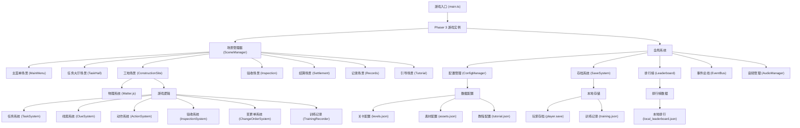
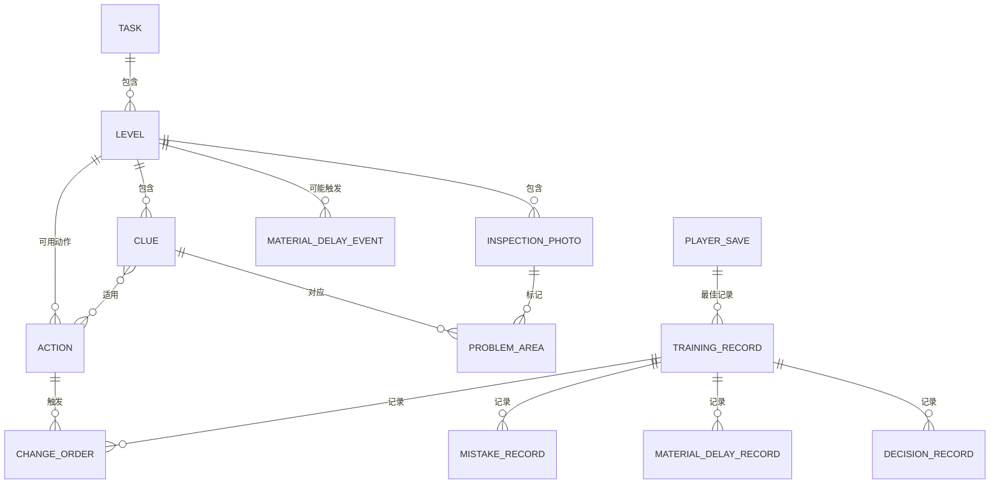

## 1. 架构设计



## 2. 技术描述

### 2.1 技术栈选型

| 技术 | 版本 | 用途 |
|------|------|------|
| Phaser 3 | ^3.70.0 | 2D 游戏引擎，负责场景管理、渲染、输入处理 |
| TypeScript | ^5.3.0 | 类型安全的 JavaScript 超集 |
| Vite | ^5.0.0 | 构建工具，提供快速开发体验 |
| Matter.js | ^0.19.0 | 2D 物理引擎，处理工地物体交互 |
| LocalStorage API | - | 本地存档和数据持久化 |
| Web Audio API | - | 游戏音效管理 |

### 2.2 项目初始化

使用 Vite 的 vanilla-ts 模板初始化项目，然后添加 Phaser 3 和 Matter.js 依赖。

**初始化命令**：
```bash
npm create vite@latest . -- --template vanilla-ts --force
npm install phaser matter-js
npm install -D @types/matter-js
```

### 2.3 核心技术决策

1. **Phaser 3 + Matter.js 集成**：使用 Phaser 3 的 Matter.js 插件，实现物理世界与游戏场景的无缝集成
2. **场景驱动架构**：每个游戏页面是独立的 Phaser Scene，通过 Scene Manager 管理切换
3. **配置驱动**：所有关卡、素材、教程数据通过 JSON 配置文件管理，便于扩展
4. **模块化系统**：游戏逻辑拆分为独立的系统（任务、线索、动作等），降低耦合
5. **事件驱动通信**：使用 EventBus 实现系统间解耦通信

## 3. 目录结构

```
src/
├── main.ts                      # 游戏入口
├── game/
│   ├── GameConfig.ts            # 游戏全局配置
│   ├── GameInstance.ts          # Phaser 游戏实例封装
│   └── SceneManager.ts          # 场景管理器
├── scenes/                      # 场景目录
│   ├── BaseScene.ts             # 场景基类
│   ├── MainMenuScene.ts         # 主菜单
│   ├── TaskHallScene.ts         # 任务大厅
│   ├── ConstructionSiteScene.ts # 工地场景
│   ├── InspectionScene.ts       # 验收场景
│   ├── SettlementScene.ts       # 结算场景
│   ├── RecordsScene.ts          # 训练记录
│   ├── LeaderboardScene.ts      # 排行榜
│   └── TutorialScene.ts         # 新手引导
├── systems/                     # 游戏系统
│   ├── TaskSystem.ts            # 任务系统
│   ├── ClueSystem.ts            # 线索系统
│   ├── ActionSystem.ts          # 动作系统
│   ├── InspectionSystem.ts      # 验收系统
│   ├── ChangeOrderSystem.ts     # 变更单系统
│   └── TrainingRecorder.ts      # 训练记录系统
├── core/                        # 核心模块
│   ├── ConfigManager.ts         # 配置管理
│   ├── SaveSystem.ts            # 存档系统
│   ├── Leaderboard.ts           # 排行榜
│   ├── EventBus.ts              # 事件总线
│   ├── AudioManager.ts          # 音频管理
│   └── PhysicsManager.ts        # 物理管理
├── models/                      # 数据模型
│   ├── index.ts                 # 类型导出
│   ├── Task.ts                  # 任务模型
│   ├── Level.ts                 # 关卡模型
│   ├── Clue.ts                  # 线索模型
│   ├── Action.ts                # 动作模型
│   ├── Photo.ts                 # 验收照片模型
│   ├── ChangeOrder.ts           # 变更单模型
│   ├── Player.ts                # 玩家模型
│   └── TrainingRecord.ts        # 训练记录模型
├── config/                      # 配置文件
│   ├── levels/                  # 关卡配置
│   │   ├── level_001.json
│   │   └── level_002.json
│   ├── assets.json              # 素材配置
│   ├── tutorial.json            # 教程配置
│   └── gameConfig.json          # 游戏参数配置
├── assets/                      # 游戏资源
│   ├── images/                  # 图片资源
│   │   ├── ui/                  # UI 元素
│   │   ├── site/                # 工地元素
│   │   └── photos/              # 验收照片
│   └── audio/                   # 音频资源
│       ├── sfx/                 # 音效
│       └── music/               # 音乐
├── components/                  # UI 组件
│   ├── TaskCard.ts              # 任务卡片
│   ├── CluePanel.ts             # 线索面板
│   ├── ActionPanel.ts           # 动作面板
│   ├── PhotoViewer.ts           # 照片查看器
│   ├── ChangeOrderModal.ts      # 变更单弹窗
│   ├── ProgressBar.ts           # 进度条
│   └── TutorialOverlay.ts       # 引导遮罩
└── utils/                       # 工具函数
    ├── math.ts                  # 数学工具
    ├── storage.ts               # 存储工具
    └── logger.ts                # 日志工具
```

## 4. 数据模型定义

### 4.1 核心类型定义

```typescript
// 任务状态
type TaskStatus = 'available' | 'in_progress' | 'completed' | 'failed';

// 任务难度
type Difficulty = 'easy' | 'medium' | 'hard';

// 线索类型
type ClueType = 'visual' | 'photo' | 'document' | 'measurement';

// 动作类型
type ActionType = 'repair' | 'replace' | 'redesign' | 'ignore' | 'report';

// 验收状态
type InspectionStatus = 'pending' | 'passed' | 'failed' | 'rework';

// 变更单状态
type ChangeOrderStatus = 'draft' | 'pending_approval' | 'approved' | 'rejected' | 'executed';

// 施工阶段
type ConstructionPhase = 'preparation' | 'demolition' | 'water_electric' | 'masonry' | 'woodwork' | 'painting' | 'installation' | 'final';

// 问题类型
type ProblemType = 'quality' | 'safety' | 'design' | 'material' | 'schedule' | 'cost';

// 错误原因
type MistakeReason = 'missed_clue' | 'wrong_action' | 'delayed_material' | 'poor_quality' | 'over_budget' | 'over_time';
```

### 4.2 实体模型

```typescript
// 任务
interface Task {
  id: string;
  title: string;
  description: string;
  clientName: string;
  difficulty: Difficulty;
  budget: number;
  duration: number; // 计划工期（天）
  houseType: string;
  area: number;
  requirements: string[];
  reward: number;
  penaltyRate: number; // 逾期罚款率
  unlocked: boolean;
}

// 关卡
interface Level {
  id: string;
  taskId: string;
  name: string;
  description: string;
  phases: ConstructionPhase[];
  clues: Clue[];
  photos: InspectionPhoto[];
  availableActions: Action[];
  layout: SiteLayout;
  materialDelays: MaterialDelayEvent[];
  perfectScore: number;
  passingScore: number;
}

// 线索
interface Clue {
  id: string;
  levelId: string;
  type: ClueType;
  title: string;
  description: string;
  position: { x: number; y: number };
  photoId?: string;
  problemType: ProblemType;
  severity: number; // 1-5
  isHidden: boolean;
  relatedClueIds: string[];
  hint: string;
  requiredActions: string[];
}

// 验收照片
interface InspectionPhoto {
  id: string;
  levelId: string;
  phase: ConstructionPhase;
  title: string;
  description: string;
  imageUrl: string;
  standardImageUrl: string; // 标准对比照片
  problemAreas: ProblemArea[];
  isUnlocked: boolean;
  unlockCondition: UnlockCondition;
}

// 问题区域
interface ProblemArea {
  id: string;
  x: number;
  y: number;
  width: number;
  height: number;
  problemType: ProblemType;
  description: string;
  clueId: string;
}

// 动作
interface Action {
  id: string;
  levelId: string;
  type: ActionType;
  title: string;
  description: string;
  cost: number;
  duration: number; // 所需工期
  risk: number; // 1-5 风险等级
  qualityImpact: number; // 对质量的影响 -10 ~ +10
  applicableClueIds: string[];
  requiredClueIds: string[];
  consequences: ActionConsequence[];
}

// 动作后果
interface ActionConsequence {
  type: 'cost' | 'time' | 'quality' | 'material' | 'clue';
  value: number;
  description: string;
  probability: number;
}

// 变更单
interface ChangeOrder {
  id: string;
  taskId: string;
  levelId: string;
  title: string;
  description: string;
  reason: string;
  originalPlan: string;
  newPlan: string;
  costIncrease: number;
  timeExtension: number;
  qualityImpact: number;
  status: ChangeOrderStatus;
  createdAt: number;
  approvedAt?: number;
  rejectionReason?: string;
  relatedActionIds: string[];
}

// 训练记录
interface TrainingRecord {
  id: string;
  taskId: string;
  levelId: string;
  playerName: string;
  startTime: number;
  endTime: number;
  score: number;
  qualityScore: number;
  costScore: number;
  timeScore: number;
  actualCost: number;
  budget: number;
  actualDuration: number;
  plannedDuration: number;
  timeDeviation: number; // 工期偏差
  costDeviation: number; // 成本偏差
  mistakes: MistakeRecord[];
  materialDelays: MaterialDelayRecord[];
  decisions: DecisionRecord[];
  changeOrders: ChangeOrder[];
  isPerfect: boolean;
  rating: 'S' | 'A' | 'B' | 'C' | 'D';
}

// 错误记录
interface MistakeRecord {
  id: string;
  reason: MistakeReason;
  description: string;
  phase: ConstructionPhase;
  clueId?: string;
  actionId?: string;
  penalty: number;
  timestamp: number;
}

// 材料延期记录
interface MaterialDelayRecord {
  id: string;
  materialName: string;
  plannedDate: number;
  actualDate: number;
  delayDays: number;
  impact: string;
  phase: ConstructionPhase;
}

// 决策记录
interface DecisionRecord {
  id: string;
  phase: ConstructionPhase;
  clueId?: string;
  actionId: string;
  timestamp: number;
  outcome: 'positive' | 'negative' | 'neutral';
}

// 玩家存档
interface PlayerSave {
  playerName: string;
  totalScore: number;
  completedTasks: string[];
  unlockedLevels: string[];
  tutorialCompleted: boolean;
  bestRecords: Record<string, TrainingRecord>;
  settings: GameSettings;
  lastPlayed: number;
}

// 游戏设置
interface GameSettings {
  soundVolume: number;
  musicVolume: number;
  difficulty: Difficulty;
  language: 'zh-CN';
  fullscreen: boolean;
}
```

### 4.3 数据实体关系



## 5. 核心系统设计

### 5.1 场景管理器 (SceneManager)

**职责**：
- 管理所有 Phaser 场景的生命周期
- 处理场景切换逻辑和过渡动画
- 维护场景间的状态传递

**核心方法**：
```typescript
class SceneManager {
  startScene(key: string, data?: any): void;
  switchScene(fromKey: string, toKey: string, data?: any): void;
  pauseScene(key: string): void;
  resumeScene(key: string): void;
  stopScene(key: string): void;
  getSceneData(key: string): any;
}
```

### 5.2 配置管理器 (ConfigManager)

**职责**：
- 加载和缓存所有 JSON 配置文件
- 提供类型安全的配置访问
- 支持热重载（开发环境）

**核心方法**：
```typescript
class ConfigManager {
  loadAll(): Promise<void>;
  getLevel(id: string): Level;
  getTask(id: string): Task;
  getAsset(id: string): AssetConfig;
  getTutorial(): TutorialConfig;
  getGameConfig(): GameConfig;
}
```

### 5.3 存档系统 (SaveSystem)

**职责**：
- 玩家存档的读写
- 自动保存
- 存档版本管理和迁移
- 训练记录存储

**存储结构**：
```
localStorage:
  - renovation_game_save_v1: PlayerSave (JSON)
  - renovation_game_records_v1: TrainingRecord[] (JSON)
  - renovation_game_leaderboard_v1: LeaderboardEntry[] (JSON)
```

### 5.4 事件总线 (EventBus)

**职责**：
- 实现发布-订阅模式
- 系统间解耦通信
- 支持事件优先级和取消

**核心事件**：
```typescript
enum GameEvent {
  TASK_ACCEPTED = 'task:accepted',
  CLUE_DISCOVERED = 'clue:discovered',
  ACTION_EXECUTED = 'action:executed',
  CHANGE_ORDER_SIGNED = 'change_order:signed',
  INSPECTION_COMPLETED = 'inspection:completed',
  MATERIAL_DELAYED = 'material:delayed',
  SCORE_UPDATED = 'score:updated',
  PHASE_COMPLETED = 'phase:completed',
  TASK_COMPLETED = 'task:completed',
  TUTORIAL_STEP = 'tutorial:step',
}
```

### 5.5 物理管理器 (PhysicsManager)

**职责**：
- 封装 Matter.js 物理世界
- 管理物理物体的创建和销毁
- 处理碰撞检测和物理交互
- 同步物理状态到游戏渲染

### 5.6 训练记录系统 (TrainingRecorder)

**职责**：
- 实时记录训练过程数据
- 统计错误原因
- 计算工期和成本偏差
- 生成复盘报告

## 6. 核心场景流程

### 6.1 工地场景 (ConstructionSiteScene)

```typescript
// 场景状态
interface SiteSceneState {
  levelId: string;
  currentPhase: ConstructionPhase;
  discoveredClueIds: string[];
  executedActionIds: string[];
  unlockedPhotoIds: string[];
  currentScore: number;
  elapsedDays: number;
  remainingBudget: number;
  changeOrders: ChangeOrder[];
  materialDelays: MaterialDelayRecord[];
}

// 核心流程
class ConstructionSiteScene extends BaseScene {
  preload(): void;        // 加载关卡资源
  create(): void;         // 创建场景元素
  update(): void;         // 游戏循环更新
  
  // 交互处理
  onSiteClick(pointer: Phaser.Input.Pointer): void;
  onClueClick(clue: Clue): void;
  onPhotoClick(photo: InspectionPhoto): void;
  onActionSelect(action: Action): void;
  
  // 游戏逻辑
  discoverClue(clueId: string): void;
  executeAction(actionId: string, clueIds: string[]): void;
  triggerMaterialDelay(event: MaterialDelayEvent): void;
  completePhase(): void;
  checkCompletion(): boolean;
}
```

### 6.2 验收场景 (InspectionScene)

```typescript
class InspectionScene extends BaseScene {
  // 验收流程
  startInspection(phase: ConstructionPhase): void;
  showPhotoComparison(photo: InspectionPhoto): void;
  markProblem(area: ProblemArea): void;
  submitInspection(): InspectionResult;
  
  // 评分计算
  calculateQualityScore(): number;
  calculateTimeScore(): number;
  calculateCostScore(): number;
  calculateTotalScore(): number;
}
```

## 7. 构建与部署

### 7.1 构建命令

```bash
npm run dev      # 开发模式
npm run build    # 生产构建
npm run preview  # 预览构建结果
npm run lint     # 代码检查
npm run typecheck # 类型检查
```

### 7.2 Vite 配置

```typescript
// vite.config.ts
import { defineConfig } from 'vite';

export default defineConfig({
  root: '.',
  base: './',
  server: {
    port: 5173,
    open: true,
  },
  build: {
    outDir: 'dist',
    assetsDir: 'assets',
    sourcemap: true,
    rollupOptions: {
      output: {
        manualChunks: {
          phaser: ['phaser'],
          'matter-js': ['matter-js'],
        },
      },
    },
  },
  optimizeDeps: {
    include: ['phaser', 'matter-js'],
  },
});
```

### 7.3 性能优化策略

1. **资源预加载**：分场景预加载资源，避免卡顿
2. **对象池**：复用游戏对象，减少 GC
3. **纹理图集**：合并小图片为图集，减少 draw call
4. **物理优化**：限制物理物体数量，使用静态物体
5. **懒加载**：关卡配置按需加载
6. **Web Worker**：训练记录分析使用 Worker 处理
