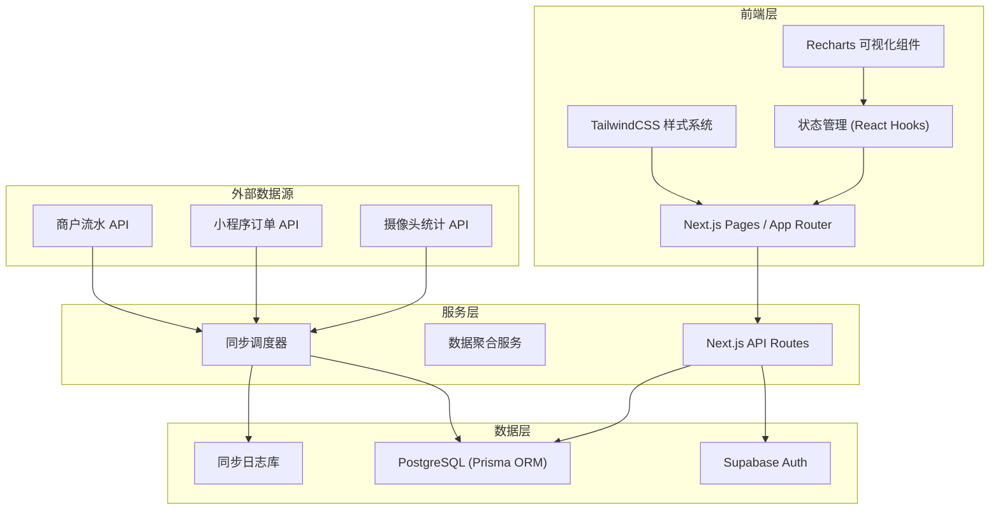
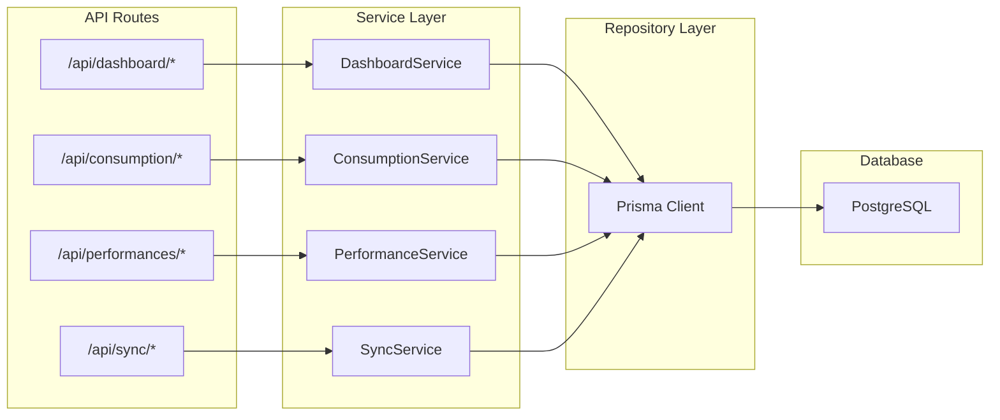
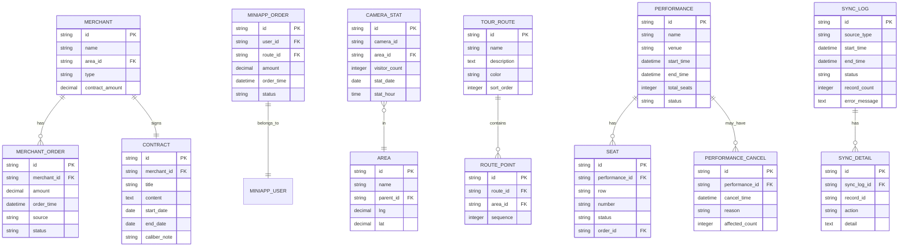

## 1. 架构设计

整体采用前后端一体化的 Next.js 全栈架构，通过 Prisma ORM 连接 PostgreSQL 数据库，Supabase 提供认证和实时能力，Recharts 实现数据可视化。



## 2. 技术描述

### 2.1 前端技术栈
- **框架**: Next.js 14 (App Router)
- **UI 框架**: React 18 + TypeScript
- **样式**: TailwindCSS 3 + CSS Modules
- **图表库**: Recharts 2.x
- **状态管理**: React Hooks + Context API
- **日期处理**: date-fns
- **动画**: framer-motion

### 2.2 后端技术栈
- **服务端**: Next.js API Routes (Serverless)
- **ORM**: Prisma 5.x
- **数据库**: PostgreSQL 15
- **认证**: Supabase Auth
- **任务调度**: node-cron（数据同步）

### 2.3 数据源接入
- 商户流水：通过 REST API 定时拉取
- 小程序订单：通过 Webhook + 定时轮询双链路
- 摄像头统计：通过第三方 SDK 接入
- 所有数据同步均记录详细日志

## 3. 路由定义

| 路由 | 用途 |
|------|------|
| `/` | 导览路线趋势看板首页 |
| `/secondary-consumption` | 二消转化报表页 |
| `/performances` | 演出列表页 |
| `/performances/[id]` | 演出座位明细页 |
| `/sync-monitor` | 数据同步监控页 |
| `/contracts` | 合同口径说明页 |
| `/api/dashboard/trend` | 导览趋势数据接口 |
| `/api/dashboard/heatmap` | 热力点位数据接口 |
| `/api/secondary-consumption` | 二消转化数据接口 |
| `/api/performances` | 演出列表接口 |
| `/api/performances/[id]/seats` | 演出座位明细接口 |
| `/api/sync/logs` | 同步日志接口 |
| `/api/contracts` | 合同列表接口 |

## 4. API 接口定义

### 4.1 导览趋势数据

```typescript
// 请求参数
interface TrendQuery {
  startDate: string;
  endDate: string;
  routeIds?: string[];
  areaIds?: string[];
  compareType?: 'yoy' | 'mom' | 'none';
}

// 响应数据
interface TrendResponse {
  dateRange: { start: string; end: string };
  routes: {
    id: string;
    name: string;
    color: string;
    data: { date: string; visitorCount: number }[];
  }[];
  cancelEvents: {
    id: string;
    date: string;
    performanceName: string;
    reason: string;
  }[];
  summary: {
    totalVisitors: number;
    avgDaily: number;
    growthRate: number;
  };
}
```

### 4.2 二消转化数据

```typescript
interface ConsumptionQuery {
  dateRange: [string, string];
  areaIds?: string[];
  compareType: 'date' | 'area';
}

interface ConsumptionResponse {
  funnel: {
    stage: string;
    count: number;
    rate: number;
  }[];
  comparison: {
    label: string;
    amount: number;
    conversionRate: number;
    avgPrice: number;
    orderCount: number;
  }[];
}
```

### 4.3 同步日志

```typescript
interface SyncLogQuery {
  sourceType?: 'merchant' | 'miniapp' | 'camera';
  status?: 'success' | 'failed' | 'running';
  page: number;
  pageSize: number;
}

interface SyncLogResponse {
  total: number;
  list: {
    id: string;
    sourceType: string;
    startTime: string;
    endTime?: string;
    status: string;
    recordCount: number;
    errorMessage?: string;
  }[];
}
```

## 5. 服务端架构图



## 6. 数据模型

### 6.1 ER 图



### 6.2 数据同步链路设计

三大数据源各自独立同步，每条链路均有完整日志追踪：

1. **商户流水同步链路**
   - 触发方式：定时任务（每小时）
   - 数据源：商户 POS 系统 API
   - 同步表：merchant_orders
   - 日志记录：sync_logs + sync_details

2. **小程序订单同步链路**
   - 触发方式：Webhook 实时 + 定时补偿（每30分钟）
   - 数据源：小程序后端 API
   - 同步表：miniapp_orders
   - 日志记录：sync_logs + sync_details

3. **摄像头统计同步链路**
   - 触发方式：定时任务（每15分钟）
   - 数据源：摄像头厂商 SDK
   - 同步表：camera_stats
   - 日志记录：sync_logs + sync_details
