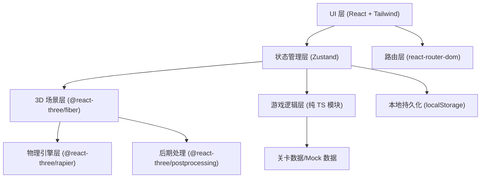
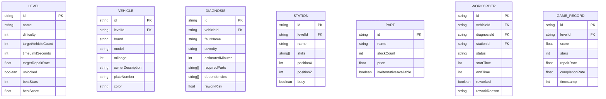

## 1. 架构设计



## 2. 技术说明

- 前端框架：React@18 + TypeScript@5
- 构建工具：Vite@5
- 样式方案：TailwindCSS@3 + CSS Variables 主题
- 路由管理：react-router-dom@6
- 状态管理：Zustand@4（含 persist 中间件本地存储）
- 3D 引擎：three@0.161 + @react-three/fiber@8
- 3D 辅助库：@react-three/drei@9（OrbitControls、环境、模型等）
- 物理引擎：@react-three/rapier@0.14（用于车辆工位碰撞检测）
- 后期处理：@react-three/postprocessing@2（Bloom、颗粒感）
- 图标：lucide-react@0.344
- 动画：framer-motion@11（UI 层过渡动画）

## 3. 路由定义

| 路由 | 页面组件 | 用途 |
|------|---------|------|
| `/` | `MainMenu` | 主菜单 |
| `/levels` | `LevelSelect` | 关卡选择 |
| `/game/:levelId` | `GameScene` | 游戏主场景（3D） |
| `/review/:levelId` | `ReviewPage` | 复盘页 |
| `/stats` | `StatsCenter` | 统计中心 |

## 4. 数据模型

### 4.1 数据模型定义（ER 图）



### 4.2 Zustand Store 切片

```typescript
// 游戏全局状态
interface GameState {
  // 路由/UI 状态
  currentPage: 'menu' | 'levels' | 'game' | 'review' | 'stats';
  isLoading: boolean;
  loadingProgress: number;

  // 当前关卡状态
  currentLevelId: string | null;
  timeRemaining: number;
  isPaused: boolean;
  score: number;
  reworkCount: number;
  completedCount: number;

  // 选择状态
  selectedVehicleId: string | null;
  selectedDiagnosisId: string | null;
  activePanel: 'archive' | 'diagnosis' | 'dispatch' | 'inventory' | null;

  // 配件缺货弹窗
  shortageModal: { open: boolean; partId: string | null; workOrderId: string | null };

  // 历史记录
  gameRecords: GameRecord[];
}
```

## 5. 项目目录结构

```
src/
├── components/
│   ├── ui/                     # 通用 UI 组件（Button, Card, Modal, Progress...）
│   ├── menu/                   # 主菜单组件
│   ├── levels/                 # 关卡选择组件
│   ├── game/                   # 游戏场景 UI 组件
│   │   ├── HUD.tsx
│   │   ├── VehicleArchive.tsx
│   │   ├── DiagnosisPanel.tsx
│   │   ├── DispatchPanel.tsx
│   │   ├── InventoryPanel.tsx
│   │   ├── ShortageModal.tsx
│   │   └── SidePanel.tsx
│   ├── three/                  # R3F 3D 场景组件
│   │   ├── WorkshopScene.tsx
│   │   ├── Station.tsx
│   │   ├── Vehicle3D.tsx
│   │   ├── Ground.tsx
│   │   └── Lights.tsx
│   ├── review/                 # 复盘页组件
│   └── stats/                  # 统计页组件
├── hooks/
│   ├── useGameLoop.ts          # 游戏主循环 hook
│   ├── useKeyboardControls.ts  # 键盘控制 hook
│   ├── useTouchControls.ts     # 触屏控制 hook
│   └── useLevelLoader.ts       # 关卡加载 hook
├── pages/
│   ├── MainMenu.tsx
│   ├── LevelSelect.tsx
│   ├── GameScene.tsx
│   ├── ReviewPage.tsx
│   └── StatsCenter.tsx
├── store/
│   ├── useGameStore.ts         # Zustand 主 store
│   └── slices/
│       ├── gameSlice.ts
│       ├── levelSlice.ts
│       └── statsSlice.ts
├── data/
│   ├── levels.ts               # 关卡 Mock 数据
│   ├── vehicles.ts             # 车辆模板数据
│   ├── diagnoses.ts            # 故障模板数据
│   ├── stations.ts             # 工位模板数据
│   └── parts.ts                # 配件模板数据
├── utils/
│   ├── scoring.ts              # 评分算法
│   ├── dispatch.ts             # 调度/分配算法
│   ├── rework.ts               # 返修率计算
│   └── animations.ts           # 动画配置
├── types/
│   └── index.ts                # 全局 TypeScript 类型定义
├── App.tsx
├── main.tsx
└── index.css
```

## 6. 关键算法说明

### 6.1 工单分配约束检查
- 检查工位技能匹配度（不匹配增加返修风险 +30%）
- 检查工位时间冲突（同一时段不能安排两个工序）
- 检查工序依赖关系（前置工序必须完成）

### 6.2 配件缺货处理逻辑
- **等货**：延迟 30 秒，正常完成，扣分
- **替代配件**：即时可用，返修率 +15%，轻微扣分
- **跳过工序**：立即完成，返修率 +40%，该工序得分 0

### 6.3 综合评分算法
```
总分 = (完成工单基础分 × 完成率 × 技能匹配系数) 
     - (返修扣分项 × 返修权重) 
     - (超时扣分项 × 时间权重)
     + (剩余时间奖励分)
```

### 6.4 星数评定
- ⭐ 1 星：完成率 ≥ 60% 且返修率 ≤ 40%
- ⭐⭐ 2 星：完成率 ≥ 80% 且返修率 ≤ 25%
- ⭐⭐⭐ 3 星：完成率 ≥ 95% 且返修率 ≤ 10%
