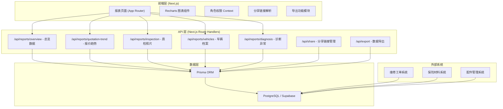
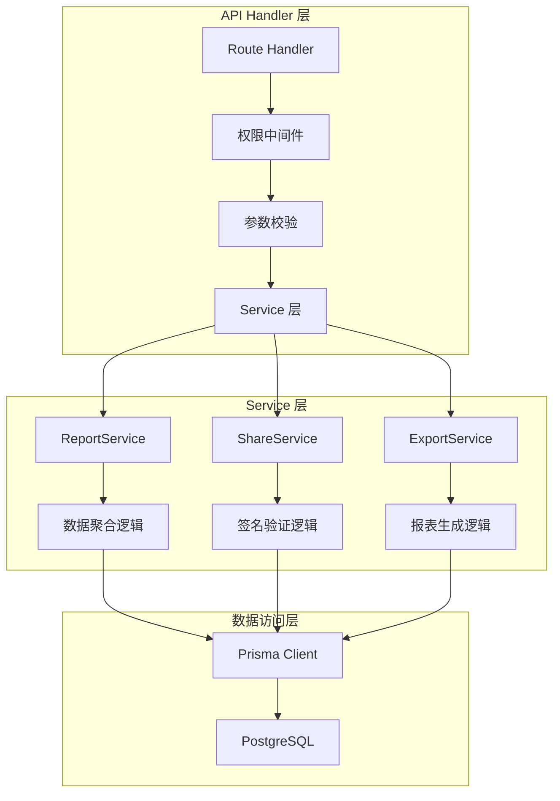
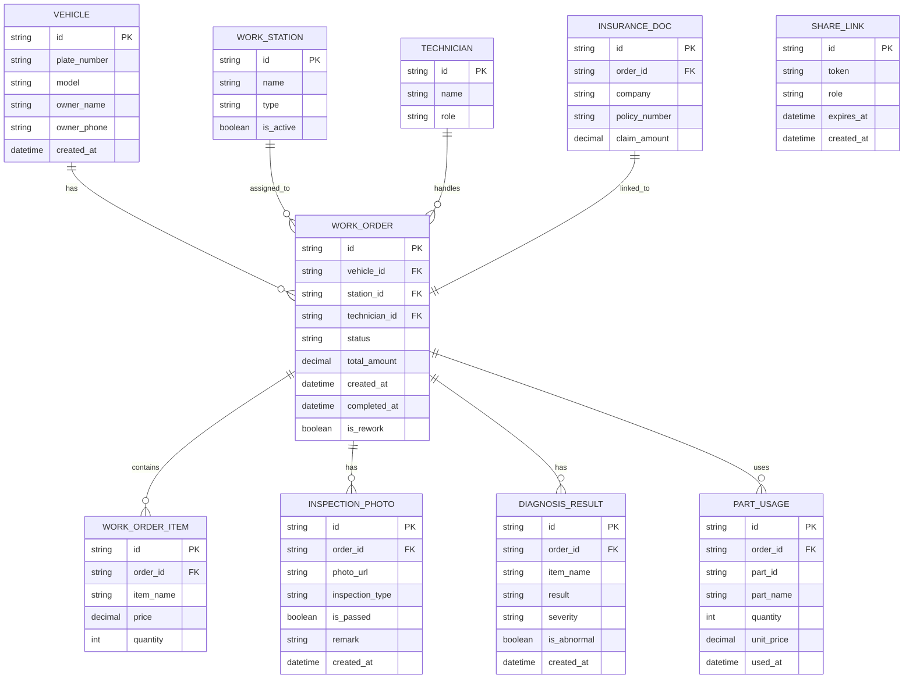

## 1. 架构设计



## 2. 技术选型说明

| 层级 | 技术选型 | 说明 |
|------|----------|------|
| 前端框架 | Next.js 14 (App Router) | React 全栈框架，支持 SSR/SSG，内置 API 路由 |
| 图表库 | Recharts | React 生态成熟图表库，支持折线图、柱状图、饼图等 |
| 样式方案 | Tailwind CSS 3 | 原子化 CSS，响应式设计，自定义主题配置 |
| 状态管理 | Zustand | 轻量级状态管理，管理角色权限、分享状态 |
| UI 组件 | 自定义 + Lucide Icons | 高质量图标库，线性风格统一 |
| 后端 | Next.js Route Handlers | 无服务器函数，与前端同构部署 |
| ORM | Prisma | 类型安全的数据库访问，支持 PostgreSQL |
| 数据库 | PostgreSQL (Supabase) | 关系型数据库，Supabase 提供托管服务 |
| 认证方案 | JWT + 分享链接签名 | 基于角色的访问控制，链接带签名验证 |
| 导出 | xlsx + jspdf | 支持 Excel 和 PDF 导出 |

## 3. 路由定义

| 路由 | 页面/接口 | 说明 |
|------|-----------|------|
| `/` | 报表总览页 | 主报表页面，展示所有图表模块 |
| `/share/[token]` | 分享链接页 | 通过分享令牌访问，按角色限制数据 |
| `/api/reports/overview` | API | 获取总览 KPI 数据 |
| `/api/reports/quotation-trend` | API | 获取报价单趋势数据 |
| `/api/reports/inspection` | API | 获取质检照片构成数据 |
| `/api/reports/vehicles` | API | 获取车辆档案明细 |
| `/api/reports/diagnosis` | API | 获取诊断结果异常数据 |
| `/api/share/generate` | API | 生成分享链接 |
| `/api/share/validate` | API | 验证分享链接 |
| `/api/export/excel` | API | 导出 Excel 报表 |

## 4. API 数据结构定义

### 4.1 总览数据

```typescript
interface OverviewData {
  totalWorkOrders: number;
  avgRepairDuration: number;
  reworkRate: number;
  stationUtilization: number;
  lastUpdated: string;
}
```

### 4.2 报价单趋势

```typescript
interface QuotationTrendItem {
  date: string;
  orderCount: number;
  totalAmount: number;
  avgAmount: number;
}

interface QuotationTrendResponse {
  data: QuotationTrendItem[];
  lastUpdated: string;
}
```

### 4.3 质检照片构成

```typescript
interface InspectionSummary {
  total: number;
  passed: number;
  failed: number;
  passRate: number;
}

interface InspectionIssueItem {
  type: string;
  count: number;
  percentage: number;
}

interface InspectionResponse {
  summary: InspectionSummary;
  issues: InspectionIssueItem[];
  lastUpdated: string;
}
```

### 4.4 车辆档案明细

```typescript
interface VehicleRecord {
  id: string;
  plateNumber: string;
  vehicleModel: string;
  ownerName: string;
  lastServiceDate: string;
  serviceCount: number;
  totalAmount: number;
  parts: VehiclePart[];
}

interface VehiclePart {
  partId: string;
  partName: string;
  quantity: number;
  unitPrice: number;
  usedDate: string;
}

interface VehicleResponse {
  data: VehicleRecord[];
  total: number;
  lastUpdated: string;
}
```

### 4.5 诊断结果异常

```typescript
interface DiagnosisAbnormalItem {
  id: string;
  date: string;
  vehiclePlate: string;
  diagnosisItem: string;
  severity: 'low' | 'medium' | 'high';
  isRework: boolean;
  technician: string;
}

interface DiagnosisTrendItem {
  date: string;
  abnormalCount: number;
  reworkCount: number;
}

interface DiagnosisResponse {
  abnormalItems: DiagnosisAbnormalItem[];
  trend: DiagnosisTrendItem[];
  lastUpdated: string;
}
```

### 4.6 分享链接

```typescript
interface ShareLinkRequest {
  role: 'director' | 'advisor' | 'technician' | 'parts' | 'external';
  expiresIn?: number;
  scope?: string[];
}

interface ShareLinkResponse {
  token: string;
  url: string;
  role: string;
  expiresAt: string;
  createdAt: string;
}
```

## 5. 服务端架构



## 6. 数据模型

### 6.1 ER 图



### 6.2 角色权限矩阵

| 数据模块 | 厂长 | 服务顾问 | 维修技师 | 配件员 | 外部人员 |
|----------|------|----------|----------|--------|----------|
| 总览 KPI | ✓ 全部 | ✓ 脱敏 | ✓ 脱敏 | ✓ 脱敏 | ✗ |
| 报价单趋势 | ✓ 全部 | ✓ 全部 | ✓ 金额脱敏 | ✗ | ✗ |
| 质检照片构成 | ✓ 全部 | ✓ 仅统计 | ✓ 全部 | ✗ | ✗ |
| 车辆档案 | ✓ 全部 | ✓ 全部 | ✓ 本人负责 | ✓ 配件明细 | ✗ |
| 诊断异常 | ✓ 全部 | ✓ 全部 | ✓ 本人负责 | ✗ | ✗ |
| 配件使用明细 | ✓ 全部 | ✓ 仅汇总 | ✗ | ✓ 全部 | ✗ |
| 导出功能 | ✓ 完整导出 | ✓ 部分导出 | ✗ | ✓ 配件导出 | ✗ |

### 6.3 返修率口径说明

- **定义**：返修率 = 返修工单数 / 总工单数量 × 100%
- **统计范围**：统计周期内完成的所有维修工单
- **返修判定**：同一车辆 30 天内因相同故障再次入场维修
- **时间维度**：支持按日、周、月统计
- **排除项**：保养类工单、主动召回不计入返修率统计
