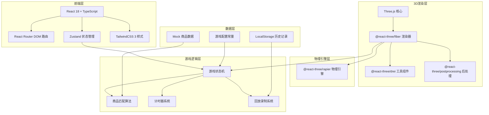
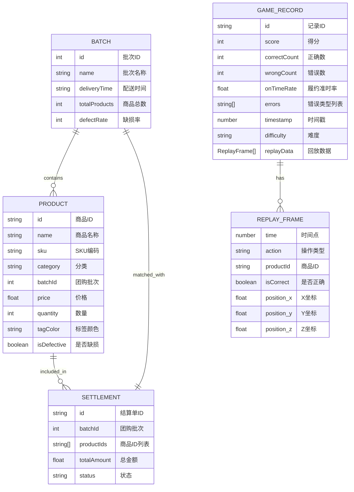

## 1. 架构设计



## 2. 技术描述

- **前端框架**：React@18 + TypeScript@5 + Vite@5
- **3D技术栈**：three@0.160, @react-three/fiber@8.15, @react-three/drei@9.92, @react-three/postprocessing@2.15
- **物理引擎**：@react-three/rapier@0.14 (Rapier 2D/3D physics)
- **状态管理**：zustand@4.4
- **路由管理**：react-router-dom@6.21
- **样式方案**：tailwindcss@3.4
- **图标库**：lucide-react@0.294
- **数据存储**：LocalStorage (历史记录) + Mock 数据
- **构建工具**：Vite@5

## 3. 路由定义

| 路由 | 页面 | 用途 |
|-------|------|------|
| `/` | 开始页 | 游戏入口、难度选择、统计入口 |
| `/game` | 游戏主场景 | 3D核销训练主玩法 |
| `/settlement` | 结算页 | 本局结果、错因分析 |
| `/stats` | 统计页 | 履约准时率、历史数据 |
| `/replay` | 复盘回放页 | 失败记录对比分析 |

## 4. 数据模型

### 4.1 核心数据结构



### 4.2 Zustand Store 定义

```typescript
// 游戏状态
interface GameState {
  phase: 'menu' | 'playing' | 'paused' | 'finished';
  difficulty: 'easy' | 'normal' | 'hard';
  score: number;
  timeRemaining: number;
  correctCount: number;
  wrongCount: number;
  currentBatch: Batch | null;
  products: Product[];
  settlements: Settlement[];
  warningProducts: string[];
  actionHistory: ReplayFrame[];
  
  // Actions
  startGame: (difficulty: string) => void;
  submitProduct: (productId: string, settlementId: string) => boolean;
  registerWarning: (productId: string) => void;
  endGame: () => void;
  saveRecord: () => string;
}

// 回放状态
interface ReplayState {
  records: GameRecord[];
  selectedRecords: string[];
  isPlaying: boolean;
  currentTime: number;
  
  loadRecords: () => void;
  selectRecord: (id: string) => void;
  playReplay: () => void;
}

// 统计状态
interface StatsState {
  totalGames: number;
  averageOnTimeRate: number;
  errorDistribution: Record<string, number>;
  recentRecords: GameRecord[];
  
  calculateStats: () => void;
}
```

## 5. 目录结构

```
src/
├── components/
│   ├── 3d/
│   │   ├── Scene.tsx          # 3D主场景
│   │   ├── Shelf.tsx          # 货架组件
│   │   ├── Product3D.tsx      # 3D商品组件
│   │   ├── CheckoutCounter.tsx # 核销台
│   │   ├── HologramLabel.tsx  # 全息标签
│   │   └── PhysicsWorld.tsx   # 物理世界
│   ├── ui/
│   │   ├── HUD.tsx            # 游戏HUD
│   │   ├── Countdown.tsx      # 倒计时
│   │   ├── WarningOverlay.tsx # 预警覆盖层
│   │   ├── SettlementCard.tsx # 结算单卡片
│   │   └── Button3D.tsx       # 3D按钮
│   ├── layout/
│   │   └── GameLayout.tsx     # 游戏布局
│   └── charts/
│       └── StatsChart.tsx     # 统计图表
├── pages/
│   ├── StartPage.tsx          # 开始页
│   ├── GamePage.tsx           # 游戏页
│   ├── SettlementPage.tsx     # 结算页
│   ├── StatsPage.tsx          # 统计页
│   └── ReplayPage.tsx         # 回放页
├── store/
│   ├── useGameStore.ts        # 游戏状态
│   ├── useReplayStore.ts      # 回放状态
│   └── useStatsStore.ts       # 统计状态
├── hooks/
│   ├── useDragDrop.ts         # 拖拽Hook
│   ├── useTimer.ts            # 计时器Hook
│   ├── useReplayRecorder.ts   # 回放录制Hook
│   └── useWarningSystem.ts    # 预警系统Hook
├── utils/
│   ├── productMatcher.ts      # 商品匹配算法
│   ├── mockData.ts            # Mock数据生成
│   └── constants.ts           # 常量配置
├── types/
│   └── index.ts               # 类型定义
├── App.tsx
├── main.tsx
└── index.css
```

## 6. 核心算法

### 6.1 商品匹配算法
```typescript
function matchProductToSettlement(
  product: Product,
  settlement: Settlement,
  batch: Batch
): {
  isMatch: boolean;
  errorType?: 'wrong_batch' | 'wrong_product' | 'shortage' | 'expired';
}
```

### 6.2 预警触发机制
```typescript
// 当剩余时间 < 阈值 且 缺损商品未处理 时触发
function shouldTriggerWarning(
  timeRemaining: number,
  defectiveProducts: Product[],
  processedIds: string[]
): string[]
```

### 6.3 回放差异对比
```typescript
function compareReplayRecords(
  records: GameRecord[]
): Array<{
  time: number;
  differences: Array<{
    recordId: string;
    action: string;
    isCorrect: boolean;
  }>;
}>
```
