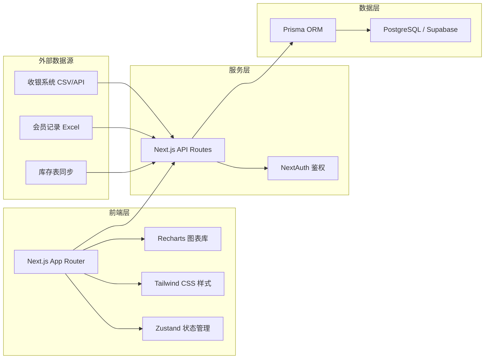
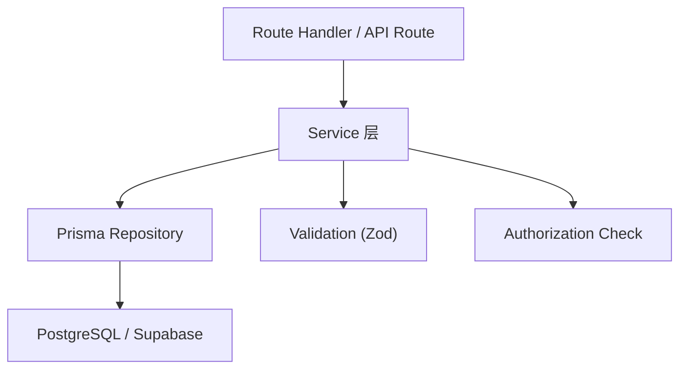
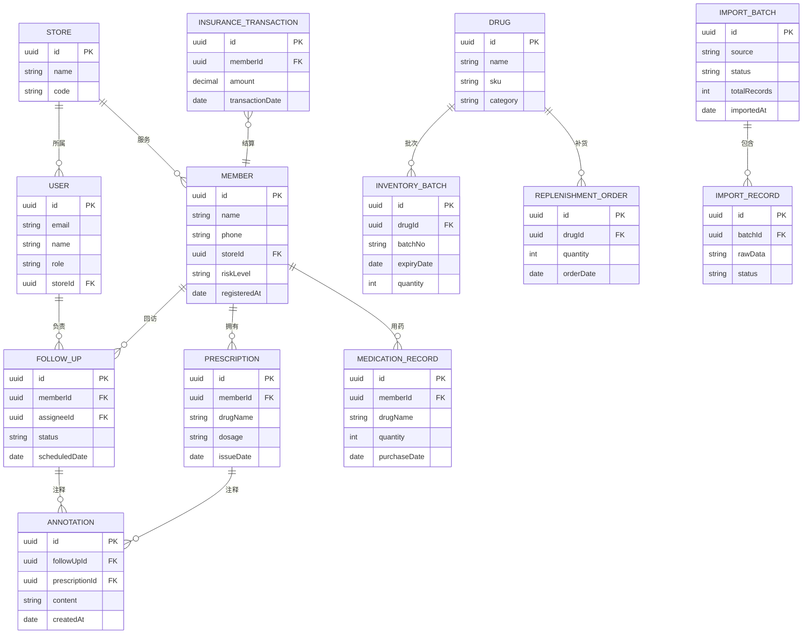

## 1. 架构设计



## 2. 技术描述

- **前端框架**：Next.js 14 (App Router) + React 18 + TypeScript
- **样式方案**：Tailwind CSS 3
- **图表库**：Recharts 2
- **状态管理**：Zustand
- **图标库**：lucide-react
- **服务端**：Next.js API Routes + Route Handlers
- **鉴权**：NextAuth.js
- **ORM**：Prisma 5
- **数据库**：PostgreSQL（Supabase 托管）
- **包管理**：pnpm

## 3. 路由定义

| 路由 | 页面/用途 | 权限 |
|-------|---------|------|
| `/login` | 登录页 | 公开 |
| `/dashboard` | 管理层总览仪表盘 | 管理层/管理员 |
| `/follow-ups` | 回访明细列表 | 一线/管理层 |
| `/follow-ups/[id]` | 回访详情 | 一线（仅本人）/管理层 |
| `/analytics` | 数据分析区 | 管理层/管理员 |
| `/analytics/batch-expiry` | 批号效期分布 | 管理层 |
| `/analytics/member-funnel` | 会员档案漏斗 | 管理层 |
| `/analytics/replenishment` | 补货单排行 | 管理层 |
| `/analytics/insurance` | 医保流水变化 | 管理层 |
| `/imports` | 数据导入批次列表 | 管理员 |
| `/imports/[batchId]` | 批次详情回查 | 管理员 |
| `/users` | 用户管理 | 管理员 |

## 4. API 定义

```typescript
// 登录
POST /api/auth/login
Request: { email: string; password: string }
Response: { user: User; token: string }

// 总览指标
GET /api/dashboard/overview
Response: {
  totalChronicMembers: number;
  highRiskCount: number;
  followUpCompletionRate: number;
  monthlyInsuranceAmount: number;
  riskTrend: Array<{ date: string; high: number; medium: number; low: number }>;
  storeRanking: Array<{ storeId: string; storeName: string; completionRate: number }>;
}

// 回访列表
GET /api/follow-ups?status=&riskLevel=&memberName=
Response: {
  items: Array<{
    id: string;
    memberName: string;
    riskLevel: 'high' | 'medium' | 'low';
    lastVisitDate: string;
    assigneeId: string;
    assigneeName: string;
    status: 'pending' | 'completed' | 'annotated';
  }>;
  total: number;
}

// 回访详情
GET /api/follow-ups/[id]
Response: {
  id: string;
  member: MemberProfile;
  prescriptions: Array<Prescription>;
  medicationRecords: Array<MedicationRecord>;
  annotations: Array<Annotation>;
  followUpHistory: Array<FollowUpRecord>;
}

// 添加处方注释
POST /api/follow-ups/[id]/annotations
Request: { content: string; prescriptionId?: string }
Response: Annotation

// 批号效期分布
GET /api/analytics/batch-expiry
Response: Array<{ range: string; count: number }>

// 会员漏斗
GET /api/analytics/member-funnel
Response: Array<{ stage: string; count: number; conversionRate: number }>

// 补货排行
GET /api/analytics/replenishment?limit=10
Response: Array<{ drugName: string; sku: string; count: number }>

// 医保流水
GET /api/analytics/insurance-trend?months=6
Response: Array<{ month: string; amount: number; count: number }>

// 导入批次列表
GET /api/imports?status=&source=&page=
Response: {
  items: Array<ImportBatch>;
  total: number;
}

// 导入批次详情
GET /api/imports/[batchId]
Response: {
  batch: ImportBatch;
  records: Array<ImportRecord>;
  errors: Array<ImportError>;
}

// 创建导入批次
POST /api/imports
Request: { source: 'pos' | 'member' | 'inventory'; file?: File; mapping?: Record<string, string> }
Response: ImportBatch
```

## 5. 服务端分层架构



## 6. 数据模型

### 6.1 ER 图



### 6.2 Prisma Schema 预览

```prisma
model User {
  id        String   @id @default(cuid())
  email     String   @unique
  name      String
  password  String
  role      String   // "admin" | "manager" | "staff"
  storeId   String
  store     Store    @relation(fields: [storeId], references: [id])
  followUps FollowUp[]
  createdAt DateTime @default(now())
}

model Store {
  id      String @id @default(cuid())
  name    String
  code    String @unique
  users   User[]
  members Member[]
}

model Member {
  id            String   @id @default(cuid())
  name          String
  phone         String
  storeId       String
  store         Store    @relation(fields: [storeId], references: [id])
  riskLevel     String   // "high" | "medium" | "low"
  registeredAt  DateTime @default(now())
  prescriptions Prescription[]
  medications   MedicationRecord[]
  followUps     FollowUp[]
  insurance     InsuranceTransaction[]
}

model Prescription {
  id           String       @id @default(cuid())
  memberId     String
  member       Member       @relation(fields: [memberId], references: [id])
  drugName     String
  dosage       String
  issueDate    DateTime
  annotations  Annotation[]
  importBatchId String?
}

model MedicationRecord {
  id             String   @id @default(cuid())
  memberId       String
  member         Member   @relation(fields: [memberId], references: [id])
  drugName       String
  quantity       Int
  purchaseDate   DateTime
  importBatchId  String?
}

model FollowUp {
  id            String       @id @default(cuid())
  memberId      String
  member        Member       @relation(fields: [memberId], references: [id])
  assigneeId    String
  assignee      User         @relation(fields: [assigneeId], references: [id])
  status        String       // "pending" | "completed" | "annotated"
  scheduledDate DateTime
  annotations   Annotation[]
}

model Annotation {
  id              String        @id @default(cuid())
  followUpId      String
  followUp        FollowUp      @relation(fields: [followUpId], references: [id])
  prescriptionId  String?
  prescription    Prescription? @relation(fields: [prescriptionId], references: [id])
  content         String
  createdBy       String
  createdAt       DateTime      @default(now())
}

model Drug {
  id          String              @id @default(cuid())
  name        String
  sku         String              @unique
  category    String
  batches     InventoryBatch[]
  replenish   ReplenishmentOrder[]
}

model InventoryBatch {
  id         String   @id @default(cuid())
  drugId     String
  drug       Drug     @relation(fields: [drugId], references: [id])
  batchNo    String
  expiryDate DateTime
  quantity   Int
  importBatchId String?
}

model ReplenishmentOrder {
  id         String   @id @default(cuid())
  drugId     String
  drug       Drug     @relation(fields: [drugId], references: [id])
  quantity   Int
  orderDate  DateTime
  importBatchId String?
}

model ImportBatch {
  id         String          @id @default(cuid())
  source     String          // "pos" | "member" | "inventory"
  status     String          // "pending" | "processing" | "completed" | "failed"
  totalRecords Int
  fileName   String?
  importedBy String
  importedAt DateTime        @default(now())
  records    ImportRecord[]
}

model ImportRecord {
  id         String   @id @default(cuid())
  batchId    String
  batch      ImportBatch @relation(fields: [batchId], references: [id])
  rawData    Json
  status     String   // "success" | "skipped" | "error"
  errorMsg   String?
  mappedId   String?  // 关联到的业务表 ID
}

model InsuranceTransaction {
  id              String   @id @default(cuid())
  memberId        String
  member          Member   @relation(fields: [memberId], references: [id])
  amount          Decimal  @db.Decimal(12, 2)
  transactionDate DateTime
  importBatchId   String?
}
```
