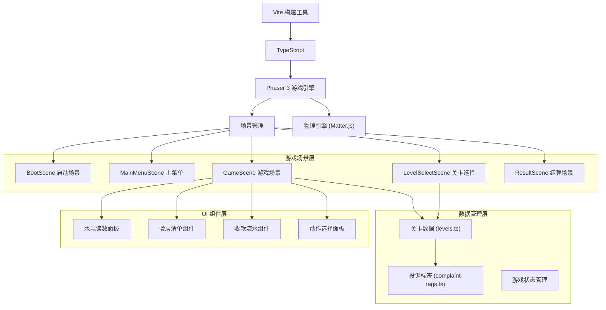

## 1. 架构设计



## 2. 技术选型说明

- **前端框架**：Phaser 3.70 + TypeScript 5.x + Vite 5.x
- **物理引擎**：Matter.js（通过 Phaser 内置插件使用，用于交互物体物理效果）
- **构建工具**：Vite，提供快速热更新和打包
- **状态管理**：Phaser 自带 DataManager + 简单的事件总线
- **样式方案**：Phaser 内置 Graphics + DOM 元素混合模式，复杂 UI 使用 HTML/CSS 叠加层

## 3. 目录结构

```
src/
├── scenes/                 # 游戏场景
│   ├── BootScene.ts       # 启动加载场景
│   ├── MainMenuScene.ts   # 主菜单场景
│   ├── LevelSelectScene.ts # 关卡选择场景
│   ├── GameScene.ts       # 游戏主场景
│   └── ResultScene.ts     # 结算场景
├── game/                   # 游戏逻辑
│   ├── types.ts           # 类型定义
│   ├── GameManager.ts     # 游戏状态管理器
│   ├── ScoreCalculator.ts # 分数计算器
│   └── Timer.ts           # 计时器
├── data/                   # 数据配置
│   ├── levels.ts          # 关卡数据
│   └── complaint-tags.ts  # 投诉标签定义
├── components/             # UI 组件
│   ├── UtilityPanel.ts    # 水电读数面板
│   ├── InspectionList.ts  # 验房清单组件
│   ├── PaymentFlow.ts     # 收款流水组件
│   ├── ActionPanel.ts     # 动作选择面板
│   └── ProgressBar.ts     # 进度条组件
├── utils/                  # 工具函数
│   └── helpers.ts
├── main.ts                # 入口文件
└── style.css              # 全局样式（DOM UI 用）
```

## 4. 场景路由

| 场景键名 | 场景类名 | 入口 | 说明 |
|---------|---------|------|------|
| Boot | BootScene | 游戏启动 | 预加载资源，初始化配置 |
| MainMenu | MainMenuScene | 启动完成后 | 主菜单，选择正式训练或自由练习 |
| LevelSelect | LevelSelectScene | 主菜单点击入口 | 展示关卡列表，选择关卡 |
| Game | GameScene | 选择关卡后 | 游戏主场景，核心玩法 |
| Result | ResultScene | 游戏结束后 | 结算页面，展示成绩和错误 |

## 5. 数据模型

### 5.1 关卡数据结构

```typescript
interface Level {
  id: string;
  name: string;
  description: string;
  difficulty: 'easy' | 'medium' | 'hard' | 'expert';
  complaintTags: string[];
  estimatedTime: number;
  
  roomInfo: RoomInfo;
  utilityData: UtilityData;
  inspectionItems: InspectionItem[];
  paymentRecords: PaymentRecord[];
  correctAction: GameAction;
  correctDeductions: DeductionDetail[];
}

interface RoomInfo {
  roomNumber: string;
  tenantName: string;
  moveInDate: string;
  moveOutDate: string;
  deposit: number;
  monthlyRent: number;
}

interface UtilityData {
  electricityStart: number;
  electricityEnd: number;
  electricityRate: number;
  waterStart: number;
  waterEnd: number;
  waterRate: number;
  hasAbnormality: boolean;
  abnormalityHint?: string;
}

interface InspectionItem {
  id: string;
  name: string;
  category: string;
  status: 'normal' | 'damaged' | 'missing' | 'dirty';
  severity: 'minor' | 'major' | 'critical';
  description: string;
  deductionAmount: number;
  isHidden?: boolean;
}

interface PaymentRecord {
  id: string;
  date: string;
  amount: number;
  type: 'rent' | 'utility' | 'deposit' | 'other';
  status: 'paid' | 'overdue' | 'partial';
  description: string;
}

type GameAction = 'full_refund' | 'partial_deduction' | 'full_deduction' | 'escalate';

interface DeductionDetail {
  itemId: string;
  reason: string;
  amount: number;
}
```

### 5.2 游戏状态

```typescript
interface GameState {
  currentLevel: Level | null;
  gameMode: 'training' | 'practice';
  startTime: number;
  endTime: number | null;
  score: number;
  errors: GameError[];
  playerAnswers: PlayerAnswers;
}

interface PlayerAnswers {
  utilityJudgment: boolean;
  inspectionMarks: Record<string, boolean>;
  paymentJudgment: boolean;
  selectedAction: GameAction | null;
  deductionAmount: number;
}

interface GameError {
  type: 'utility' | 'inspection' | 'payment' | 'action';
  itemId?: string;
  description: string;
  correctAnswer: string;
  playerAnswer: string;
  pointDeduction: number;
}
```

### 5.3 投诉标签系统

```typescript
interface ComplaintTag {
  id: string;
  name: string;
  category: 'facility' | 'payment' | 'behavior' | 'document';
  color: string;
  description: string;
}
```

## 6. 核心技术要点

### 6.1 Phaser + DOM 混合 UI
- 游戏背景和基础元素使用 Phaser Canvas 渲染
- 复杂表单类 UI 使用 HTML/CSS 叠加层实现，提升开发效率
- 通过 Phaser 的 ScaleManager 实现响应式适配

### 6.2 关卡数据驱动
- 所有关卡参数配置化，存储在 `src/data/levels.ts`
- 投诉标签独立管理，关卡通过标签关联
- 支持动态追加关卡和标签，无需修改核心逻辑

### 6.3 双模式设计
- 正式训练模式：有限时间，严格评分，记录成绩
- 自由练习模式：无限时，可查看提示，即时反馈
- 两种模式共用游戏核心逻辑，通过参数区分

### 6.4 Matter.js 应用
- 用于房间示意图中的可交互物体（如可拖拽检查的家具）
- 增强游戏的沉浸感和操作趣味性
- 物理效果仅用于展示层，不影响核心判断逻辑
